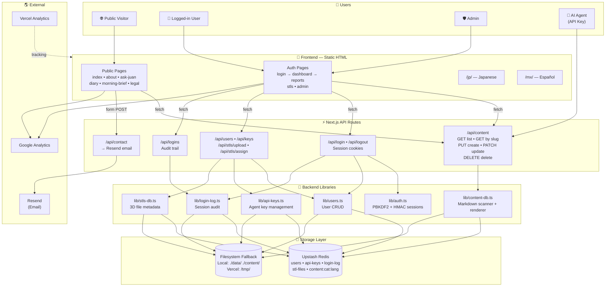
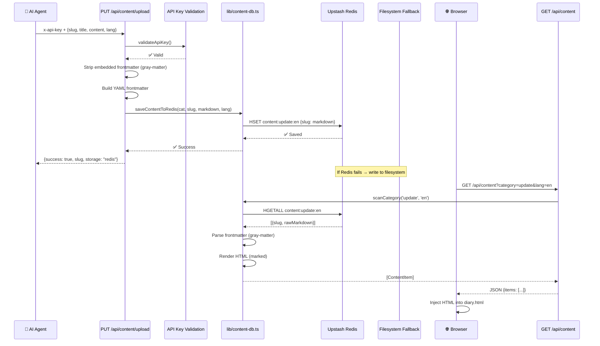
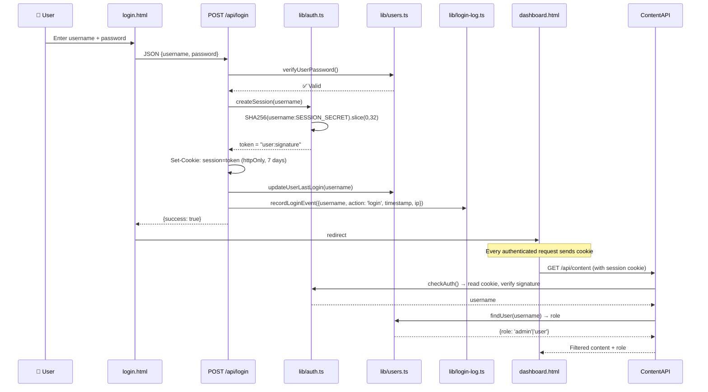
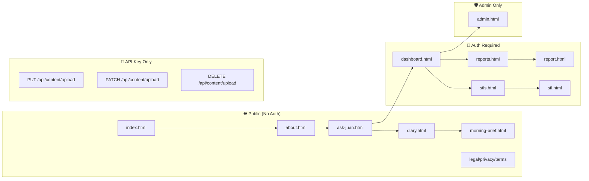
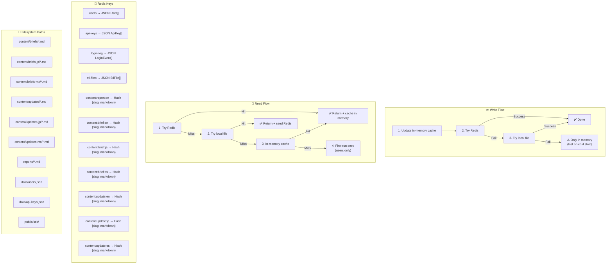
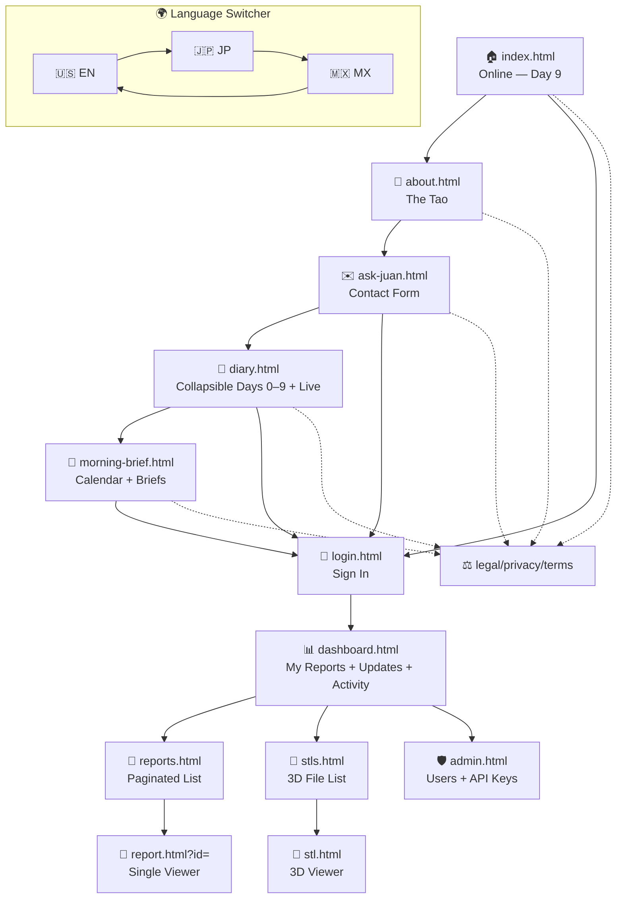
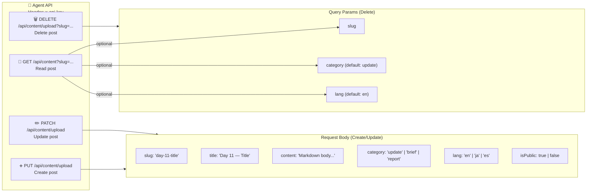
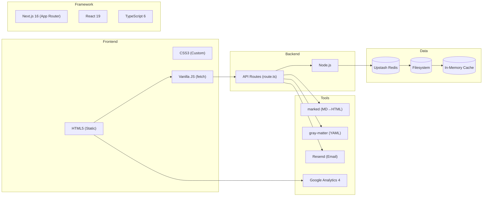

# Juan's World — Architecture & Workflow

> Visual reference for planning new features.

---

## 1. System Overview

---

## 2. Content Lifecycle (Agent → Live Site)

---

## 3. Auth & Session Flow

---

## 4. Page Access Matrix

---

## 5. Data Storage — Redis vs Filesystem

---

## 6. Navigation Flow — All Pages

---

## 7. CRUD API — Agent Operations

---

## 8. Permissions Matrix

| Feature | Public | User | Admin | AI Agent |
|---------|--------|------|-------|----------|
| View landing | ✅ | ✅ | ✅ | — |
| View diary | ✅ | ✅ | ✅ | — |
| View briefs | ✅ | ✅ | ✅ | — |
| View reports | ❌ | ✅ (assigned) | ✅ (all) | — |
| View STL list | ❌ | ✅ (assigned) | ✅ (all) | — |
| Download STL | ❌ | ✅ (assigned) | ✅ (all) | — |
| Dashboard | ❌ | ✅ | ✅ | — |
| Admin panel | ❌ | ❌ | ✅ | — |
| Create content | ❌ | ❌ | ❌ | ✅ |
| Update content | ❌ | ❌ | ❌ | ✅ |
| Delete content | ❌ | ❌ | ❌ | ✅ |
| Contact form | ✅ | ✅ | ✅ | — |

---

## 9. Environment Variables

| Variable | Used By | Purpose |
|----------|---------|---------|
| `UPSTASH_REDIS_REST_URL` | All DB libs | Redis connection URL |
| `UPSTASH_REDIS_REST_TOKEN` | All DB libs | Redis auth token |
| `SESSION_SECRET` | lib/auth.ts | Session signing key |
| `ADMIN_PASSWORD_HASH` | lib/auth.ts | Optional override for admin hash |
| `CONTACT_EMAIL` | /api/contact | Destination email |
| `RESEND_API_KEY` | /api/contact | Email service API key |
| `VERCEL` (auto) | All DB libs | Switches paths to `/tmp/` |

---

## 10. Tech Stack

