# Juan's World — DevOps Manual for AI Developers

> A comprehensive, beginner-friendly guide to understanding, operating, and replicating the Juan's World full-stack application.

---

## Table of Contents

1. [Executive Summary](#1-executive-summary)
2. [Core Concepts Explained](#2-core-concepts-explained)
3. [System Architecture Diagram (Annotated)](#3-system-architecture-diagram-annotated)
4. [Data Flow Walkthroughs](#4-data-flow-walkthroughs)
5. [Permissions & Access Control Table](#5-permissions--access-control-table)
6. [Redis Data Model Reference](#6-redis-data-model-reference)
7. [API Reference](#7-api-reference)
8. [Environment Variables Setup Guide](#8-environment-variables-setup-guide)
9. [How to Replicate This System](#9-how-to-replicate-this-system-step-by-step)
10. [Glossary](#10-glossary)

---

## 1. Executive Summary

**Juan's World** is a multilingual content website built for a single operator — Juan — who wants to publish diary entries, briefings, and reports in three languages (English, Japanese, and Mexican Spanish) while keeping some content restricted to specific logged-in users. The system is unusual because it is designed to be **co-managed by an AI agent**: a large language model can log in with a special API key, create new posts, update existing ones, and delete content — all without human intervention.

At its heart, the application is a **Next.js** website. Next.js is a framework that runs on top of React and Node.js. If you have never seen Next.js before, think of it as a tool that lets you write both the visible parts of a website (the pages people see in their browser) and the invisible backend logic (the code that handles logins, saves data, and sends emails) in the same project. The visible pages in Juan's World are actually plain HTML files stored in the `public/` folder — they are "static," meaning they do not change when different people visit them. The dynamic parts — like fetching the latest diary post or checking whether a user is logged in — are handled by small programs called **API routes** that live inside the `app/api/` folder.

The site is hosted on **Vercel**, a cloud platform designed specifically for Next.js apps. Vercel automatically takes the code from a GitHub repository, builds it, and serves it to visitors around the world. One important quirk of Vercel is that its filesystem is read-only except for a temporary folder called `/tmp/`. This means the application cannot save new files to disk permanently. To work around this, the system uses **Upstash Redis** as its primary database. Redis is an extremely fast data store that keeps everything in memory. Upstash provides Redis as a hosted service with a REST API, which means the Next.js app can talk to it over the internet using simple HTTP requests. If Redis is ever unreachable, the app falls back to writing JSON files to `/tmp/` on Vercel (which survive for the lifetime of the serverless function) or to a local `data/` folder during development.

The system serves four distinct types of users. **Public visitors** can browse the landing page, read the diary, view briefings, and send messages through a contact form. **Logged-in users** get access to a personal dashboard, reports assigned to them, and a list of 3D STL files. **Admins** have all user privileges plus the ability to manage other users, create API keys for the AI agent, and view audit logs. Finally, the **AI agent** itself is a special actor that authenticates with a long secret string called an API key. When the agent sends a properly signed request, it can create, edit, or delete content directly. This architecture was chosen because it gives Juan a "hands-off" publishing workflow: he can tell his AI to write and post content, and it appears on the site within seconds.

---

## 2. Core Concepts Explained

### Static HTML Frontend vs. API Routes

In a traditional website, every page is generated by a server when someone visits it. In Juan's World, most pages are **static HTML** files. This means they were written once by a human (or generated once at build time) and are served to every visitor exactly as-is. You can find these files in the `public/` directory — files like `index.html`, `diary.html`, and `about.html`. When a visitor types `juansworld.xyz/diary.html` into their browser, Vercel simply finds that file on disk and sends it back. There is no code running to build that page on the fly.

However, static files cannot do everything. They cannot check whether someone is logged in. They cannot fetch a list of the latest diary posts from a database. They cannot send an email. For these dynamic tasks, the system uses **API routes**. An API route is a small piece of code that runs on the server when a specific URL is requested. In Next.js, API routes live in files named `route.ts` inside folders under `app/api/`. For example, when the diary page wants to load the latest live updates, it runs JavaScript in the browser that sends a `fetch` request to `/api/content?category=update&lang=en`. The server receives that request, runs the code inside `app/api/content/route.ts`, fetches the data from Redis, and returns it as JSON. The browser then takes that JSON and injects the new HTML into the page. Think of static HTML as the "frame" of the website, and API routes as the "engine" that fills the frame with live data.

### Redis as a Primary Database with Filesystem Fallback

A **database** is simply a place to store information so you can find it later. Most websites use traditional databases like PostgreSQL or MySQL. Juan's World uses **Redis** instead. Redis is special because it stores everything in memory (RAM) rather than on a hard disk. This makes it incredibly fast — reading or writing a piece of data takes fractions of a millisecond. The specific service used is **Upstash Redis**, which provides a hosted Redis instance that you can talk to over HTTPS using a simple REST API. This is perfect for Vercel because there is no persistent server; each request runs in a short-lived "serverless function," and Upstash Redis gives that function a place to save data that outlives the function itself.

The system is designed with a **three-layer fallback strategy**. When the app needs to read or write data, it always tries Redis first. If Redis responds, great — that is the fastest and most reliable path. If Redis fails (for example, because of a network timeout or the service is temporarily down), the app tries to read or write a JSON file on the local filesystem. On a developer's laptop, this file lives in `./data/`. On Vercel, it lives in `/tmp/`. The `/tmp/` folder on Vercel is writable, but its contents are lost whenever the platform spins up a new server instance — which happens unpredictably. So the filesystem fallback is a "best effort" safety net. If even the filesystem is unavailable (for example, because the disk is full or permissions are wrong), the app keeps a copy of the data in an **in-memory cache** — a JavaScript variable that exists only for the lifetime of the current serverless function. Data in memory is the fastest to access, but it is lost completely when the function ends. This layered approach ensures the app keeps working even when its primary database has hiccups.

### Session-Based Authentication Using HMAC Signatures

**Authentication** is the process of proving who you are. When Juan logs into his website, the system needs to remember that he is Juan for every page he visits afterward. The standard web mechanism for this is a **session cookie**. Here is how it works in plain English: when Juan submits his username and password on the login page, the server checks the password. If it is correct, the server creates a small piece of text called a **session token**. This token contains Juan's username plus a **digital signature** created with a secret key that only the server knows. The server then sends this token back to the browser inside a **cookie** — a special kind of text file that the browser stores and automatically sends along with every future request to the same website.

The signature is created using a technique called **HMAC** (Hash-based Message Authentication Code). In this system, the server takes the string `"juan:my-super-secret-key"`, runs it through the SHA-256 hashing algorithm, and keeps only the first 32 characters of the result. This becomes the signature. The final token looks like `"juan:a3f7b2c9..."`. On every subsequent request, the server reads the cookie, splits it into the username and the signature, re-computes what the signature *should* be using the same secret key, and compares the two. If they match, the server knows the cookie was genuinely created by this server and has not been tampered with. If they do not match, the request is rejected. The cookie is marked `httpOnly`, which means JavaScript running in the browser cannot read it — this protects against a common attack called **cross-site scripting (XSS)** where malicious scripts try to steal cookies.

### API Key Authentication for AI Agents

Sessions and cookies work great for humans using browsers, but AI agents do not use browsers. An AI agent is a program (often running on a different computer or in a different cloud) that needs to interact with the website's API directly. For this purpose, the system uses **API keys**. An API key is a long, random string of letters and numbers that acts like a password, but it is meant to be used by software rather than by a person typing it in. In Juan's World, API keys are generated by an admin in the `admin.html` panel and are stored in Redis under the key `api-keys`. A typical key looks like `jw_7b8ea214866210a23d22693cd205109b28b710785d15c69bc36a2e7597a7c9af`.

When the AI agent wants to publish a new diary entry, it sends an HTTP request to the server. In the headers of that request, it includes `x-api-key: jw_7b8ea...`. The server receives the request, reads the key from the header, and checks whether that exact string exists in the list of valid API keys stored in Redis. If it does, the request is allowed to proceed. If it does not, the server returns a `403 Forbidden` error. This is a much simpler authentication model than sessions because there is no cookie, no signature verification, and no expiration — the key is either valid or it is not. The trade-off is that if an API key is stolen, anyone who has it can impersonate the AI agent until an admin deletes the key from the system.

### Content Lifecycle: How Markdown Goes from an AI Agent to a Live Webpage

The content in Juan's World is stored as **Markdown** — a lightweight text format that uses simple symbols like `#` for headings and `*` for emphasis. Markdown is popular because it is easy for both humans and AI to read and write. Each piece of content also has a small block of **frontmatter** at the top: a section between triple dashes (`---`) that contains metadata like the title, date, and whether the post is public. The frontmatter is written in **YAML**, a human-friendly data format.

Here is the full journey of a new diary post from the AI agent to a visitor's screen:

1. **The agent composes the post.** The AI writes a Markdown body (for example, `## Day 10\n\nToday I tested the new feature...`) and decides on a title and a URL-friendly identifier called a **slug** (for example, `day-10-testing`).
2. **The agent sends a PUT request.** It makes an HTTP request to `PUT /api/content/upload` with the API key in the header and a JSON body containing `slug`, `title`, `content`, `category` (set to `update` for diary entries), and `lang` (set to `en`, `ja`, or `es`).
3. **The server validates the API key.** The route handler in `app/api/content/upload/route.ts` calls `validateApiKey()` to make sure the request came from a trusted agent.
4. **The server builds the frontmatter.** It takes the title and today's date and constructs a YAML block. If the title contains special characters like colons, it wraps the title in double quotes to keep the YAML valid.
5. **The server strips accidental frontmatter.** Sometimes the AI includes its own `---` block in the content. The server uses the `gray-matter` library to detect and remove any embedded frontmatter, keeping only the body text.
6. **The server saves to Redis.** It calls `saveContentToRedis('update', 'day-10-testing', fullMarkdown, 'en')`, which sends an `HSET` command to Redis. The Redis key is `content:update:en`, and the field name is the slug. The value is the complete Markdown string including frontmatter.
7. **The visitor loads the diary page.** When someone visits `diary.html`, the page's JavaScript runs and sends a `fetch` request to `GET /api/content?category=update&lang=en`.
8. **The server reads from Redis.** The content API calls `scanCategory('update', 'en')`, which asks Redis for all fields inside the hash `content:update:en`.
9. **The server renders HTML.** For each Markdown string returned by Redis, the server uses `gray-matter` to parse the frontmatter and `marked` to convert the Markdown body into HTML. It returns a JSON array of content items.
10. **The browser displays the post.** The diary page's JavaScript receives the JSON, generates HTML elements, and injects them into the page. If the post has `isPublic: true`, it appears at the top of the page with a "Live" badge.

This entire cycle — from the AI agent writing a post to a visitor seeing it — takes less than a second.

### Role-Based Access Control (Public / User / Admin / AI Agent)

**Role-based access control (RBAC)** is a security pattern where different users are assigned different "roles," and each role has permission to do different things. In Juan's World, there are four roles, though one of them (the AI Agent) is technically not a user account in the traditional sense.

**Public** is not really a role — it simply means "no authentication required." Anyone on the internet can visit the public pages: the homepage, the diary, the morning brief, the about page, and the contact form. Public content is not personalized; everyone sees the same thing.

**User** is the standard authenticated role. When someone logs in with a username and password, the system looks them up in the user database and sees their role is `user`. A user can access the dashboard, view reports and STL files that are either assigned to them or not restricted to specific users, and see their own login history. They cannot see other users' content, access the admin panel, or create new posts.

**Admin** is the superuser role. Admins can do everything users can do, plus they can access `admin.html` to create and delete user accounts, generate and revoke API keys for the AI agent, and view the full login audit log for every user. In the code, admin checks are performed by calling `checkAuth()` to get the current username, then `findUser(username)` to look up their role, and finally checking whether `role === 'admin'`.

**AI Agent** is a special actor that authenticates with an API key rather than a username and password. The agent has its own set of permissions entirely separate from the user/admin hierarchy. It can create, update, and delete content via the `/api/content/upload` endpoints, but it cannot log in through the normal login page, view the dashboard, or access reports. In the permissions matrix, the agent is the only actor that can modify content, while admins are the only humans who can manage users and keys.

---

## 3. System Architecture Diagram (Annotated)

Below is the system overview diagram from the architecture guide, reproduced with inline comments explaining every node and connection.

```mermaid
flowchart TB
    subgraph Users["👤 Users"]
        %% Four types of actors who interact with the system
        PUB["🌐 Public Visitor"]
        %% Anyone on the internet browsing without logging in
        USER["🔑 Logged-in User"]
        %% A person who has entered a valid username and password
        ADMIN["🛡️ Admin"]
        %% A logged-in user whose role is 'admin'; can manage other users
        AGENT["🤖 AI Agent<br/>(API Key)"]
        %% An automated program that authenticates with a secret API key
    end

    subgraph Frontend["📄 Frontend — Static HTML"]
        direction TB
        PUBLIC["Public Pages<br/>index • about • ask-juan<br/>diary • morning-brief • legal"]
        %% HTML files in the public/ folder that anyone can view
        AUTH["Auth Pages<br/>login → dashboard → reports<br/>stls • admin"]
        %% HTML files that require a valid session cookie to access
        JP["/jp/ — Japanese"]
        %% Japanese translation of public pages, located in public/jp/
        MX["/mx/ — Español"]
        %% Mexican Spanish translation of public pages, located in public/mx/
    end

    subgraph API["⚡ Next.js API Routes"]
        direction TB
        CONTENT_API["/api/content<br/>GET list • GET by slug<br/>PUT create • PATCH update<br/>DELETE delete"]
        %% The main content CRUD endpoint used by both browsers and the AI agent
        AUTH_API["/api/login • /api/logout<br/>Session cookies"]
        %% Endpoints that create and destroy browser session cookies
        ADMIN_API["/api/users • /api/keys<br/>/api/stls/upload • /api/stls/assign"]
        %% Endpoints restricted to admin users for user/key/file management
        CONTACT_API["/api/contact<br/>→ Resend email"]
        %% Accepts contact form submissions and forwards them via email
        LOGIN_LOG_API["/api/logins<br/>Audit trail"]
        %% Returns login/logout history for the current user (or all users for admins)
    end

    subgraph Backend["🔧 Backend Libraries"]
        direction TB
        AUTH_LIB["lib/auth.ts<br/>PBKDF2 + HMAC sessions"]
        %% Handles password hashing and session cookie creation/verification
        USERS["lib/users.ts<br/>User CRUD"]
        %% Reads and writes user accounts with Redis → file → memory fallback
        CONTENT_DB["lib/content-db.ts<br/>Markdown scanner + renderer"]
        %% Parses Markdown, extracts frontmatter, renders HTML, talks to Redis
        API_KEYS["lib/api-keys.ts<br/>Agent key management"]
        %% Stores and validates the secret keys used by the AI agent
        LOGIN_LOG["lib/login-log.ts<br/>Session audit"]
        %% Records every login and logout event with IP and user agent
        STL_DB["lib/stls-db.ts<br/>3D file metadata"]
        %% Tracks metadata for uploaded 3D STL files and user assignments
    end

    subgraph Storage["💾 Storage Layer"]
        direction TB
        REDIS[("Upstash Redis<br/>users • api-keys • login-log<br/>stl-files • content:cat:lang")]
        %% The primary cloud database; stores JSON and hash data structures
        FS[("Filesystem Fallback<br/>Local: ./data/ ./content/<br/>Vercel: /tmp/")]
        %% JSON files used when Redis is unreachable; /tmp/ is writable on Vercel
    end

    subgraph External["🌎 External"]
        RESEND["Resend<br/>(Email)"]
        %% Third-party service that sends transactional emails from contact forms
        GA["Google Analytics"]
        %% Tracks visitor behavior for marketing insights
        VERCEL["Vercel Analytics"]
        %% Performance monitoring provided by the hosting platform
    end

    %% Connection annotations:
    PUB --> PUBLIC
    %% Public visitors can only see the public static pages
    USER --> AUTH
    %% Logged-in users can access the protected static pages
    ADMIN --> AUTH
    %% Admins use the same auth pages but see extra admin controls
    AGENT --> CONTENT_API
    %% The AI agent talks directly to the content API, bypassing HTML pages

    PUBLIC -->|fetch| CONTENT_API
    %% Public pages use JavaScript fetch() to load live content from the API
    AUTH -->|fetch| CONTENT_API
    %% Authenticated pages also fetch content to populate dashboards
    AUTH -->|fetch| AUTH_API
    %% Login and logout forms POST to the auth API
    AUTH -->|fetch| ADMIN_API
    %% The admin panel fetches user lists and API keys from admin endpoints
    AUTH -->|fetch| LOGIN_LOG_API
    %% The dashboard fetches login history to display session activity
    PUBLIC -->|form POST| CONTACT_API
    %% The contact form submits directly to the contact API as a form POST

    CONTENT_API --> CONTENT_DB
    %% Content API delegates all data operations to the content database library
    AUTH_API --> AUTH_LIB
    %% Login API uses the auth library to hash passwords and create sessions
    AUTH_API --> USERS
    %% Login API checks user credentials against the user database
    AUTH_API --> LOGIN_LOG
    %% Login API records successful logins in the audit log
    ADMIN_API --> USERS
    %% Admin API reads and modifies user accounts
    ADMIN_API --> API_KEYS
    %% Admin API generates and revokes API keys for the AI agent
    ADMIN_API --> STL_DB
    %% Admin API uploads and assigns 3D STL files
    CONTACT_API --> RESEND
    %% Contact API forwards form data to the Resend email service
    LOGIN_LOG_API --> LOGIN_LOG
    %% Login log API reads events from the audit log library

    CONTENT_DB --> REDIS
    %% Content library saves and loads Markdown from Redis hashes
    CONTENT_DB --> FS
    %% Content library falls back to filesystem when Redis is unavailable
    USERS --> REDIS
    %% User library stores account data in Redis as JSON
    USERS --> FS
    %% User library falls back to users.json on disk
    API_KEYS --> REDIS
    %% API key library stores keys in Redis
    API_KEYS --> FS
    %% API key library falls back to api-keys.json on disk
    LOGIN_LOG --> REDIS
    %% Audit log stores events in Redis
    LOGIN_LOG --> FS
    %% Audit log falls back to login-log.json on disk
    STL_DB --> REDIS
    %% STL metadata stored in Redis
    STL_DB --> FS
    %% STL metadata falls back to stls-meta.json on disk

    PUBLIC --> GA
    %% Public pages include Google Analytics tracking scripts
    AUTH --> GA
    %% Authenticated pages also include Google Analytics
    VERCEL -.->|tracking| Frontend
    %% Vercel injects performance analytics automatically on all pages
```



### Walking Through the Diagram

Start at the top with the **Users** subgraph. On the far left, a **Public Visitor** arrives at the site. They can only reach the **Public Pages** in the Frontend section — the homepage, about page, diary, and so on. These pages are static HTML files, so Vercel serves them directly without running any code. However, the diary page and morning brief page contain JavaScript that makes `fetch` calls to the **Content API** in the API layer. The Content API then talks to the **Content Database Library**, which tries to read from **Upstash Redis** first. If Redis has the data, it is returned as JSON, parsed by the browser, and displayed on the page. If Redis is down, the library falls back to reading Markdown files from the **Filesystem**.

In the middle of the diagram, a **Logged-in User** follows a different path. They start at `login.html`, which submits their credentials to the **Auth API**. The Auth API uses the **Auth Library** to verify their password (using PBKDF2 hashing) and create a signed session cookie (using HMAC-SHA256). Once authenticated, the user can access the dashboard and other protected pages. Every protected page fetch includes the session cookie, which the server validates on each request. The user can view reports and STL files, but only those assigned to them or marked as public.

To the right, an **Admin** uses the same login flow but sees additional controls in `admin.html`. The admin panel makes requests to the **Admin API**, which checks that the user's role is `admin` before allowing them to create users, generate API keys, or manage STL files. The Admin API talks to the **Users Library**, the **API Keys Library**, and the **STL Database Library**, all of which use the same Redis-first, filesystem-fallback storage pattern.

Finally, on the far right, the **AI Agent** bypasses the HTML frontend entirely. It sends HTTP requests directly to the **Content API** with an `x-api-key` header. The Content API validates this key against the **API Keys Library** (which reads from Redis). If the key is valid, the agent can create, update, or delete content that immediately becomes visible to all visitors. The agent never sees HTML pages, never uses cookies, and never interacts with the login system — it is a machine-to-machine actor that operates entirely through JSON API calls.

---

## 4. Data Flow Walkthroughs

### Flow A: A Public Visitor Reads a Diary Entry

This walkthrough traces every single network hop and code execution step when a stranger visits the diary page.

1. **The visitor opens their browser and types `juansworld.xyz/diary.html`.**
   Their browser sends an HTTP `GET` request over the internet to Vercel's servers.

2. **Vercel receives the request and looks for a matching file.**
   Because the path ends in `.html`, Vercel treats it as a static file request. It finds `public/diary.html` and begins streaming it back to the browser.

3. **The browser receives the HTML and starts parsing it.**
   The HTML contains `<link>` tags for CSS, `<script>` tags for JavaScript, and the basic structure of the diary page including the calendar navigation bar and collapsible day entries (Day 0 through Day 9).

4. **The browser encounters a `<script>` tag that calls `loadLiveUpdates()`.**
   This JavaScript function runs in the visitor's browser. It creates a `fetch` request to `GET /api/content?category=update&lang=en`.

5. **The browser sends the `fetch` request to the server.**
   This is a second HTTP request, separate from the initial page load. Because it is a `fetch` to the same domain, the browser automatically includes any cookies, but since the visitor is not logged in, there is no session cookie.

6. **Vercel routes the request to `app/api/content/route.ts`.**
   Next.js sees the path `/api/content` and knows to run the `GET` handler in that file.

7. **The handler calls `checkAuth()`.**
   This function looks for a `session` cookie. There is none, so it returns `null`. The handler notes that the user is a guest.

8. **The handler calls `getAllContent('en')`.**
   This function is defined in `lib/content-db.ts`. It needs to find all content items in the `update` category for English.

9. **`scanCategory('update', 'en')` runs inside the content library.**
   This function does two things in parallel:
   - It calls `scanRedisCategory('update', 'en')`, which sends an `HGETALL content:update:en` command to Upstash Redis.
   - It calls `scanFilesystemCategory('update', 'en')`, which reads Markdown files from `content/updates/`.

10. **Redis responds with a hash of all stored diary entries.**
    Each field in the hash is a slug (like `day-10-testing`), and each value is the full Markdown string including frontmatter. If Redis is unreachable, the function returns an empty array and the filesystem scan takes over.

11. **The content library parses each Markdown string.**
    For each item returned by Redis (and each file found on disk), the library calls `parseMarkdownItem()`. This function uses `gray-matter` to split the frontmatter from the body, extracts the title and date, and uses `marked` to convert the Markdown body into HTML.

12. **The library merges Redis and filesystem results, deduplicating by slug.**
    If the same slug exists in both Redis and on disk, the Redis version wins. The merged list is sorted by date, newest first.

13. **The handler filters by visibility.**
    Since the visitor is not logged in, the handler removes any items that are not public, not briefs, or have future publish dates. Only items with `isPublic: true` or `category: 'brief'` remain.

14. **The handler paginates the results.**
    It takes the first 20 items (page 1) and returns them as JSON.

15. **The browser receives the JSON response.**
    The `loadLiveUpdates()` function inspects the array. If it is empty, it hides the live updates container entirely. If there are items, it generates HTML for each one — a title, rendered HTML body, and a "Live" badge — and injects it into the `#live-updates` div at the top of the diary page.

16. **The visitor sees the complete diary page.**
    Static entries (Day 0–9) are visible from the initial HTML load, and any live updates are visible at the top from the API fetch. The entire process typically takes 200–500 milliseconds.

---

### Flow B: A Logged-In User Authenticates

This walkthrough traces the full login sequence from the moment Juan enters his password to the moment his dashboard loads.

1. **Juan navigates to `login.html` and enters his username and password.**
   He clicks the "Sign In" button. The page's JavaScript intercepts the form submission and prevents the browser from reloading the page.

2. **The JavaScript sends a `POST` request to `/api/login`.**
   The request body is a JSON object: `{"username": "juan", "password": "hunter2"}`. There is no cookie yet because this is the first request.

3. **Vercel routes the request to `app/api/login/route.ts`.**
   The `POST` handler receives the JSON body and extracts the username and password.

4. **The handler calls `verifyUserPassword('juan', 'hunter2')`.**
   This function is in `lib/users.ts`. It first calls `getUsers()` to load the full user list.

5. **`getUsers()` tries Redis first.**
   It sends `GET users` to Redis. If Redis returns a JSON array, it is parsed into JavaScript objects. If Redis is empty or down, it tries to read `data/users.json` (or `/tmp/users.json` on Vercel). If that file does not exist, it creates a default admin user with the password `changeme123` and saves it.

6. **`findUser('juan')` searches the user list.**
   It scans the array for an object where `username === 'juan'`.

7. **The password hash is split into salt and hash.**
   Stored passwords look like `salt:hash` — for example, `a1b2c3:7d8e9f...`. The function extracts the salt and runs `verifyPassword('hunter2', 'a1b2c3', '7d8e9f...')`.

8. **PBKDF2 recomputes the hash.**
   Inside `lib/auth.ts`, `hashPassword()` runs PBKDF2 with the same salt, 100,000 iterations, and SHA-256. It produces a new hash and compares it to the stored hash. If they match, the password is correct.

9. **The handler calls `createSession('juan')`.**
   This function takes the username and the `SESSION_SECRET` environment variable, concatenates them as `"juan:SESSION_SECRET"`, and runs SHA-256 on the result. It keeps the first 32 hex characters as the signature. The full token is `"juan:signature"`.

10. **The handler sets the session cookie.**
    It calls `cookies().set('session', token, { httpOnly: true, secure: true, sameSite: 'lax', maxAge: 604800 })`. This tells the browser to store the cookie for 7 days and send it automatically on every future request to the domain. Because it is `httpOnly`, JavaScript cannot read it, which prevents XSS attacks.

11. **The handler updates the user's last login time.**
    It calls `updateUserLastLogin('juan')`, which modifies the user's `lastLoginAt` field and saves the user list back to Redis.

12. **The handler records the login event.**
    It calls `recordLoginEvent()` in `lib/login-log.ts`, which appends an event object containing the username, action (`login`), timestamp, IP address, and browser user agent. This is saved to Redis under the key `login-log`.

13. **The handler returns `{ success: true, username: 'juan' }`.**
    The browser receives this JSON and redirects to `dashboard.html`.

14. **The dashboard page loads.**
    The browser requests `dashboard.html` (a static file), and Vercel serves it. The page includes JavaScript that makes several `fetch` calls, including one to `GET /api/content` and one to `GET /api/logins`.

15. **Each `fetch` automatically includes the session cookie.**
    The browser attaches `Cookie: session=juan:signature` to every request to the same domain.

16. **The server validates the cookie on every request.**
    `checkAuth()` reads the cookie, splits it into username and signature, recomputes the expected signature using the same `SESSION_SECRET`, and compares. If they match, it returns the username. If they do not match, it returns `null` and the API returns a `401` error.

17. **`findUser('juan')` returns the user object including `role: 'admin'`.**
    The content API uses this role to decide what the user is allowed to see. Admins see all content; regular users see only their assigned content.

18. **The dashboard renders personalized data.**
    The browser receives the filtered content list and the login history, and displays Juan's reports, updates, STL files, and a "Session Activity" card showing his last login time and recent events.

---

### Flow C: An AI Agent Publishes a New Post

This walkthrough traces the full PUT request from the moment the AI decides to publish to the moment the post appears live on the site.

1. **The AI agent decides to publish a diary entry.**
   The agent has composed a title (`"Day 11 — Reflections"`), a slug (`"day-11-reflections"`), and a Markdown body. It knows the target endpoint is `PUT https://juansworld.xyz/api/content/upload`.

2. **The agent constructs the HTTP request.**
   It sets the header `x-api-key: jw_7b8ea214866210a23d22693cd205109b28b710785d15c69bc36a2e7597a7c9af` and builds the JSON body:
   ```json
   {
     "slug": "day-11-reflections",
     "title": "Day 11 — Reflections",
     "content": "## Morning\n\nToday I...",
     "category": "update",
     "lang": "en",
     "isPublic": true
   }
   ```

3. **The agent sends the PUT request.**
   The request travels over the internet to Vercel's edge network.

4. **Vercel routes the request to `app/api/content/upload/route.ts`.**
   Next.js matches the path `/api/content/upload` and runs the `PUT` handler.

5. **The handler reads the `x-api-key` header.**
   It extracts the API key string and calls `validateApiKey(apiKey)` from `lib/api-keys.ts`.

6. **`validateApiKey()` loads the key list.**
   It calls `getAllApiKeys()`, which tries Redis first (`GET api-keys`), then falls back to `data/api-keys.json` or `/tmp/api-keys.json`, then falls back to memory.

7. **The key is found in the list.**
   `keys.some((k) => k.key === key)` returns `true` because the agent's key was previously generated by an admin and stored. The request is authenticated.

8. **The handler validates required fields.**
   It checks that `slug`, `title`, and `content` are present and that `category` is one of `report`, `brief`, or `update`. The slug is sanitized by replacing any non-alphanumeric characters with underscores.

9. **The handler strips accidental frontmatter.**
   The agent might have included its own `---` block in the content. The handler calls `matter(content).content.trim()` to extract only the body text, discarding any YAML the agent accidentally included.

10. **The handler builds the YAML frontmatter.**
    It constructs a string starting with `---` and adds lines for `title`, `date` (today's date in `YYYY-MM-DD` format), and any optional fields like `isPublic`. The title is wrapped in double quotes if it contains colons or other YAML-special characters. The final frontmatter looks like:
    ```yaml
    ---
    title: "Day 11 — Reflections"
    date: 2026-04-25
    isPublic: true
    ---
    ```

11. **The handler combines frontmatter and body.**
    It concatenates the frontmatter, two newlines, the stripped content, and a trailing newline into a single Markdown string.

12. **The handler calls `saveContentToRedis()`.**
    It passes the category (`update`), sanitized slug (`day-11-reflections`), the full Markdown string, and language (`en`) to the content database library.

13. **`saveContentToRedis()` sends an `HSET` command to Redis.**
    The Redis key is `content:update:en`. The field name is the slug, and the value is the full Markdown. The command looks like:
    ```
    HSET content:update:en day-11-reflections "---\ntitle: ..."
    ```

14. **Redis confirms the save.**
    Redis returns an integer indicating the field was set. The library returns `true` to the handler.

15. **The handler returns success to the agent.**
    It responds with JSON: `{ success: true, slug: "day-11-reflections", category: "update", storage: "redis" }`.

16. **A visitor loads the diary page moments later.**
    Their browser sends `GET /api/content?category=update&lang=en`.

17. **`scanCategory()` reads from Redis.**
    It sends `HGETALL content:update:en` and receives the hash, which now includes the new `day-11-reflections` field.

18. **The new post is parsed and rendered.**
    `parseMarkdownItem()` extracts the title and date from the frontmatter and converts the body to HTML using `marked`. Because `isPublic` is `true`, the content API includes it in the response.

19. **The visitor sees the new post at the top of the diary.**
    The browser injects the rendered HTML into the live updates section with a "Live" badge. The entire process from the agent's PUT to the visitor's screen took less than one second.

---

## 5. Permissions & Access Control Table

| Feature | Public | User | Admin | AI Agent | How It's Enforced |
|---------|--------|------|-------|----------|-------------------|
| View landing page (`index.html`) | ✅ | ✅ | ✅ | — | No auth required; static file served by Vercel |
| View diary (`diary.html`) | ✅ | ✅ | ✅ | — | No auth required; static file with public API fetch |
| View briefs (`morning-brief.html`) | ✅ | ✅ | ✅ | — | No auth required; brief category is public by default |
| View reports | ❌ | ✅ (assigned only) | ✅ (all) | — | `checkAuth()` in `GET /api/reports`; filters by `assignedUsers` unless `role === 'admin'` |
| View STL list | ❌ | ✅ (assigned only) | ✅ (all) | — | `checkAuth()` in `GET /api/stls`; filters by `assignedUsers` unless `role === 'admin'` |
| Download STL | ❌ | ✅ (assigned only) | ✅ (all) | — | `checkAuth()` in `GET /api/stls/[filename]`; verifies assignment before streaming file |
| Dashboard | ❌ | ✅ | ✅ | — | `checkAuth()` returns 401 if no session cookie; dashboard HTML is public but data APIs require auth |
| Admin panel (`admin.html`) | ❌ | ❌ | ✅ | — | `requireAdmin()` in `GET /api/users` and `GET /api/keys`; returns 403 if `role !== 'admin'` |
| Create content | ❌ | ❌ | ❌ | ✅ | `validateApiKey()` in `PUT /api/content/upload`; returns 401/403 if header missing or invalid |
| Update content | ❌ | ❌ | ❌ | ✅ | `validateApiKey()` in `PATCH /api/content/upload`; same key validation as create |
| Delete content | ❌ | ❌ | ❌ | ✅ | `validateApiKey()` in `DELETE /api/content/upload`; same key validation as create |
| Contact form | ✅ | ✅ | ✅ | — | No auth required; `POST /api/contact` accepts form data from anyone |
| View login audit log | ❌ | ✅ (self only) | ✅ (all) | — | `checkAuth()` in `GET /api/logins`; non-admins see `getUserLoginLog(username)`, admins can pass `?all=true` |

### Security Model Overview

The security model is a **defense-in-depth** approach with two parallel authentication systems and explicit role checks at every sensitive boundary. For human users, the model relies on **session cookies** signed with a server-side secret (HMAC-SHA256). The cookie is `httpOnly`, `secure` in production, and `sameSite=lax`, which protects against XSS, man-in-the-middle, and CSRF attacks respectively. Every protected API route starts by calling `checkAuth()`, which verifies the cookie signature before proceeding. After authentication, routes call `findUser()` to check the user's `role`, and content routes additionally filter by `assignedUsers` and visibility windows (`publishAt` / `expireAt`).

For the AI agent, the model uses **API keys** — long random strings stored in Redis. The agent must include its key in the `x-api-key` header on every request. There is no session, no cookie, and no role hierarchy for the agent; it is either a valid key or it is not. This separation is intentional: if an API key is compromised, an attacker can only create, update, or delete content. They cannot impersonate a human user, access the dashboard, or view restricted reports. Conversely, if a user's session is stolen, the attacker can only access that user's assigned content and cannot modify site-wide content through the agent endpoints. Admin accounts are the only bridge between the two systems, and admin access requires both a valid session and the `admin` role.

---

## 6. Redis Data Model Reference

| Key Name | Type | What It Stores | Who Reads It | Who Writes It | Example Value |
|----------|------|----------------|--------------|---------------|---------------|
| `users` | String (JSON) | Array of all user accounts | `lib/users.ts` (login, admin APIs) | `lib/users.ts` (create, update, delete users) | `[{"username":"admin","passwordHash":"salt:hash","role":"admin","lastLoginAt":"2026-04-25T10:00:00Z"}]` |
| `api-keys` | String (JSON) | Array of valid AI agent API keys | `lib/api-keys.ts` (agent auth) | `lib/api-keys.ts` (admin creates/deletes keys) | `[{"key":"jw_abc123...","name":"Agent-1","createdAt":"2026-04-25T10:00:00Z","createdBy":"admin"}]` |
| `login-log` | String (JSON) | Array of login/logout audit events | `lib/login-log.ts` (dashboard display) | `lib/login-log.ts` (login/logout handlers) | `[{"username":"juan","action":"login","timestamp":"2026-04-25T10:00:00Z","ip":"203.0.113.1","userAgent":"Mozilla/5.0..."}]` |
| `stl-files` | String (JSON) | Array of 3D STL file metadata records | `lib/stls-db.ts` (STL list API) | `lib/stls-db.ts` (upload, assign, delete) | `[{"id":"1234567890-abc","title":"Model A","filename":"model-a.stl","assignedUsers":["juan"],"uploadedAt":"2026-04-25T10:00:00Z","uploadedBy":"admin"}]` |
| `incoming-emails` | String (JSON) | Array of received inbound emails | `lib/email-db.ts` (agent read API) | `lib/email-db.ts` (inbound webhook) | `[{"id":"1712345678901-abc","from":"sender@example.com","to":"hello@juansworld.xyz","subject":"Hello","text":"...","receivedAt":"2026-04-25T10:00:00Z","read":false}]` |
| `content:report:en` | Hash | Map of slug → Markdown string for English reports | `lib/content-db.ts` (content API) | `lib/content-db.ts` (agent upload) | `{ "apology-to-nick": "---\ntitle: Apology...\n---\n\nContent..." }` |
| `content:brief:en` | Hash | Map of slug → Markdown string for English briefs | `lib/content-db.ts` (content API) | `lib/content-db.ts` (agent upload) | `{ "brief-2026-04-25": "---\ntitle: Morning Brief...\n---\n\nContent..." }` |
| `content:brief:ja` | Hash | Map of slug → Markdown string for Japanese briefs | `lib/content-db.ts` (content API) | `lib/content-db.ts` (agent upload) | Same structure as `content:brief:en` |
| `content:brief:es` | Hash | Map of slug → Markdown string for Spanish briefs | `lib/content-db.ts` (content API) | `lib/content-db.ts` (agent upload) | Same structure as `content:brief:en` |
| `content:update:en` | Hash | Map of slug → Markdown string for English diary updates | `lib/content-db.ts` (diary live updates) | `lib/content-db.ts` (agent upload) | `{ "day-11-reflections": "---\ntitle: Day 11...\n---\n\nToday I..." }` |
| `content:update:ja` | Hash | Map of slug → Markdown string for Japanese diary updates | `lib/content-db.ts` (diary live updates) | `lib/content-db.ts` (agent upload) | Same structure as `content:update:en` |
| `content:update:es` | Hash | Map of slug → Markdown string for Spanish diary updates | `lib/content-db.ts` (diary live updates) | `lib/content-db.ts` (agent upload) | Same structure as `content:update:en` |

### Why Redis Was Chosen

**Redis** was chosen as the primary database for three reasons. First, **speed**: because Redis stores everything in memory, read and write operations complete in sub-millisecond time. This is critical for a website where visitors expect instant page loads and the AI agent may publish content in rapid succession. Second, **simplicity**: Redis data structures (strings and hashes) map cleanly to the application's needs. User lists, API keys, and audit logs are stored as JSON strings. Content items are stored as Redis hashes where the field name is the slug and the value is the Markdown — this makes it trivial to fetch, update, or delete individual posts without reading the entire database. Third, **Vercel compatibility**: Upstash Redis exposes a REST API, which means the serverless Next.js functions can talk to it using ordinary HTTP requests. There is no need to maintain a persistent TCP connection, which would be problematic in Vercel's ephemeral function environment.

### How the Filesystem Fallback Protects Against Data Loss

The filesystem fallback is a **graceful degradation** strategy. In the ideal case, Redis is always available and all data lives safely in the cloud. But networks are unreliable. If Redis becomes unreachable — perhaps because of an Upstash outage, a network partition, or a misconfigured environment variable — the application does not crash. Instead, every library (`users.ts`, `api-keys.ts`, `login-log.ts`, `content-db.ts`, `stls-db.ts`, `email-db.ts`) has a parallel filesystem path. On a developer's machine, these files live in `./data/` and are committed to Git or added to `.gitignore` depending on whether the data should persist across reinstalls. On Vercel, they live in `/tmp/`, which is the only writable directory in the serverless environment.

The `/tmp/` fallback on Vercel has an important limitation: it is **not persistent across deploys or cold starts**. When Vercel deploys a new version of the code, or when a function instance that has been idle is shut down and restarted, the `/tmp/` directory is wiped. This means that if Redis is down *and* the function cold-starts, data written to `/tmp/` since the last warm instance will be lost. The final layer of protection is the **in-memory cache**: each library keeps a JavaScript variable that holds the most recently loaded data. If Redis and the filesystem both fail, the app still serves the data it loaded earlier in the same function invocation. This three-layer cake — Redis (persistent cloud), filesystem (semi-persistent local), memory (ephemeral but fast) — ensures the application remains operational under almost any failure scenario, even if some recently written data may be temporarily unavailable after a cold start.

---

## 7. API Reference

### Content APIs

#### `GET /api/content`

| Attribute | Value |
|-----------|-------|
| **Method** | `GET` |
| **Auth required** | No for public content; session cookie required for private content |
| **Query params** | `category` (optional): `report`, `brief`, or `update`; `lang` (optional): `en`, `ja`, or `es` (default `en`); `page` (optional): page number (default `1`); `slug` (optional): fetch a single item by slug |
| **Response** | JSON `{ items: [...], page, total_pages, total, user, role }` or `{ item, user, role }` for single slug lookup |

Lists content items, filtered by visibility and user permissions. Public visitors see only public briefs and updates. Logged-in users see assigned content. Admins see everything. If `slug` is provided, returns a single item or `404`.

---

#### `PUT /api/content/upload`

| Attribute | Value |
|-----------|-------|
| **Method** | `PUT` |
| **Auth required** | `x-api-key` header |
| **Request body** | JSON: `{ slug, title, content, category, lang, isPublic, publishAt?, expireAt?, assignedUsers? }` |
| **Response** | JSON `{ success: true, slug, category, storage: "redis" }` or `{ success: true, slug, category, path }` for filesystem fallback |

Creates a new content item. Strips accidental frontmatter from `content`, builds YAML frontmatter server-side, and saves to Redis. Returns `401` if API key is missing, `403` if invalid, `400` if required fields are missing.

---

#### `PATCH /api/content/upload`

| Attribute | Value |
|-----------|-------|
| **Method** | `PATCH` |
| **Auth required** | `x-api-key` header |
| **Request body** | JSON: `{ slug, title?, content?, category?, lang?, isPublic?, publishAt?, expireAt?, assignedUsers? }` |
| **Response** | JSON `{ success: true, slug, category, action: "updated" }` |

Partially updates an existing content item. Reads the current Markdown from Redis, parses the frontmatter, merges the provided fields, rebuilds the frontmatter, and saves back. Returns `404` if the slug does not exist.

---

#### `DELETE /api/content/upload`

| Attribute | Value |
|-----------|-------|
| **Method** | `DELETE` |
| **Auth required** | `x-api-key` header |
| **Query params** | `slug` (required), `category` (optional, default `update`), `lang` (optional, default `en`) |
| **Response** | JSON `{ success: true, slug, category, action: "deleted" }` |

Deletes a content item from Redis and from the filesystem if it exists there. Returns `400` if slug is missing.

---

### Auth APIs

#### `POST /api/login`

| Attribute | Value |
|-----------|-------|
| **Method** | `POST` |
| **Auth required** | No |
| **Request body** | JSON: `{ username, password }` |
| **Response** | JSON `{ success: true, username }` or `{ error, status: 401 }` |

Verifies the username and password using PBKDF2 hashing. If valid, creates an HMAC-SHA256 signed session cookie with 7-day expiry, updates `lastLoginAt`, records a login event, and returns success.

---

#### `POST /api/logout`

| Attribute | Value |
|-----------|-------|
| **Method** | `POST` |
| **Auth required** | Session cookie (optional but recommended) |
| **Request body** | None |
| **Response** | JSON `{ success: true, message: "Logged out successfully" }` |

Clears the session cookie by setting it to an empty value with `maxAge: 0`. If a valid session existed, records a logout event in the audit log.

---

### Admin APIs

#### `GET /api/users`

| Attribute | Value |
|-----------|-------|
| **Method** | `GET` |
| **Auth required** | Session cookie + `role: admin` |
| **Response** | JSON `{ users: [{ username, role }] }` or `{ error, status: 401/403 }` |

Returns a list of all user accounts with usernames and roles. Password hashes are never included in the response.

---

#### `POST /api/users`

| Attribute | Value |
|-----------|-------|
| **Method** | `POST` |
| **Auth required** | Session cookie + `role: admin` |
| **Request body** | JSON: `{ action: "create"|"update"|"delete", username, password?, role?, newUsername? }` |
| **Response** | JSON `{ success: true, user? }` or `{ error, status: 400/401/403 }` |

Performs CRUD operations on user accounts. `create` makes a new user with PBKDF2-hashed password. `update` changes username, password, or role. `delete` removes a user.

---

#### `GET /api/keys`

| Attribute | Value |
|-----------|-------|
| **Method** | `GET` |
| **Auth required** | Session cookie + `role: admin` |
| **Response** | JSON `{ keys: [{ key, name, createdAt, createdBy }] }` or `{ error, status: 401/403 }` |

Returns all AI agent API keys. The full key string is visible so admins can share it with the agent.

---

#### `POST /api/keys`

| Attribute | Value |
|-----------|-------|
| **Method** | `POST` |
| **Auth required** | Session cookie + `role: admin` |
| **Request body** | JSON: `{ name }` to create, or `{ action: "delete", key }` to revoke |
| **Response** | JSON `{ success: true, key: { key, name, createdAt, createdBy } }` or `{ success: true }` |

Generates a new random API key (prefix `jw_` + 64 hex chars) or deletes an existing one. The admin's username is recorded as `createdBy`.

---

### Report APIs

#### `GET /api/reports`

| Attribute | Value |
|-----------|-------|
| **Method** | `GET` |
| **Auth required** | Session cookie |
| **Query params** | `page` (optional, default `1`), `opponent` (optional, filters by title) |
| **Response** | JSON `{ reports, page, total_pages, total, user, role }` or `{ error, status: 401 }` |

Returns a paginated list of Markdown reports from the `reports/` directory. Non-admin users only see reports assigned to them or with no assignments. Admins see all reports with a `status` field (`live` or `scheduled`).

---

#### `GET /api/report`

| Attribute | Value |
|-----------|-------|
| **Method** | `GET` |
| **Auth required** | Session cookie |
| **Query params** | `id` (required, the report slug) |
| **Response** | JSON `{ report: { slug, title, date, content, html, ... }, user }` or `{ error, status: 400/401/404 }` |

Returns a single report with its full Markdown content and rendered HTML. Subject to the same assignment and visibility filters as `/api/reports`.

---

### Contact API

#### `POST /api/contact`

| Attribute | Value |
|-----------|-------|
| **Method** | `POST` |
| **Auth required** | No |
| **Request body** | `multipart/form-data`: `name`, `email`, `reason`, `message` |
| **Response** | HTTP 303 Redirect to `ask-juan.html?sent=1` or `ask-juan.html?error=...` |

Accepts a contact form submission and forwards it as an email via Resend. The `from` address is `onboarding@resend.dev` (Resend's default sender) and the `to` address comes from the `CONTACT_EMAIL` environment variable. Redirects back to the contact page with a success or error query parameter.

---

### Audit API

#### `GET /api/logins`

| Attribute | Value |
|-----------|-------|
| **Method** | `GET` |
| **Auth required** | Session cookie |
| **Query params** | `all` (optional): if `true` and user is admin, returns all users' events |
| **Response** | JSON `{ events: [...], lastLoginAt, user, role }` or `{ error, status: 401/404 }` |

Returns the login/logout audit history. Regular users see only their own events. Admins can pass `?all=true` to see everyone's events. The `lastLoginAt` field shows the user's most recent login timestamp from their profile.

---

### STL APIs

#### `GET /api/stls`

| Attribute | Value |
|-----------|-------|
| **Method** | `GET` |
| **Auth required** | Session cookie |
| **Response** | JSON `{ stls: [{ id, title, filename, assignedUsers, uploadedAt, uploadedBy }] }` or `{ error, status: 401 }` |

Returns a list of 3D STL file metadata. Non-admin users only see files assigned to them. Admins see all files.

---

#### `POST /api/stls/upload`

| Attribute | Value |
|-----------|-------|
| **Method** | `POST` |
| **Auth required** | Session cookie + `role: admin` |
| **Request body** | `multipart/form-data`: `file` (binary STL file), `title` |
| **Response** | JSON `{ success: true, stl: { id, title, filename, ... } }` or `{ error, status: 401/403 }` |

Uploads a 3D STL file to the server and records its metadata. On Vercel, files are saved to `/tmp/stls/`. On local development, they go to `public/stls/`.

---

#### `POST /api/stls/assign`

| Attribute | Value |
|-----------|-------|
| **Method** | `POST` |
| **Auth required** | Session cookie + `role: admin` |
| **Request body** | JSON: `{ id, usernames: string[] }` |
| **Response** | JSON `{ success: true }` or `{ error, status: 400/401/403 }` |

Assigns a list of usernames to an STL file. Only those users (and admins) will see the file in their list.

---

### Email APIs

#### `POST /api/email/inbound`

| Attribute | Value |
|-----------|-------|
| **Method** | `POST` |
| **Auth required** | `x-webhook-secret` header must match `EMAIL_WEBHOOK_SECRET` env var |
| **Request body** | JSON with common email fields: `from`, `to`, `subject`, `text`, `html` (accepts multiple field names used by different forwarding services) |
| **Response** | JSON `{ success: true, id, from, subject }` or `{ success: true, ignored: true, reason: "auto-reply" }` |

Webhook endpoint for inbound email forwarding services (ImprovMX, Cloudflare Email Routing, etc.). Stores the email in Redis. Auto-replies and out-of-office emails are silently ignored.

---

#### `GET /api/email`

| Attribute | Value |
|-----------|-------|
| **Method** | `GET` |
| **Auth required** | `x-api-key` header |
| **Query params** | `id` (optional): get a single email by ID; `unread` (optional): if `true`, filter to unread only |
| **Response** | JSON `{ emails: [{ id, from, to, subject, receivedAt, read, preview }], total }` or `{ email }` for single lookup |

Returns stored inbound emails for the AI agent. The list view omits HTML bodies to keep payloads small. Returns `404` if a specific ID is not found.

---

#### `PATCH /api/email`

| Attribute | Value |
|-----------|-------|
| **Method** | `PATCH` |
| **Auth required** | `x-api-key` header |
| **Query params** | `id` (required) |
| **Request body** | JSON: `{ read: boolean }` |
| **Response** | JSON `{ success: true, id, read }` or `{ error, status: 400/404 }` |

Marks an email as read or unread. Useful for an agent to track which emails it has already processed.

---

#### `DELETE /api/email`

| Attribute | Value |
|-----------|-------|
| **Method** | `DELETE` |
| **Auth required** | `x-api-key` header |
| **Query params** | `id` (required) |
| **Response** | JSON `{ success: true, id, action: "deleted" }` or `{ error, status: 400/404 }` |

Permanently deletes an email from storage.

---

## 8. Environment Variables Setup Guide

This section walks you through every environment variable the system needs, where to get each value, and what happens if it is missing.

### Step 1: Create a `.env.local` file

In the root of your project, create a file named `.env.local`. This file is automatically loaded by Next.js during development and is ignored by Git (it should already be in `.gitignore`). Never commit this file to version control — it contains secrets.

```bash
touch .env.local
```

### Step 2: Add each variable

#### `UPSTASH_REDIS_REST_URL`

| Property | Value |
|----------|-------|
| **What it is** | The HTTPS endpoint of your Upstash Redis database |
| **Where to get it** | Go to [upstash.com](https://upstash.com) → Sign up → Create a new Redis database → Choose a region close to your Vercel deployment → On the database dashboard, copy the **REST API → UPSTASH_REDIS_REST_URL** value. It looks like `https://us1-ample-cod-12345.upstash.io` |
| **What happens if missing** | Redis will not connect. All database libraries will fall back to filesystem (`./data/` locally, `/tmp/` on Vercel) or in-memory storage. Data may be lost on Vercel cold starts. |
| **Required?** | Yes (for production) |

#### `UPSTASH_REDIS_REST_TOKEN`

| Property | Value |
|----------|-------|
| **What it is** | The authentication token for your Upstash Redis database |
| **Where to get it** | On the same Upstash database dashboard, copy the **REST API → UPSTASH_REDIS_REST_TOKEN** value. It is a long string starting with `AYaA...` or similar |
| **What happens if missing** | Same as above — Redis connection fails and the system falls back to filesystem/memory |
| **Required?** | Yes (for production) |

#### `SESSION_SECRET`

| Property | Value |
|----------|-------|
| **What it is** | A secret string used to sign session cookies. If someone learns this secret, they can forge session cookies and impersonate any user |
| **Where to get it** | Generate it yourself using a cryptographically secure random generator. Run this command in your terminal: `openssl rand -hex 32`. The output is a 64-character hex string |
| **What happens if missing** | Next.js will auto-generate a random secret at startup, but **this is dangerous** because the secret changes on every deploy/cold start, invalidating all existing session cookies. Users will be logged out unexpectedly |
| **Required?** | Yes |

#### `ADMIN_PASSWORD_HASH`

| Property | Value |
|----------|-------|
| **What it is** | An optional override for the default admin password hash. If set, the system creates an admin user with this pre-hashed password instead of the default `changeme123` |
| **Where to get it** | Generate a hash using a small Node.js script. Create a file called `hash-password.js`:<br>`const crypto = require('crypto');`<br>`const password = 'your-secure-admin-password';`<br>`const salt = crypto.randomBytes(16).toString('hex');`<br>`const hash = crypto.pbkdf2Sync(password, salt, 100000, 32, 'sha256').toString('hex');`<br>`console.log(\`ADMIN_PASSWORD_HASH=${salt}:${hash}\`);`<br>Run it with `node hash-password.js` |
| **What happens if missing** | The system creates a default admin user with username `admin` and password `changeme123`. This is convenient for first setup but insecure for production |
| **Required?** | No (but strongly recommended for production) |

#### `CONTACT_EMAIL`

| Property | Value |
|----------|-------|
| **What it is** | The email address where contact form submissions are forwarded |
| **Where to get it** | Use your own email address, such as `hello@juansworld.xyz` or `youremail@gmail.com`. Make sure it is an address you actually check |
| **What happens if missing** | The contact form will fail with a "config" error. Visitors will see an error message after submitting the form |
| **Required?** | Yes (if you want the contact form to work) |

#### `RESEND_API_KEY`

| Property | Value |
|----------|-------|
| **What it is** | The API key for the Resend email service, used to send contact form emails |
| **Where to get it** | Go to [resend.com](https://resend.com) → Sign up → Go to API Keys → Create an API key → Copy the key (starts with `re_`) |
| **What happens if missing** | Contact form submissions cannot send emails. The form will redirect with a `?error=config` query parameter |
| **Required?** | Yes (if you want the contact form to work) |

#### `EMAIL_WEBHOOK_SECRET`

| Property | Value |
|----------|-------|
| **What it is** | A secret string used to verify that inbound email webhooks came from a trusted forwarding service, not a random attacker |
| **Where to get it** | Generate it the same way as `SESSION_SECRET`: `openssl rand -hex 32` |
| **What happens if missing** | The webhook endpoint will accept emails from anyone who knows the URL, allowing attackers to inject fake emails into the system. Set this for production |
| **Required?** | No (but strongly recommended for production) |

#### `VERCEL`

| Property | Value |
|----------|-------|
| **What it is** | An environment variable automatically set to `"1"` by the Vercel platform when your code runs in their cloud |
| **Where to get it** | You do not set this manually. Vercel injects it automatically |
| **What happens if missing** | The system assumes it is running in local development and uses `./data/` and `./public/stls/` paths instead of `/tmp/`. This is correct behavior for local development |
| **Required?** | No (auto-set by platform) |

### Step 3: Example `.env.local` file

```bash
# Database
UPSTASH_REDIS_REST_URL=https://us1-ample-cod-12345.upstash.io
UPSTASH_REDIS_REST_TOKEN=AYaA...your-token-here...

# Security
SESSION_SECRET=a3f7b2c9...64-char-hex-string...
ADMIN_PASSWORD_HASH=optional:salt:hash...if-you-generated-one...

# Email
CONTACT_EMAIL=hello@juansworld.xyz
RESEND_API_KEY=re_...your-resend-key...
EMAIL_WEBHOOK_SECRET=b4e1d8f2...64-char-hex-string...
```

### Step 4: Configure Vercel Environment Variables

After pushing your code to GitHub and importing it into Vercel, you must add the same variables to the Vercel dashboard:

1. Go to [vercel.com](https://vercel.com) → Select your project → Settings → Environment Variables.
2. Add each variable one by one. **Do not** paste the values with quotes around them — Vercel stores them exactly as typed.
3. Click **Save**.
4. Redeploy the project (Vercel usually prompts you to do this automatically).

Without this step, your production deployment will not be able to connect to Redis or send emails, even if `.env.local` works perfectly on your laptop.

---

## 9. How to Replicate This System (Step-by-Step)

This guide assumes you know basic HTML and JavaScript but have never built a backend before. By the end, you will have a working copy of the Juan's World architecture running on Vercel.

### Step 1: Scaffolding a Next.js App

**What is happening:** Next.js provides a command-line tool that creates a new project with all the necessary files and configuration.

Open your terminal and run:

```bash
npx create-next-app@latest juansworld --typescript --tailwind --eslint --app --src-dir=false --import-alias "@/*"
```

When prompted, answer:
- **Would you like to use Turbopack?** → Yes (recommended)
- **Would you like to customize the default import alias?** → No

This creates a folder called `juansworld/` with the basic Next.js structure. Navigate into it:

```bash
cd juansworld
```

### Step 2: Install Required Dependencies

The system uses several libraries that are not included in the default Next.js template. Install them:

```bash
npm install @upstash/redis resend marked gray-matter
```

| Package | Purpose |
|---------|---------|
| `@upstash/redis` | Talks to Upstash Redis over HTTPS |
| `resend` | Sends emails through the Resend service |
| `marked` | Converts Markdown text to HTML |
| `gray-matter` | Parses YAML frontmatter from Markdown files |

### Step 3: Set Up Upstash Redis

**What is happening:** You are creating a cloud database that your application will use to store users, content, and API keys.

1. Go to [upstash.com](https://upstash.com) and sign up for a free account.
2. Click **Create Database**.
3. Name it `juansworld`.
4. Choose a region that is close to where most of your visitors live (for example, `us-east-1` for North America).
5. Wait a few seconds for the database to be created.
6. On the database page, find the **REST API** section.
7. Copy the `UPSTASH_REDIS_REST_URL` and `UPSTASH_REDIS_REST_TOKEN` values.
8. Create a `.env.local` file in your project root and paste them in:
   ```bash
   UPSTASH_REDIS_REST_URL=https://...your-url...
   UPSTASH_REDIS_REST_TOKEN=AYaA...your-token...
   SESSION_SECRET=$(openssl rand -hex 32)
   ```

### Step 4: Create the Auth Library

**What is happening:** You are building the core security module that handles password hashing and session cookies.

Create the file `lib/auth.ts`:

```typescript
import { cookies } from 'next/headers';
import crypto from 'crypto';

const SESSION_SECRET = process.env.SESSION_SECRET || crypto.randomBytes(32).toString('hex');
export const ADMIN_PASSWORD_HASH = process.env.ADMIN_PASSWORD_HASH || '';

export function hashPassword(password: string, salt?: string): { salt: string; hash: string } {
  const s = salt || crypto.randomBytes(16).toString('hex');
  const hash = crypto.pbkdf2Sync(password, s, 100000, 32, 'sha256').toString('hex');
  return { salt: s, hash };
}

export function verifyPassword(password: string, salt: string, hashed: string): boolean {
  const { hash } = hashPassword(password, salt);
  return hash === hashed;
}

export function createSession(username: string): string {
  const signature = crypto.createHash('sha256').update(`${username}:${SESSION_SECRET}`).digest('hex').slice(0, 32);
  return `${username}:${signature}`;
}

export async function checkAuth(): Promise<string | null> {
  const cookieStore = await cookies();
  const sessionToken = cookieStore.get('session')?.value;
  if (!sessionToken) return null;

  const parts = sessionToken.split(':');
  if (parts.length !== 2) return null;

  const [username, signature] = parts;
  const expected = crypto.createHash('sha256').update(`${username}:${SESSION_SECRET}`).digest('hex').slice(0, 32);

  if (signature === expected) {
    return username;
  }
  return null;
}
```

### Step 5: Create the User Database Library

**What is happening:** You are building the module that stores and retrieves user accounts, with the Redis → filesystem → memory fallback pattern.

Create the file `lib/users.ts`. The full implementation is approximately 200 lines and follows this pattern:

1. Try to connect to Redis using `@upstash/redis`.
2. Define a `USERS_FILE` path that switches between `/tmp/users.json` (Vercel) and `./data/users.json` (local).
3. Implement `getUsersFromRedis()`, `saveUsersToRedis()`, `getUsersFromFile()`, and `saveUsersToFile()`.
4. Implement `getUsers()` with the fallback chain: Redis → file → memory → default seed.
5. Implement CRUD functions: `findUser()`, `verifyUserPassword()`, `createUser()`, `updateUser()`, `deleteUser()`.
6. On first run (no users in Redis or filesystem), seed a default admin with password `changeme123`.

Refer to the `lib/users.ts` source file in this repository for the complete, working implementation.

### Step 6: Create the API Keys Library

**What is happening:** You are building the module that generates and validates the secret keys used by AI agents.

Create the file `lib/api-keys.ts`. The pattern is identical to `lib/users.ts` but with a simpler data model:

```typescript
export interface ApiKey {
  key: string;        // The secret key itself, e.g. "jw_abc123..."
  name: string;       // Human-readable label, e.g. "Production Agent"
  createdAt: string;  // ISO timestamp
  createdBy: string;  // Admin username who created it
}
```

Key functions:
- `generateApiKey()` → returns `jw_${randomBytes(32).toString('hex')}`
- `validateApiKey(key)` → loads all keys and checks if the provided string exists
- `createApiKey(name, createdBy)` → generates a new key and saves it
- `deleteApiKey(key)` → removes a key from storage

### Step 7: Create the Content Database Library

**What is happening:** You are building the module that reads Markdown files, parses frontmatter, renders HTML, and talks to Redis.

Create the file `lib/content-db.ts`. This is the most complex library. It needs to:

1. Define `ContentDirs` that map `(category, lang)` pairs to filesystem paths:
   ```typescript
   const CONTENT_DIRS = {
     report: { en: path.join(process.cwd(), 'reports') },
     brief: { en: 'content/briefs', ja: 'content/briefs-jp', es: 'content/briefs-mx' },
     update: { en: 'content/updates', ja: 'content/updates-jp', es: 'content/updates-mx' },
   };
   ```
2. Use `gray-matter` to parse frontmatter and `marked` to render HTML.
3. Implement `scanRedisCategory()` using `HGETALL` on keys like `content:update:en`.
4. Implement `scanFilesystemCategory()` using `fs.readdir` and `fs.readFile`.
5. Implement `scanCategory()` that merges Redis and filesystem results, with Redis winning on slug conflicts.
6. Implement `saveContentToRedis()` using `HSET`.
7. Implement `deleteContentFromRedis()` using `HDEL`.

### Step 8: Create the Login and Logout API Routes

**What is happening:** You are building the HTTP endpoints that handle authentication.

Create `app/api/login/route.ts`:

```typescript
import { NextResponse } from 'next/server';
import { cookies } from 'next/headers';
import { createSession } from '@/lib/auth';
import { verifyUserPassword, updateUserLastLogin } from '@/lib/users';
import { recordLoginEvent } from '@/lib/login-log';

export async function POST(request: Request) {
  const { username, password } = await request.json();
  const valid = await verifyUserPassword(username, password);
  if (!valid) {
    return NextResponse.json({ error: 'Invalid credentials' }, { status: 401 });
  }
  const token = createSession(username);
  const cookieStore = await cookies();
  cookieStore.set('session', token, {
    httpOnly: true,
    secure: process.env.NODE_ENV === 'production',
    sameSite: 'lax',
    maxAge: 7 * 24 * 60 * 60,
    path: '/',
  });
  await updateUserLastLogin(username);
  await recordLoginEvent({
    username,
    action: 'login',
    timestamp: new Date().toISOString(),
    ip: request.headers.get('x-forwarded-for') || 'unknown',
    userAgent: request.headers.get('user-agent') || 'unknown',
  });
  return NextResponse.json({ success: true, username });
}
```

Create `app/api/logout/route.ts` that clears the cookie and records a logout event.

### Step 9: Create the Content API Routes

**What is happening:** You are building the endpoints that serve content to visitors and accept content from the AI agent.

Create `app/api/content/route.ts` (GET handler for listing/reading content) and `app/api/content/upload/route.ts` (PUT/PATCH/DELETE handlers for agent CRUD).

The GET handler should:
- Call `checkAuth()` to optionally identify the user.
- Call `getAllContent(lang)` or `getContentBySlug(slug)`.
- Filter by visibility (`isContentVisible`) and assignments.
- Paginate and return JSON.

The upload handlers should:
- Read `x-api-key` and call `validateApiKey()`.
- Validate required fields (`slug`, `title`, `content`).
- Strip frontmatter, build new frontmatter, save to Redis.
- Return success JSON.

### Step 10: Create Static HTML Pages

**What is happening:** You are building the visible parts of the website that visitors see.

Create HTML files in the `public/` folder:

```bash
mkdir -p public/jp public/mx
```

At minimum, create:
- `public/index.html` — Landing page
- `public/diary.html` — Diary with collapsible entries and live update fetching
- `public/login.html` — Login form that POSTs to `/api/login`
- `public/dashboard.html` — Protected page that fetches user content
- `public/admin.html` — Admin panel that fetches users and API keys

Each page should include:
- A `<script>` that calls `fetch('/api/content?category=update')` to load live data.
- A `<script>` that checks for a session cookie and redirects to login if not authenticated (for protected pages).
- A language auto-detect script in the `<head>` that redirects first-time visitors to `/jp/` or `/mx/` based on `navigator.language`.

### Step 11: Deploy to Vercel

**What is happening:** You are putting your website on the internet.

1. Push your code to a GitHub repository:
   ```bash
   git init
   git add .
   git commit -m "Initial commit"
   gh repo create juansworld --public --source=. --push
   ```

2. Go to [vercel.com](https://vercel.com) and sign up.
3. Click **Add New Project**.
4. Import your GitHub repository.
5. Vercel will auto-detect that it is a Next.js project.
6. Click **Deploy**.

### Step 12: Set Environment Variables in Vercel

**What is happening:** You are telling Vercel how to connect to Redis and send emails.

1. In the Vercel dashboard, go to your project → Settings → Environment Variables.
2. Add every variable from your `.env.local` file (see Section 8 for the full list).
3. Click **Save** and redeploy.

### Step 13: Test the AI Agent API Key Flow

**What is happening:** You are verifying that the AI agent can authenticate and publish content.

1. Open your deployed site in a browser.
2. Go to the login page and log in as `admin` with password `changeme123` (or your custom admin password).
3. Navigate to the admin panel.
4. Create a new API key. Give it a name like "Test Agent" and copy the generated key.
5. Open a terminal and run:
   ```bash
   curl -X PUT https://your-domain.vercel.app/api/content/upload \
     -H "Content-Type: application/json" \
     -H "x-api-key: jw_...your-copied-key..." \
     -d '{
       "slug": "test-post",
       "title": "My First Agent Post",
       "content": "## Hello World\n\nThis was posted by an AI agent!",
       "category": "update",
       "lang": "en",
       "isPublic": true
     }'
   ```
6. You should receive: `{ "success": true, "slug": "test-post", "storage": "redis" }`.
7. Open the diary page in your browser. The new post should appear at the top with a "Live" badge.

If this works, your entire system — from AI agent to live webpage — is operational.

---

## 10. Glossary

| Term | Definition |
|------|------------|
| **Next.js** | A React framework that allows you to build both static websites and server-rendered applications in a single project. It handles routing, API endpoints, and build optimization automatically. |
| **App Router** | The modern routing system in Next.js where pages and API routes are defined by files inside the `app/` directory. It replaces the older "Pages Router." |
| **API Route** | A server-side function in a Next.js app that responds to HTTP requests at a specific URL path. In the App Router, these are files named `route.ts` inside folders under `app/api/`. |
| **Redis** | An in-memory data store that keeps all data in RAM for extremely fast access. It supports strings, hashes, lists, and other data structures. |
| **Upstash** | A cloud hosting provider that offers Redis as a managed service with a REST API, making it easy to use from serverless environments like Vercel. |
| **Vercel** | A cloud platform designed for hosting frontend frameworks like Next.js. It automatically builds and deploys your code from GitHub and serves it through a global CDN. |
| **HMAC** | Hash-based Message Authentication Code. A technique for creating a digital signature by combining a secret key with data and running it through a hash function. Used here to sign session cookies so the server can verify they were not tampered with. |
| **PBKDF2** | Password-Based Key Derivation Function 2. A standard algorithm for securely hashing passwords. It runs many thousands of iterations to make password cracking computationally expensive. |
| **Session Cookie** | A small piece of text stored by the browser that identifies a logged-in user. It is sent automatically with every request to the same website, allowing the server to remember who the user is. |
| **Frontmatter** | A block of metadata at the top of a Markdown file, written in YAML format and delimited by triple dashes (`---`). It stores information like the title, date, and author without appearing in the rendered output. |
| **gray-matter** | A JavaScript library that parses frontmatter from Markdown files. It splits the YAML metadata from the body text so each can be processed separately. |
| **marked** | A JavaScript library that converts Markdown syntax into HTML. It turns text like `## Heading` into `<h2>Heading</h2>`. |
| **Resend** | An email delivery service with a simple API for sending transactional emails. It is used in this system to forward contact form submissions to the site owner. |
| **MCP** | Model Context Protocol. A protocol that allows AI agents to interact with external systems. While not directly implemented in this codebase, the API key system serves a similar purpose by giving the AI a structured way to read and write data. |
| **Static HTML** | A web page that is saved as a complete file and served to every visitor identically. It is not generated on the fly by a server program. |
| **SSR** | Server-Side Rendering. A technique where the server generates the HTML for each request dynamically. This system does not use SSR for its pages; it uses static HTML with client-side JavaScript fetching. |
| **CDN** | Content Delivery Network. A network of servers distributed around the world that caches and serves static files from locations close to visitors, reducing load times. |
| **API Key** | A long secret string that software programs use to authenticate themselves to an API. Unlike a username and password, an API key is typically used by automated systems rather than humans. |
| **Role-based access control (RBAC)** | A security model where users are assigned roles (like "user" or "admin"), and permissions are granted to roles rather than individual users. |
| **Markdown** | A lightweight markup language that uses plain text formatting symbols (like `#` for headings and `*` for emphasis) to structure documents. It is easy to read and write without special software. |
| **Slug** | A URL-friendly identifier for a piece of content. It is typically a lowercase, hyphenated version of the title. For example, the slug for "Day 11 — Reflections" might be `day-11-reflections`. |
| **Filesystem fallback** | A backup storage strategy where the application writes data to local files when its primary database is unavailable. In this system, the fallback path is `/tmp/` on Vercel and `./data/` during local development. |
| **In-memory cache** | A temporary storage mechanism where data is held in a program's variables (RAM) while the program is running. It is the fastest type of storage but is lost when the program stops. |
| **Serverless function** | A piece of code that runs in the cloud only when triggered by an event (like an HTTP request). It does not run on a persistent server; instead, the cloud provider starts it on demand and stops it when the request is complete. |
| **Hash (data structure)** | In Redis, a hash is a data structure that maps string field names to string values, similar to a JavaScript object. The system uses hashes to store content items where the field is the slug and the value is the Markdown. |
| **HSET / HGETALL** | Redis commands. `HSET` stores a field-value pair inside a hash. `HGETALL` retrieves all field-value pairs from a hash at once. |
| **HTTP 401** | An HTTP status code meaning "Unauthorized." The server understood the request but requires authentication. In this system, it is returned when a session cookie or API key is missing. |
| **HTTP 403** | An HTTP status code meaning "Forbidden." The request was authenticated but the user does not have permission to perform the action. In this system, it is returned when a non-admin tries to access admin endpoints. |
| **HTTP 404** | An HTTP status code meaning "Not Found." The requested resource does not exist. In this system, it is returned when a content slug or user does not exist in the database. |
| **Cross-site scripting (XSS)** | A security attack where malicious JavaScript is injected into a web page to steal data or perform actions on behalf of the user. The `httpOnly` cookie flag protects against this by preventing JavaScript from reading the session cookie. |
| **CSRF** | Cross-Site Request Forgery. An attack where a malicious website tricks a user's browser into making an unwanted request to another site where the user is logged in. The `sameSite=lax` cookie setting mitigates this. |
| **Cold start** | In serverless computing, the delay that occurs when a function instance that has been shut down needs to be started again. On Vercel, this also means the `/tmp/` directory is wiped clean. |
| **YAML** | YAML Ain't Markup Language. A human-friendly data serialization format used for configuration files and, in this system, for content frontmatter. |
| **Fetch API** | A built-in browser JavaScript function (`fetch()`) for making HTTP requests to servers. It is used throughout the frontend to load data from API routes. |
| **JSON** | JavaScript Object Notation. A lightweight text format for representing structured data. The API routes in this system all return JSON responses. |

---

*End of DevOps Manual*
