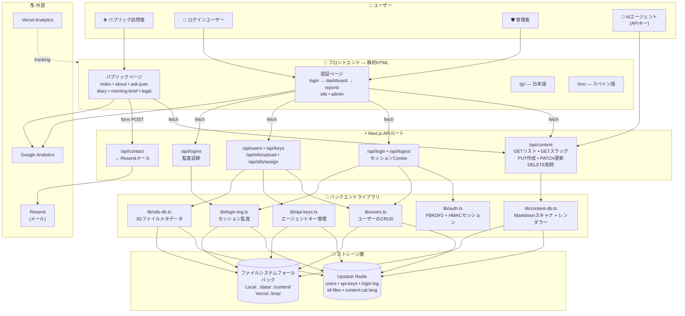

# フアンの世界 — AI開発者向けDevOpsマニュアル

> Juan's Worldフルスタックアプリケーションを理解、運用、複製するための包括的で初心者に優しいガイド。

---

## 目次

1. [エグゼクティブサマリー](#1-エグゼクティブサマリー)
2. [コアコンセプトの解説](#2-コアコンセプトの解説)
3. [システムアーキテクチャ図（注釈付き）](#3-システムアーキテクチャ図注釈付き)
4. [データフローウォークスルー](#4-データフローウォークスルー)
5. [権限とアクセスコントロール表](#5-権限とアクセスコントロール表)
6. [Redisデータモデルリファレンス](#6-redisデータモデルリファレンス)
7. [APIリファレンス](#7-apiリファレンス)
8. [環境変数セットアップガイド](#8-環境変数セットアップガイド)
9. [このシステムの複製方法（ステップバイステップ）](#9-このシステムの複製方法ステップバイステップ)
10. [用語集](#10-用語集)

---

## 1. エグゼクティブサマリー

**Juan's World**は、単一の運用者——フアン——のために構築された多言語コンテンツウェブサイトです。フアンは英語、日本語、メキシコスペイン語の3言語で日記のエントリ、ブリーフィング、レポートを公開したいと考えており、一部のコンテンツは特定のログインユーザーに制限されています。このシステムの特異な点は、**AIエージェントによって共同管理される**ように設計されていることです。大規模言語モデルは、特別なAPIキーでログインし、新しい投稿を作成したり、既存の投稿を更新したり、コンテンツを削除したりすることができ、すべて人間の介入なしで行われます。

その中核には、このアプリケーションは**Next.js**のウェブサイトです。Next.jsは、ReactとNode.jsの上に動作するフレームワークです。Next.jsを初めて見る人のために説明すると、ブラウザで人々が見るウェブサイトの表示部分（フロントエンド）と、ログイン処理やデータ保存、メール送信などの目に見えないバックエンドロジックを、同じプロジェクト内で作成できるツールだと思ってください。Juan's Worldで表示されるページは、実際には`public/`フォルダに保存されているプレーンなHTMLファイルです。これらは「静的」であり、つまり異なる人が訪問しても変更されません。動的な部分——最新の日記投稿を取得したり、ユーザーがログインしているか確認したりするなど——は、`app/api/`フォルダ内に存在する**APIルート**と呼ばれる小さなプログラムによって処理されます。

このサイトは**Vercel**でホストされています。VercelはNext.jsアプリ専用に設計されたクラウドプラットフォームです。Vercelは自動的にGitHubリポジトリからコードを取得し、ビルドして、世界中の訪問者に提供します。Vercelの重要な特徴の一つは、ファイルシステムが`/tmp/`という一時フォルダを除いて読み取り専用であることです。つまり、アプリケーションはディスクに新しいファイルを永続的に保存できません。この問題を回避するために、このシステムは**Upstash Redis**をプライマリデータベースとして使用します。Redisは、すべてをメモリに保持する非常に高速なデータストアです。UpstashはREST APIを備えたホスト型Redisサービスを提供しており、Next.jsアプリがインターネット上で簡単なHTTPリクエストを使用して通信できることを意味します。Redisに到達できない場合でも、アプリはVercel上の`/tmp/`（サーバーレス関数の存続期間中は維持されます）や、ローカル開発時には`data/`フォルダにJSONファイルを書き込むフォールバックがあります。

このシステムは4種類の異なるユーザーを対象としています。**パブリック訪問者**はランディングページの閲覧、日記の閲覧、ブリーフィングの閲覧、コンタクトフォームからのメッセージ送信ができます。**ログインユーザー**はパーソナルダッシュボード、自分に割り当てられたレポート、3D STLファイルのリストにアクセスできます。**管理者**はすべてのユーザーの特権に加えて、他のユーザーの管理、AIエージェントのAPIキーの作成、監査ログの閲覧ができます。最後に、**AIエージェント**自体は、APIキーと呼ばれる長い秘密文字列で認証される特別なアクターです。エージェントが正しく署名されたリクエストを送信すると、コンテンツを直接作成、編集、削除できます。このアーキテクチャが選ばれた理由は、フアンに「手を離した」公開ワークフローを提供するためです。彼はAIにコンテンツを書いて投稿するように指示でき、それが数秒以内にサイトに表示されます。

---

## 2. コアコンセプトの解説

### 静的HTMLフロントエンド vs APIルート

従来のウェブサイトでは、サーバーが訪問者が来るたびにページを生成します。Juan's Worldでは、ほとんどのページは**静的HTML**ファイルです。これは、人間（またはビルド時に一度）によって書かれ、すべての訪問者に対して完全にそのまま提供されることを意味します。これらのファイルは`public/`ディレクトリにあり、`index.html`、`diary.html`、`about.html`などがあります。訪問者が`juansworld.xyz/diary.html`とブラウザに入力すると、Vercelはそのファイルをディスク上で見つけて送り返します。そのページをその場で構築するコードは実行されていません。

しかし、静的ファイルですべてを行うことはできません。ログインしているかどうかを確認することはできません。データベースから最新の日記投稿のリストを取得することはできません。メールを送信することはできません。これらの動的なタスクのために、システムは**APIルート**を使用します。APIルートは、特定のURLがリクエストされたときにサーバー上で実行される小さなコードです。Next.jsでは、APIルートは`app/api/`の下のフォルダ内にある`route.ts`という名前のファイルに存在します。例えば、日記ページが最新のライブアップデートを読み込みたい場合、ブラウザでJavaScriptを実行し、`fetch`リクエストを`/api/content?category=update&lang=en`に送信します。サーバーはそのリクエストを受信し、`app/api/content/route.ts`内のコードを実行し、Redisからデータを取得し、JSONとして返します。ブラウザはそのJSONを取得し、新しいHTMLをページに注入します。静的HTMLをウェブサイトの「フレーム」、APIルートをフレームをライブデータで満たす「エンジン」と考えてください。

### Redisをプライマリデータベースとして、ファイルシステムフォールバック付き

**データベース**は、後で見つけるために情報を保存する場所です。ほとんどのウェブサイトはPostgreSQLやMySQLのような従来のデータベースを使用します。Juan's Worldは代わりに**Redis**を使用します。Redisは特別なのは、すべてのデータをハードディスクではなくメモリ（RAM）に保存するためです。これにより、信じられないほど高速になります——データの読み書きはミリ秒の分数で完了します。使用されている特定のサービスは**Upstash Redis**で、これはREST APIを備えたホスト型Redisインスタンスを提供し、Vercelのようなサーバーレス環境から簡単に使用できます。

このシステムは**3層フォールバック戦略**で設計されています。アプリがデータを読み書きする必要がある場合、常に最初にRedisを試します。Redisが応答すれば、それが最も高速で信頼性の高いパスです。Redisが失敗した場合（例えば、ネットワークタイムアウトやサービスが一時的に停止している場合）、アプリはローカルファイルシステムにJSONファイルの読み書きを試みます。開発者のラップトップでは、このファイルは`./data/`にあります。Vercelでは`/tmp/`にあります。Vercelの`/tmp/`フォルダは書き込み可能ですが、その内容はプラットフォームが新しいサーバーインスタンスを起動するたびに予測不可能に失われます。したがって、ファイルシステムフォールバックは「最善の努力」の安全網です。ファイルシステムも利用できない場合（例えば、ディスクがいっぱいまたは権限が間違っている場合）、アプリは**インメモリキャッシュ**にデータのコピーを保持します——現在のサーバーレス関数の存続期間中のみ存在するJavaScript変数です。メモリ内のデータは最も高速にアクセスできますが、関数が終了すると完全に失われます。この層状のアプローチにより、ほぼあらゆる障害シナリオ下でもアプリケーションが動作し続けることが保証されます。

### HMAC署名を使用したセッションベース認証

**認証**は、自分が誰であるかを証明するプロセスです。フアンがウェブサイトにログインすると、システムは彼が訪問するすべてのページで彼がフアンであることを覚えておく必要があります。これを行うための標準的なWebメカニズムは**セッションCookie**です。簡単な言葉で説明すると：フアンがログインページでユーザー名とパスワードを送信すると、サーバーはパスワードをチェックします。正しければ、サーバーは**セッショントークン**と呼ばれる小さなテキストを作成します。このトークンには、フアンのユーザー名と、サーバーだけが知っている秘密キーで作成された**デジタル署名**が含まれています。サーバーは次に、このトークンを**Cookie**内でブラウザに送り返します——ブラウザが保存し、同じウェブサイトへの将来のすべてのリクエストとともに自動的に送信する特別な種類のテキストファイルです。

署名は**HMAC**（Hash-based Message Authentication Code）という技術を使用して作成されます。このシステムでは、サーバーは文字列`"juan:my-super-secret-key"`を取り、SHA-256ハッシュアルゴリズムを実行し、結果の最初の32文字のみを保持します。これが署名になります。最終的なトークンは`"juan:signature"`のように見えます。その後のすべてのリクエストで、サーバーはCookieを読み取り、ユーザー名と署名に分割し、同じ秘密キーを使用して署名が*あるべき*ものを再計算し、両者を比較します。一致すれば、サーバーはCookieが本当にこのサーバーによって作成され、改ざんされていないことを知ります。一致しなければ、リクエストは拒否されます。Cookieは`httpOnly`とマークされており、ブラウザで実行されているJavaScriptはそれを読み取ることができません——これは、悪意のあるスクリプトがCookieを盗もうとする一般的な攻撃である**クロスサイトスクリプティング（XSS）**を防ぎます。

### AIエージェントのAPIキー認証

セッションとCookieはブラウザを使用する人間には非常に適していますが、AIエージェントはブラウザを使用しません。AIエージェントは、ウェブサイトのAPIと直接対話する必要があるプログラム（別のコンピュータや別のクラウドで実行されることが多い）です。この目的のために、システムは**APIキー**を使用します。APIキーは、パスワードのように機能する長いランダムな文字と数字の文字列ですが、人が入力するのではなくソフトウェアが使用することを意図しています。Juan's Worldでは、APIキーは`admin.html`パネルで管理者によって生成され、Redisの`api-keys`キーの下に保存されます。典型的なキーは`jw_7b8ea214866210a23d22693cd205109b28b710785d15c69bc36a2e7597a7c9af`のように見えます。

AIエージェントが新しい日記エントリを公開したい場合、サーバーにHTTPリクエストを送信します。そのリクエストのヘッダーに、`x-api-key: jw_7b8ea...`を含めます。サーバーはリクエストを受信し、ヘッダーからキーを読み取り、Redisに保存されている有効なAPIキーのリストにその正確な文字列が存在するかどうかをチェックします。存在する場合、リクエストは続行を許可されます。存在しない場合、サーバーは`403 Forbidden`エラーを返します。これは、Cookieも署名検証も有効期限もないはるかに単純な認証モデルです——キーは有効か無効かのどちらかです。トレードオフは、APIキーが盗まれた場合、管理者がシステムからキーを削除するまで、誰でもそのキーを持っていればAIエージェントを装ることができることです。

### コンテンツライフサイクル：MarkdownがAIエージェントからライブWebページへどのように行くか

Juan's Worldのコンテンツは**Markdown**として保存されます——`#`を見出しに、`*`を強調に使用するなどのシンプルな記号を使用する軽量なテキスト形式です。Markdownは人間とAIの両方にとって読み書きが簡単であるため人気があります。各コンテンツには、先頭に小さな**フロントマター**ブロックもあります。これは、トリプルダッシュ（`---`）で囲まれたセクションで、タイトル、日付、投稿が公開かどうかなどのメタデータが含まれています。フロントマターは、人間に優しいデータ形式である**YAML**で書かれています。

AIエージェントから訪問者の画面への新しい日記投稿の完全な旅は以下の通りです：

1. **エージェントが投稿を作成します。** AIはMarkdown本文（例：`## Day 10\n\nToday I tested...`）、タイトル、および**スラッグ**と呼ばれるURLに優しい識別子（例：`day-10-testing`）を書きます。
2. **エージェントがPUTリクエストを送信します。** APIキーをヘッダーに入れ、`slug`、`title`、`content`、`category`（日記エントリの場合`update`に設定）、`lang`（`en`、`ja`、または`es`に設定）を含むJSON本文を持つHTTPリクエストを`PUT https://juansworld.xyz/api/content/upload`に送信します。
3. **サーバーがAPIキーを検証します。** `app/api/content/upload/route.ts`のルートハンドラーは、リクエストが信頼できるエージェントから来たことを確認するために`validateApiKey()`を呼び出します。
4. **サーバーがフロントマターを構築します。** タイトルと今日の日付を取得し、YAMLブロックを構築します。タイトルにコロンなどの特殊文字が含まれている場合は、YAMLを有効に保つために二重引用符で囲みます。
5. **サーバーが誤って含まれたフロントマターを除去します。** 時々、AIはコンテンツに独自の`---`ブロックを含めます。サーバーは`gray-matter`ライブラリを使用して、埋め込まれたフロントマターを検出して削除し、本文テキストのみを保持します。
6. **サーバーがRedisに保存します。** `saveContentToRedis('update', 'day-10-testing', fullMarkdown, 'en')`を呼び出します。これはRedisに`HSET`コマンドを送信します。Redisキーは`content:update:en`、フィールド名はスラッグ、値はフロントマターを含む完全なMarkdown文字列です。
7. **訪問者が日記ページを読み込みます。** 誰かが`diary.html`を訪れると、ページのJavaScriptが実行され、`fetch`リクエストを`GET /api/content?category=update&lang=en`に送信します。
8. **サーバーがRedisから読み取ります。** コンテンツAPIは`scanCategory('update', 'en')`を呼び出し、Redisに`content:update:en`ハッシュ内のすべてのフィールドを要求します。
9. **サーバーがHTMLをレンダリングします。** Redisが返す各Markdown文字列に対して、サーバーは`gray-matter`を使用してフロントマターを解析し、`marked`を使用してMarkdown本文をHTMLに変換します。JSON配列のコンテンツアイテムを返します。
10. **ブラウザが投稿を表示します。** 日記ページのJavaScriptがJSONを受信し、HTML要素を生成し、ページに注入します。投稿に`isPublic: true`がある場合、ページの上部に「Live」バッジと共に表示されます。

この完全なサイクル——AIエージェントが投稿を書くから訪問者がそれを見るまで——1秒未満で完了します。

### ロールベースアクセスコントロール（パブリック / ユーザー / 管理者 / AIエージェント）

**ロールベースアクセスコントロール（RBAC）**は、異なるユーザーに異なる「ロール」が割り当てられ、各ロールに異なることができる許可が与えられるセキュリティパターンです。Juan's Worldには4つのロールがありますが、そのうちの1つ（AIエージェント）は伝統的な意味では本当のユーザーアカウントではありません。

**パブリック**は実際にはロールではありません——単に「認証が不要」という意味です。インターネット上の誰もがパブリックページを訪問できます：ホームページ、日記、朝のブリーフィング、Aboutページ、コンタクトフォームです。パブリックコンテンツはパーソナライズされていません。誰もが同じものを見ます。

**ユーザー**は標準的な認証済みロールです。誰かがユーザー名とパスワードでログインすると、システムはユーザーデータベースで彼らを調べ、彼らのロールが`user`であることを確認します。ユーザーはダッシュボード、自分に割り当てられたレポートや特定のユーザーに制限されていないSTLファイル、自分自身のログイン履歴を表示できます。他のユーザーのコンテンツを見たり、管理パネルにアクセスしたり、新しい投稿を作成したりすることはできません。

**管理者**はスーパーユーザーロールです。管理者はユーザーのできるすべてのことに加えて、`admin.html`にアクセスしてユーザーアカウントを作成および削除したり、AIエージェントのAPIキーを生成および取り消したり、すべてのユーザーの完全なログイン監査ログを表示したりできます。コードでは、`checkAuth()`を呼び出して現在のユーザー名を取得し、次に`findUser(username)`を呼び出して彼らのロールを調べ、最後に`role === 'admin'`であるかどうかをチェックすることによって管理者チェックが実行されます。

**AIエージェント**は、ユーザー名とパスワードではなくAPIキーで認証される特別なアクターです。エージェントは、ユーザー/管理者階層から完全に分離された独自の権限セットを持っています。`/api/content/upload`エンドポイントを介してコンテンツを作成、更新、削除できますが、通常のログインページを介してログインしたり、ダッシュボードを表示したり、レポートにアクセスしたりすることはできません。権限マトリックスでは、エージェントはコンテンツを変更できる唯一のアクターであり、管理者はユーザーとキーを管理できる唯一の人間です。

---

## 3. システムアーキテクチャ図（注釈付き）

以下は、アーキテクチャガイドからのシステム概要図で、各ノードと接続を説明するインラインコメントが追加されています。



### 図のウォークスルー

上部の**ユーザー**サブグラフから始めます。左端には**パブリック訪問者**がサイトに到着します。彼らはフロントエンドセクションの**パブリックページ**にしか到達できません——ホームページ、Aboutページ、日記など。これらは静的HTMLファイルなので、Vercelはコードを実行せずに直接それらを提供します。しかし、日記ページと朝のブリーフィングページにはJavaScriptが含まれており、**API層のコンテンツAPI**に`fetch`呼び出しを行います。コンテンツAPIは次に**コンテンツデータベースライブラリ**と通信し、最初に**Upstash Redis**からの読み取りを試みます。Redisにデータがある場合、JSONとして返され、ブラウザで解析され、ページに表示されます。Redisがダウンしている場合、ライブラリは**ファイルシステム**からMarkdownファイルを読み取るフォールバックに入ります。

図の中央には、**ログインユーザー**が異なるパスを辿ります。彼らは`login.html`から始まり、そこで資格情報を**認証API**に送信します。認証APIは**認証ライブラリ**を使用してパスワードを検証し（PBKDF2ハッシュを使用）、署名付きセッションCookieを作成します（HMAC-SHA256を使用）。認証されると、ユーザーはダッシュボードやその他の保護されたページにアクセスできます。すべての保護されたページのフェッチはセッションCookieを含み、サーバーは各リクエストでそれを検証します。ユーザーはレポートとSTLファイルを表示できますが、自分に割り当てられたものまたはパブリックとしてマークされたもののみです。

右側には、**管理者**が同じログインフローを使用しますが、`admin.html`に追加のコントロールが表示されます。管理パネルは**管理API**にリクエストを行い、ユーザーのロールが`admin`であることを確認してから、ユーザーの作成、APIキーの生成、STLファイルの管理を許可します。管理APIは**ユーザーライブラリ**、**APIキーライブラリ**、**STLデータベースライブラリ**と通信し、すべて同じRedis優先、ファイルシステムフォールバックのストレージパターンを使用します。

最後に、右端には**AIエージェント**がいます。これはHTMLフロントエンドを完全にバイパスします。HTTPリクエストを`x-api-key`ヘッダー付きで**コンテンツAPI**に直接送信します。コンテンツAPIは**APIキーライブラリ**（Redisから読み取り）に対してこのキーを検証します。キーが有効な場合、エージェントは作成、更新、または削除できるコンテンツを即座にすべての訪問者に表示させることができます。エージェントはHTMLページを見ることなく、Cookieを使用せず、ログインシステムとやり取りせず——JSON API呼び出しを介してのみ動作するマシン対マシンのアクターです。

---

## 4. データフローウォークスルー

### フローA：パブリック訪問者が日記エントリを読む

このウォークスルーは、見知らぬ人が日記ページを訪問したときのすべてのネットワークホップとコード実行ステップを追跡します。

1. **訪問者がブラウザを開き、`juansworld.xyz/diary.html`と入力します。**
   彼らのブラウザはインターネットを介してVercelのサーバーにHTTP `GET`リクエストを送信します。

2. **Vercelはリクエストを受信し、一致するファイルを探します。**
   パスが`.html`で終わるため、Vercelはそれを静的ファイルリクエストとして扱います。`public/diary.html`を見つけ、ブラウザにストリーミングし始めます。

3. **ブラウザはHTMLを受信し、解析し始めます。**
   HTMLにはCSSの`<link>`タグ、JavaScriptの`<script>`タグ、およびカレンダーナビゲーションバーと折りたたみ可能な日エントリ（Day 0からDay 9）を含む日記ページの基本構造が含まれています。

4. **ブラウザは`loadLiveUpdates()`を呼び出す`<script>`タグに遭遇します。**
   このJavaScript関数は訪問者のブラウザで実行されます。`GET /api/content?category=update&lang=en`への`fetch`リクエストを作成します。

5. **ブラウザはサーバーに`fetch`リクエストを送信します。**
   これは、初期ページ読み込みからの2番目のHTTPリクエストです。同じドメインへの`fetch`であるため、ブラウザはCookieを自動的に含めますが、訪問者がログインしていないため、セッションCookieはありません。

6. **Vercelはリクエストを`app/api/content/route.ts`にルーティングします。**
   Next.jsはパス`/api/content`を認識し、そのファイルの`GET`ハンドラーを実行することを知っています。

7. **ハンドラーが`checkAuth()`を呼び出します。**
   この関数は`session` Cookieを探します。存在しないため、`null`を返します。ハンドラーはユーザーがゲストであることを認識します。

8. **ハンドラーが`getAllContent('en')`を呼び出します。**
   この関数は`lib/content-db.ts`で定義されています。英語の`update`カテゴリのすべてのコンテンツアイテムを見つける必要があります。

9. **`scanCategory('update', 'en')`がコンテンツライブラリ内で実行されます。**
   この関数は2つのことを並行して行います：
   - `scanRedisCategory('update', 'en')`を呼び出し、Upstash Redisに`HGETALL content:update:en`コマンドを送信します。
   - `scanFilesystemCategory('update', 'en')`を呼び出し、`content/updates/`からMarkdownファイルを読み取ります。

10. **Redisは保存されているすべての日記エントリのハッシュで応答します。**
    ハッシュ内の各フィールドはスラッグ（`day-10-testing`のような）、各値はフロントマターを含む完全なMarkdown文字列です。Redisに到達できない場合、関数は空の配列を返し、ファイルシステムスキャンが引き継ぎます。

11. **コンテンツライブラリが各Markdown文字列を解析します。**
    Redisが返す各アイテム（およびディスク上で見つかった各ファイル）に対して、ライブラリは`parseMarkdownItem()`を呼び出します。この関数は`gray-matter`を使用してフロントマターを本文から分離し、タイトルと日付を抽出し、`marked`を使用してMarkdown本文をHTMLに変換します。

12. **ライブラリはRedisとファイルシステムの結果をマージし、スラッグで重複を排除します。**
    同じスラッグがRedisとディスクの両方に存在する場合、Redisバージョンが勝ちます。マージされたリストは日付で並べ替えられ、最新が最初になります。

13. **ハンドラーが可視性でフィルタリングします。**
    訪問者がログインしていないため、ハンドラーはパブリックでないもの、ブリーフでないもの、または将来の公開日を持つものを削除します。`isPublic: true`または`category: 'brief'`のアイテムのみが残ります。

14. **ハンドラーが結果をページネーションします。**
    最初の20アイテム（ページ1）を取得し、JSONとして返します。

15. **ブラウザがJSONレスポンスを受信します。**
    `loadLiveUpdates()`関数は配列を調べます。空の場合、ライブアップデートコンテナを完全に非表示にします。アイテムがある場合は、それぞれに対してHTMLを生成します——タイトル、レンダリングされたHTML本文、「Live」バッジ——および日記ページの上部にある`#live-updates` divに注入します。

16. **訪問者が完全な日記ページを見ます。**
    静的エントリ（Day 0–9）は初期HTML読み込みから表示され、ライブアップデートはAPIフェッチから上部に表示されます。プロセス全体は通常200〜500ミリ秒かかります。

---

### フローB：ログインユーザーが認証される

このウォークスルーは、フアンがパスワードを入力する瞬間からダッシュボードが読み込まれるまでの完全なログインシーケンスを追跡します。

1. **フアンが`login.html`に移動し、ユーザー名とパスワードを入力します。**
   「サインイン」ボタンをクリックします。ページのJavaScriptがフォーム送信を傍受し、ブラウザがページをリロードしないようにします。

2. **JavaScriptが`/api/login`に`POST`リクエストを送信します。**
   リクエスト本文はJSONオブジェクトです：`{"username": "juan", "password": "hunter2"}`。これが最初のリクエストであるため、まだCookieはありません。

3. **Vercelがリクエストを`app/api/login/route.ts`にルーティングします。**
   `POST`ハンドラーはJSON本文を受信し、ユーザー名とパスワードを抽出します。

4. **ハンドラーが`verifyUserPassword('juan', 'hunter2')`を呼び出します。**
   この関数は`lib/users.ts`にあります。まず`getUsers()`を呼び出して完全なユーザーリストを読み込みます。

5. **`getUsers()`は最初にRedisを試します。**
   Redisに`GET users`を送信します。RedisがJSON配列を返す場合、JavaScriptオブジェクトに解析されます。Redisが空またはダウンしている場合、`data/users.json`（またはVercelでは`/tmp/users.json`）の読み取りを試みます。そのファイルが存在しない場合、デフォルトの管理者ユーザーをパスワード`changeme123`で作成し保存します。

6. **`findUser('juan')`がユーザーリストを検索します。**
   `username === 'juan'`であるオブジェクトを探すために配列をスキャンします。

7. **パスワードハッシュがソルトとハッシュに分割されます。**
   保存されたパスワードは`salt:hash`のように見えます——例えば、`a1b2c3:7d8e9f...`。関数はソルトを抽出し、`verifyPassword('hunter2', 'a1b2c3', '7d8e9f...')`を実行します。

8. **PBKDF2がハッシュを再計算します。**
   `lib/auth.ts`内で、`hashPassword()`は同じソルト、100,000回の反復、およびSHA-256でPBKDF2を実行します。新しいハッシュを生成し、保存されたハッシュと比較します。一致すれば、パスワードは正しいです。

9. **ハンドラーが`createSession('juan')`を呼び出します。**
   この関数はユーザー名と環境変数`SESSION_SECRET`を取り、`"juan:SESSION_SECRET"`として連結し、その結果にSHA-256を実行します。最初の32文字の16進数を署名として保持します。完全なトークンは`"juan:signature"`です。

10. **ハンドラーがセッションCookieを設定します。**
    `cookies().set('session', token, { httpOnly: true, secure: true, sameSite: 'lax', maxAge: 604800 })`を呼び出します。これはブラウザにCookieを7日間保存し、ドメインへの将来のすべてのリクエストで自動的に送信するよう指示します。`httpOnly`であるため、JavaScriptはそれを読み取ることができず、XSS攻撃を防ぎます。

11. **ハンドラーがユーザーの最終ログイン時刻を更新します。**
    `updateUserLastLogin('juan')`を呼び出し、ユーザーの`lastLoginAt`フィールドを変更し、ユーザーリストをRedisに保存し直します。

12. **ハンドラーがログインイベントを記録します。**
    `lib/login-log.ts`の`recordLoginEvent()`を呼び出し、ユーザー名、アクション（`login`）、タイムスタンプ、IPアドレス、ブラウザユーザーエージェントを含むイベントオブジェクトを追加します。これはRedisの`login-log`キーの下に保存されます。

13. **ハンドラーが`{ success: true, username: 'juan' }`を返します。**
    ブラウザはこのJSONを受信し、`dashboard.html`にリダイレクトします。

14. **ダッシュボードページが読み込まれます。**
    ブラウザは`dashboard.html`（静的ファイル）をリクエストし、Vercelがそれを提供します。ページにはJavaScriptが含まれており、いくつかの`fetch`呼び出しを行います。これには`GET /api/content`と`GET /api/logins`が含まれます。

15. **各`fetch`が自動的にセッションCookieを含めます。**
    ブラウザは同じドメインへのすべてのリクエストに`Cookie: session=juan:signature`を添付します。

16. **サーバーがすべてのリクエストでCookieを検証します。**
    `checkAuth()`はCookieを読み取り、ユーザー名と署名に分割し、同じ`SESSION_SECRET`を使用して予想される署名を再計算し、比較します。一致すれば、ユーザー名を返します。一致しなければ、`null`を返し、APIは`401`エラーを返します。

17. **`findUser('juan')`は`role: 'admin'`を含むユーザーオブジェクトを返します。**
    コンテンツAPIはこのロールを使用して、ユーザーが何を見ることが許可されているかを決定します。管理者はすべてのコンテンツを見ます。通常のユーザーは自分に割り当てられたコンテンツのみを見ます。

18. **ダッシュボードがパーソナライズされたデータをレンダリングします。**
    ブラウザはフィルタリングされたコンテンツリストとログイン履歴を受信し、フアンのレポート、アップデート、STLファイル、および最終ログイン時刻と最近のイベントを示す「セッションアクティビティ」カードを表示します。

---

### フローC：AIエージェントが新しい投稿を公開する

このウォークスルーは、AIが公開することを決定した瞬間から投稿がサイト上でライブに表示されるまでの完全なPUTリクエストを追跡します。

1. **AIエージェントが日記エントリを公開することを決定します。**
   エージェントはタイトル（`"Day 11 — Reflections"`）、スラッグ（`"day-11-reflections"`）、およびMarkdown本文を作成しました。ターゲットエンドポイントが`PUT https://juansworld.xyz/api/content/upload`であることを知っています。

2. **エージェントがHTTPリクエストを構築します。**
   ヘッダーに`x-api-key: jw_7b8ea214866210a23d22693cd205109b28b710785d15c69bc36a2e7597a7c9af`を設定し、以下のJSON本文を構築します：
   ```json
   {
     "slug": "day-11-reflections",
     "title": "Day 11 — Reflections",
     "content": "## Morning\n\nToday I...",
     "category": "update",
     "lang": "en",
     "isPublic": true
   }
   ```

3. **エージェントがPUTリクエストを送信します。**
   リクエストはインターネットを介してVercelのエッジネットワークに到達します。

4. **Vercelがリクエストを`app/api/content/upload/route.ts`にルーティングします。**
   Next.jsはパス`/api/content/upload`を一致させ、`PUT`ハンドラーを実行します。

5. **ハンドラーが`x-api-key`ヘッダーを読み取ります。**
   APIキー文字列を抽出し、`lib/api-keys.ts`の`validateApiKey(apiKey)`を呼び出します。

6. **`validateApiKey()`がキーリストを読み込みます。**
   `getAllApiKeys()`を呼び出します。これは最初にRedis（`GET api-keys`）を試し、次に`data/api-keys.json`または`/tmp/api-keys.json`にフォールバックし、最後にメモリにフォールバックします。

7. **キーがリストで見つかります。**
   `keys.some((k) => k.key === key)`は`true`を返します。エージェントのキーは以前に管理者によって生成され保存されていました。リクエストは認証されています。

8. **ハンドラーが必須フィールドを検証します。**
   `slug`、`title`、および`content`が存在し、`category`が`report`、`brief`、または`update`のいずれかであることを確認します。スラッグは、非英数字文字をアンダースコアに置き換えることでサニタイズされます。

9. **ハンドラーが誤って含まれたフロントマターを除去します。**
   エージェントがコンテンツに独自の`---`ブロックを含めている可能性があります。ハンドラーは`matter(content).content.trim()`を呼び出して、本文テキストのみを抽出し、エージェントが誤って含めたYAMLを破棄します。

10. **ハンドラーがYAMLフロントマターを構築します。**
    `---`で始まる文字列を構築し、`title`、`date`（今日の日付を`YYYY-MM-DD`形式で）、および`isPublic`などのオプションフィールドの行を追加します。タイトルにコロンなどのYAML特殊文字が含まれている場合は、二重引用符で囲みます。最終的なフロントマターは次のようになります：
    ```yaml
    ---
    title: "Day 11 — Reflections"
    date: 2026-04-25
    isPublic: true
    ---
    ```

11. **ハンドラーがフロントマターと本文を結合します。**
    フロントマター、2つの改行、クリーンなコンテンツ、および末尾の改行を1つのMarkdown文字列に連結します。

12. **ハンドラーが`saveContentToRedis()`を呼び出します。**
    カテゴリ（`update`）、サニタイズされたスラッグ（`day-11-reflections`）、完全なMarkdown文字列、および言語（`en`）をコンテンツデータベースライブラリに渡します。

13. **`saveContentToRedis()`がRedisに`HSET`コマンドを送信します。**
    Redisキーは`content:update:en`です。フィールド名はスラッグ、値はフロントマターを含む完全なMarkdownです。コマンドは次のようになります：
    ```
    HSET content:update:en day-11-reflections "---\ntitle: ..."
    ```

14. **Redisが保存を確認します。**
    Redisはフィールドが設定されたことを示す整数を返します。ライブラリはハンドラーに`true`を返します。

15. **ハンドラーがエージェントに成功を返します。**
    JSONで応答します：`{ success: true, slug: "day-11-reflections", category: "update", storage: "redis" }`。

16. **訪問者がしばらくして日記ページを読み込みます。**
    彼らのブラウザは`GET /api/content?category=update&lang=en`を送信します。

17. **`scanCategory()`がRedisから読み取ります。**
    `HGETALL content:update:en`を送信し、ハッシュを受信します。これには新しい`day-11-reflections`フィールドが含まれるようになりました。

18. **新しい投稿が解析されレンダリングされます。**
    `parseMarkdownItem()`はフロントマターからタイトルと日付を抽出し、`marked`を使用して本文をHTMLに変換します。`isPublic`が`true`であるため、コンテンツAPIはレスポンスにそれを含めます。

19. **訪問者が日記の上部に新しい投稿を見ます。**
    ブラウザはレンダリングされたHTMLをライブアップデートセクションに「Live」バッジと共に注入します。エージェントのPUTから訪問者の画面までの完全なプロセスは1秒未満でした。

---

## 5. 権限とアクセスコントロール表

| 機能 | パブリック | ユーザー | 管理者 | AIエージェント | どのように適用されるか |
|---------|--------|------|-------|----------|-------------------|
| ランディングページの表示 (`index.html`) | ✅ | ✅ | ✅ | — | 認証不要；Vercelが提供する静的ファイル |
| 日記の表示 (`diary.html`) | ✅ | ✅ | ✅ | — | 認証不要；パブリックAPIフェッチ付きの静的ファイル |
| ブリーフィングの表示 (`morning-brief.html`) | ✅ | ✅ | ✅ | — | 認証不要；ブリーフカテゴリはデフォルトでパブリック |
| レポートの表示 | ❌ | ✅（割り当てのみ） | ✅（すべて） | — | `GET /api/reports`の`checkAuth()`；`role === 'admin'`でない限り`assignedUsers`でフィルタリング |
| STLリストの表示 | ❌ | ✅（割り当てのみ） | ✅（すべて） | — | `GET /api/stls`の`checkAuth()`；`role === 'admin'`でない限り`assignedUsers`でフィルタリング |
| STLのダウンロード | ❌ | ✅（割り当てのみ） | ✅（すべて） | — | `GET /api/stls/[filename]`の`checkAuth()`；ファイルをストリーミングする前に割り当てを検証 |
| ダッシュボード | ❌ | ✅ | ✅ | — | `checkAuth()`はセッションCookieがない場合401を返す；ダッシュボードHTMLはパブリックだがデータAPIは認証が必要 |
| 管理パネル (`admin.html`) | ❌ | ❌ | ✅ | — | `GET /api/users`と`GET /api/keys`の`requireAdmin()`；`role !== 'admin'`の場合403を返す |
| コンテンツの作成 | ❌ | ❌ | ❌ | ✅ | `PUT /api/content/upload`の`validateApiKey()`；ヘッダーが欠落しているか無効な場合401/403を返す |
| コンテンツの更新 | ❌ | ❌ | ❌ | ✅ | `PATCH /api/content/upload`の`validateApiKey()`；作成と同じキー検証 |
| コンテンツの削除 | ❌ | ❌ | ❌ | ✅ | `DELETE /api/content/upload`の`validateApiKey()`；作成と同じキー検証 |
| コンタクトフォーム | ✅ | ✅ | ✅ | — | 認証不要；`POST /api/contact`は誰からでもフォームデータを受け入れる |
| ログイン監査ログの表示 | ❌ | ✅（自分のみ） | ✅（すべて） | — | `GET /api/logins`の`checkAuth()`；非管理者は`getUserLoginLog(username)`を見る、管理者は`?all=true`を渡せる |

### セキュリティモデルの概要

セキュリティモデルは、2つの並列認証システムと、すべての重要な境界での明示的なロールチェックを持つ**ディフェンスイン・デプス（深層防御）**アプローチです。人間のユーザーにとって、モデルはサーバー側の秘密（HMAC-SHA256）で署名された**セッションCookie**に依存しています。Cookieは`httpOnly`、`secure`（本番環境）、および`sameSite=lax`であり、それぞれXSS、中間者攻撃、およびCSRF攻撃から保護します。すべての保護されたAPIルートは、`checkAuth()`を呼び出すことから始まります。これは、続行する前にCookieの署名を検証します。認証後、ルートはユーザーの`role`をチェックするために`findUser()`を呼び出し、コンテンツルートはさらに`assignedUsers`と可視性ウィンドウ（`publishAt` / `expireAt`）でフィルタリングします。

AIエージェントにとって、モデルは**APIキー**——Redisに保存された長いランダムな文字列——を使用します。エージェントはすべてのリクエストでヘッダーにキーを含める必要があります。セッション、Cookie、またはエージェントのロール階層はありません。有効なキーか無効なキーかです。この分離は意図的です。APIキーが侵害された場合、攻撃者はコンテンツを作成、更新、または削除できるだけです。人間のユーザーを装うことはできず、ダッシュボードにアクセスすることはできず、エージェントエンドポイントを通じて制限されたレポートを表示することはできません。逆に、ユーザーのセッションが盗まれた場合、攻撃者はそのユーザーの割り当てられたコンテンツにのみアクセスでき、エージェントエンドポイントを通じてサイト全体のコンテンツを変更することはできません。管理者アカウントは2つのシステム間の唯一の橋であり、管理者アクセスには有効なセッションと`admin`ロールの両方が必要です。

---

## 6. Redisデータモデルリファレンス

| キー名 | タイプ | 保存内容 | 読み取り者 | 書き込み者 | 例の値 |
|----------|------|----------------|--------------|---------------|---------------|
| `users` | 文字列 (JSON) | すべてのユーザーアカウントの配列 | `lib/users.ts`（ログイン、管理API） | `lib/users.ts`（作成、更新、削除ユーザー） | `[{"username":"admin","passwordHash":"salt:hash","role":"admin","lastLoginAt":"2026-04-25T10:00:00Z"}]` |
| `api-keys` | 文字列 (JSON) | 有効なAIエージェントAPIキーの配列 | `lib/api-keys.ts`（エージェント認証） | `lib/api-keys.ts`（管理者がキーを作成/削除） | `[{"key":"jw_abc123...","name":"Agent-1","createdAt":"2026-04-25T10:00:00Z","createdBy":"admin"}]` |
| `login-log` | 文字列 (JSON) | ログイン/ログアウト監査イベントの配列 | `lib/login-log.ts`（ダッシュボード表示） | `lib/login-log.ts`（ログイン/ログアウトハンドラー） | `[{"username":"juan","action":"login","timestamp":"2026-04-25T10:00:00Z","ip":"203.0.113.1","userAgent":"Mozilla/5.0..."}]` |
| `stl-files` | 文字列 (JSON) | 3D STLファイルメタデータレコードの配列 | `lib/stls-db.ts`（STLリストAPI） | `lib/stls-db.ts`（アップロード、割り当て、削除） | `[{"id":"1234567890-abc","title":"Model A","filename":"model-a.stl","assignedUsers":["juan"],"uploadedAt":"2026-04-25T10:00:00Z","uploadedBy":"admin"}]` |
| `incoming-emails` | 文字列 (JSON) | 受信した受信メールの配列 | `lib/email-db.ts`（エージェント読み取りAPI） | `lib/email-db.ts`（インバウンドWebhook） | `[{"id":"1712345678901-abc","from":"sender@example.com","to":"hello@juansworld.xyz","subject":"Hello","text":"...","receivedAt":"2026-04-25T10:00:00Z","read":false}]` |
| `content:report:en` | ハッシュ | 英語レポートのスラッグ→Markdown文字列のマップ | `lib/content-db.ts`（コンテンツAPI） | `lib/content-db.ts`（エージェントアップロード） | `{ "apology-to-nick": "---\ntitle: Apology...\n---\n\nContent..." }` |
| `content:brief:en` | ハッシュ | 英語ブリーフのスラッグ→Markdown文字列のマップ | `lib/content-db.ts`（コンテンツAPI） | `lib/content-db.ts`（エージェントアップロード） | `{ "brief-2026-04-25": "---\ntitle: Morning Brief...\n---\n\nContent..." }` |
| `content:brief:ja` | ハッシュ | 日本語ブリーフのスラッグ→Markdown文字列のマップ | `lib/content-db.ts`（コンテンツAPI） | `lib/content-db.ts`（エージェントアップロード） | `content:brief:en`と同じ構造 |
| `content:brief:es` | ハッシュ | スペイン語ブリーフのスラッグ→Markdown文字列のマップ | `lib/content-db.ts`（コンテンツAPI） | `lib/content-db.ts`（エージェントアップロード） | `content:brief:en`と同じ構造 |
| `content:update:en` | ハッシュ | 英語日記アップデートのスラッグ→Markdown文字列のマップ | `lib/content-db.ts`（日記ライブアップデート） | `lib/content-db.ts`（エージェントアップロード） | `{ "day-11-reflections": "---\ntitle: Day 11...\n---\n\nToday I..." }` |
| `content:update:ja` | ハッシュ | 日本語日記アップデートのスラッグ→Markdown文字列のマップ | `lib/content-db.ts`（日記ライブアップデート） | `lib/content-db.ts`（エージェントアップロード） | `content:update:en`と同じ構造 |
| `content:update:es` | ハッシュ | スペイン語日記アップデートのスラッグ→Markdown文字列のマップ | `lib/content-db.ts`（日記ライブアップデート） | `lib/content-db.ts`（エージェントアップロード） | `content:update:en`と同じ構造 |

### Redisが選ばれた理由

**Redis**がプライマリデータベースとして選ばれたのは3つの理由があります。第一に、**速度**：Redisがすべてをメモリに保存するため、読み書き操作はサブミリ秒で完了します。これは、訪問者が瞬時のページ読み込みを期待し、AIエージェントが高速連続でコンテンツを公開する可能性があるウェブサイトにとって重要です。第二に、**シンプルさ**：Redisのデータ構造（文字列とハッシュ）は、アプリケーションのニーズにきれいにマッピングされます。ユーザーリスト、APIキー、監査ログはJSON文字列として保存されます。コンテンツアイテムはRedisハッシュとして保存されます。フィールド名はスラッグ、値はMarkdownです——これにより、データベース全体を読み取らずに個々の投稿を取得、更新、または削除することが容易になります。第三に、**Vercelとの互換性**：Upstash RedisはREST APIを公開しており、これはサーバーレスのNext.js関数が通常のHTTPリクエストを使用して通信できることを意味します。永続的なTCP接続を維持する必要がなく、これはVercelの一時的な関数環境では問題になります。

### ファイルシステムフォールバックがデータ損失からどのように保護するか

ファイルシステムフォールバックは**グレースフルデグラデーション**戦略です。理想的な場合、Redisは常に利用可能で、すべてのデータはクラウドに安全に保存されます。しかし、ネットワークは信頼できません。Redisが到達不能になった場合——おそらくUpstashの停止、ネットワークパーティション、または誤構成の環境変数のために——アプリケーションはクラッシュしません。代わりに、すべてのライブラリ（`users.ts`、`api-keys.ts`、`login-log.ts`、`content-db.ts`、`stls-db.ts`、`email-db.ts`）には並列のファイルシステムパスがあります。開発者のマシンでは、これらのファイルは`./data/`にあり、再インストール間でデータを保持するかどうかに応じてGitにコミットされるか`.gitignore`に追加されます。Vercelでは、`/tmp/`にあります。これはサーバーレス環境で唯一書き込み可能なディレクトリです。

Vercelの`/tmp/`フォールバックには重要な制限があります：**デプロイメントやコールドスタート間で永続的ではありません**。Vercelがコードの新しいバージョンをデプロイするとき、またはアイドル状態になった関数インスタンスがシャットダウンされて再起動されるとき、`/tmp/`ディレクトリは消去されます。これは、Redisがダウンしていて*かつ*関数がコールドスタートしている場合、最後のウォームインスタンス以来`/tmp/`に書き込まれたデータが失われることを意味します。最終的な保護層は**インメモリキャッシュ**です。各ライブラリは、最も最近読み込まれたデータを保持するJavaScript変数を保持します。Redisとファイルシステムの両方が失敗した場合でも、アプリは同じ関数呼び出しで以前に読み込んだデータを提供し続けます。この3層ケーキ——Redis（永続的なクラウド）、ファイルシステム（半永続的なローカル）、メモリ（高速だが一時的）——は、コールドスタート後に一部の最近書き込まれたデータが一時的に利用できなくなる可能性があるものの、ほぼあらゆる障害シナリオでアプリケーションが動作し続けることを保証します。

---

## 7. APIリファレンス

### コンテンツAPI

#### `GET /api/content`

| 属性 | 値 |
|-----------|-------|
| **メソッド** | `GET` |
| **認証が必要** | パブリックコンテンツには不要；プライベートコンテンツにはセッションCookieが必要 |
| **クエリパラメータ** | `category` (オプション): `report`, `brief`, または `update`; `lang` (オプション): `en`, `ja`, または `es` (デフォルト `en`); `page` (オプション): ページ番号 (デフォルト `1`); `slug` (オプション): スラッグで単一アイテムを取得 |
| **レスポンス** | JSON `{ items: [...], page, total_pages, total, user, role }` または単一スラッグ検索の場合 `{ item, user, role }` |

コンテンツアイテムをリストし、可視性とユーザーの権限でフィルタリングします。パブリック訪問者はパブリックなブリーフとアップデートのみを見ます。ログインユーザーは割り当てられたコンテンツを見ます。管理者はすべてを見ます。`slug`が指定された場合、単一アイテムを返すか`404`を返します。

---

#### `PUT /api/content/upload`

| 属性 | 値 |
|-----------|-------|
| **メソッド** | `PUT` |
| **認証が必要** | `x-api-key` ヘッダー |
| **リクエストボディ** | JSON: `{ slug, title, content, category, lang, isPublic, publishAt?, expireAt?, assignedUsers? }` |
| **レスポンス** | JSON `{ success: true, slug, category, storage: "redis" }` またはファイルシステムフォールバックの場合 `{ success: true, slug, category, path }` |

新しいコンテンツアイテムを作成します。`content`から誤って含まれたフロントマターを除去し、サーバー側でYAMLフロントマターを構築し、Redisに保存します。APIキーが欠落している場合は`401`、無効な場合は`403`、必須フィールドが欠落している場合は`400`を返します。

---

#### `PATCH /api/content/upload`

| 属性 | 値 |
|-----------|-------|
| **メソッド** | `PATCH` |
| **認証が必要** | `x-api-key` ヘッダー |
| **リクエストボディ** | JSON: `{ slug, title?, content?, category?, lang?, isPublic?, publishAt?, expireAt?, assignedUsers? }` |
| **レスポンス** | JSON `{ success: true, slug, category, action: "updated" }` |

既存のコンテンツアイテムを部分的に更新します。Redisから現在のMarkdownを読み取り、フロントマターを解析し、提供されたフィールドをマージし、フロントマターを再構築し、保存し直します。スラッグが存在しない場合は`404`を返します。

---

#### `DELETE /api/content/upload`

| 属性 | 値 |
|-----------|-------|
| **メソッド** | `DELETE` |
| **認証が必要** | `x-api-key` ヘッダー |
| **クエリパラメータ** | `slug` (必須), `category` (オプション, デフォルト `update`), `lang` (オプション, デフォルト `en`) |
| **レスポンス** | JSON `{ success: true, slug, category, action: "deleted" }` |

Redisおよびファイルシステムに存在する場合はファイルシステムからコンテンツアイテムを削除します。スラッグが欠落している場合は`400`を返します。

---

### 認証API

#### `POST /api/login`

| 属性 | 値 |
|-----------|-------|
| **メソッド** | `POST` |
| **認証が必要** | 不要 |
| **リクエストボディ** | JSON: `{ username, password }` |
| **レスポンス** | JSON `{ success: true, username }` または `{ error, status: 401 }` |

PBKDF2ハッシュを使用してユーザー名とパスワードを検証します。有効な場合、7日間の有効期限を持つHMAC-SHA256署名付きセッションCookieを作成し、`lastLoginAt`を更新し、ログインイベントを記録し、成功を返します。

---

#### `POST /api/logout`

| 属性 | 値 |
|-----------|-------|
| **メソッド** | `POST` |
| **認証が必要** | セッションCookie（推奨だがオプション） |
| **リクエストボディ** | なし |
| **レスポンス** | JSON `{ success: true, message: "正常にログアウトしました" }` |

`maxAge: 0`で空の値に設定することでセッションCookieをクリアします。有効なセッションが存在した場合、監査ログにログアウトイベントを記録します。

---

### 管理API

#### `GET /api/users`

| 属性 | 値 |
|-----------|-------|
| **メソッド** | `GET` |
| **認証が必要** | セッションCookie + `role: admin` |
| **レスポンス** | JSON `{ users: [{ username, role }] }` または `{ error, status: 401/403 }` |

すべてのユーザーアカウントのリストをユーザー名とロールと共に返します。パスワードハッシュはレスポンスに決して含まれません。

---

#### `POST /api/users`

| 属性 | 値 |
|-----------|-------|
| **メソッド** | `POST` |
| **認証が必要** | セッションCookie + `role: admin` |
| **リクエストボディ** | JSON: `{ action: "create"|"update"|"delete", username, password?, role?, newUsername? }` |
| **レスポンス** | JSON `{ success: true, user? }` または `{ error, status: 400/401/403 }` |

ユーザーアカウントに対してCRUD操作を実行します。`create`はPBKDF2ハッシュ済みパスワードで新しいユーザーを作成します。`update`はユーザー名、パスワード、またはロールを変更します。`delete`はユーザーを削除します。

---

#### `GET /api/keys`

| 属性 | 値 |
|-----------|-------|
| **メソッド** | `GET` |
| **認証が必要** | セッションCookie + `role: admin` |
| **レスポンス** | JSON `{ keys: [{ key, name, createdAt, createdBy }] }` または `{ error, status: 401/403 }` |

すべてのAIエージェントAPIキーを返します。管理者がエージェントと共有できるように、完全なキー文字列が表示されます。

---

#### `POST /api/keys`

| 属性 | 値 |
|-----------|-------|
| **メソッド** | `POST` |
| **認証が必要** | セッションCookie + `role: admin` |
| **リクエストボディ** | JSON: `{ name }` で作成、または `{ action: "delete", key }` で取り消し |
| **レスポンス** | JSON `{ success: true, key: { key, name, createdAt, createdBy } }` または `{ success: true }` |

新しいランダムなAPIキー（プレフィックス `jw_` + 64文字の16進数）を生成するか、既存のものを削除します。管理者のユーザー名は`createdBy`として記録されます。

---

### レポートAPI

#### `GET /api/reports`

| 属性 | 値 |
|-----------|-------|
| **メソッド** | `GET` |
| **認証が必要** | セッションCookie |
| **クエリパラメータ** | `page` (オプション, デフォルト `1`), `opponent` (オプション, タイトルでフィルタリング) |
| **レスポンス** | JSON `{ reports, page, total_pages, total, user, role }` または `{ error, status: 401 }` |

`reports/`ディレクトリからMarkdownレポートのページ分割されたリストを返します。非管理者ユーザーは自分に割り当てられたものか割り当てがないもののみを見ます。管理者は`status`フィールド（`live`または`scheduled`）を持つすべてのレポートを見ます。

---

#### `GET /api/report`

| 属性 | 値 |
|-----------|-------|
| **メソッド** | `GET` |
| **認証が必要** | セッションCookie |
| **クエリパラメータ** | `id` (必須, レポートスラッグ) |
| **レスポンス** | JSON `{ report: { slug, title, date, content, html, ... }, user }` または `{ error, status: 400/401/404 }` |

完全なMarkdownコンテンツとレンダリングされたHTMLを持つ単一のレポートを返します。`/api/reports`と同じ割り当てと可視性フィルターの対象となります。

---

### コンタクトAPI

#### `POST /api/contact`

| 属性 | 値 |
|-----------|-------|
| **メソッド** | `POST` |
| **認証が必要** | 不要 |
| **リクエストボディ** | `multipart/form-data`: `name`, `email`, `reason`, `message` |
| **レスポンス** | HTTP 303 リダイレクト先 `ask-juan.html?sent=1` または `ask-juan.html?error=...` |

コンタクトフォームの送信を受け入れ、Resendを介してメールとして転送します。`from`アドレスは`onboarding@resend.dev`（Resendのデフォルト送信者）であり、`to`アドレスは環境変数`CONTACT_EMAIL`から取得されます。成功またはエラーのクエリパラメータを持ってコンタクトページにリダイレクトします。

---

### 監査API

#### `GET /api/logins`

| 属性 | 値 |
|-----------|-------|
| **メソッド** | `GET` |
| **認証が必要** | セッションCookie |
| **クエリパラメータ** | `all` (オプション): `true`でユーザーが管理者の場合、すべてのユーザーのイベントを返します |
| **レスポンス** | JSON `{ events: [...], lastLoginAt, user, role }` または `{ error, status: 401/404 }` |

ログイン/ログアウト監査履歴を返します。通常のユーザーは自分自身のイベントのみを見ます。管理者は`?all=true`を渡して全員のイベントを見ることができます。`lastLoginAt`フィールドはユーザープロファイルから最終ログインタイムスタンプを示します。

---

### STL API

#### `GET /api/stls`

| 属性 | 値 |
|-----------|-------|
| **メソッド** | `GET` |
| **認証が必要** | セッションCookie |
| **レスポンス** | JSON `{ stls: [{ id, title, filename, assignedUsers, uploadedAt, uploadedBy }] }` または `{ error, status: 401 }` |

3D STLファイルメタデータのリストを返します。非管理者ユーザーは自分に割り当てられたファイルのみを見ます。管理者はすべてのファイルを見ます。

---

#### `POST /api/stls/upload`

| 属性 | 値 |
|-----------|-------|
| **メソッド** | `POST` |
| **認証が必要** | セッションCookie + `role: admin` |
| **リクエストボディ** | `multipart/form-data`: `file` (バイナリSTLファイル), `title` |
| **レスポンス** | JSON `{ success: true, stl: { id, title, filename, ... } }` または `{ error, status: 401/403 }` |

3D STLファイルをサーバーにアップロードし、そのメタデータを記録します。Vercelでは、ファイルは`/tmp/stls/`に保存されます。ローカル開発では、`public/stls/`に入ります。

---

#### `POST /api/stls/assign`

| 属性 | 値 |
|-----------|-------|
| **メソッド** | `POST` |
| **認証が必要** | セッションCookie + `role: admin` |
| **リクエストボディ** | JSON: `{ id, usernames: string[] }` |
| **レスポンス** | JSON `{ success: true }` または `{ error, status: 400/401/403 }` |

ユーザー名のリストをSTLファイルに割り当てます。それらのユーザー（と管理者）だけがリストでそのファイルを見ることができます。

---

### メールAPI

#### `POST /api/email/inbound`

| 属性 | 値 |
|-----------|-------|
| **メソッド** | `POST` |
| **認証が必要** | `x-webhook-secret` ヘッダーが環境変数`EMAIL_WEBHOOK_SECRET`と一致する必要があります |
| **リクエストボディ** | 一般的なメールフィールドを持つJSON: `from`, `to`, `subject`, `text`, `html` (異なる転送サービスが使用する複数のフィールド名を受け入れます) |
| **レスポンス** | JSON `{ success: true, id, from, subject }` または `{ success: true, ignored: true, reason: "auto-reply" }` |

受信メール転送サービス（ImprovMX、Cloudflare Email Routingなど）のWebhookエンドポイント。メールをRedisに保存します。自動返信および不在メッセージは静かに無視されます。

---

#### `GET /api/email`

| 属性 | 値 |
|-----------|-------|
| **メソッド** | `GET` |
| **認証が必要** | `x-api-key` ヘッダー |
| **クエリパラメータ** | `id` (オプション): IDで単一メールを取得; `unread` (オプション): `true`の場合、未読のみをフィルタリング |
| **レスポンス** | JSON `{ emails: [{ id, from, to, subject, receivedAt, read, preview }], total }` または個別検索の場合 `{ email }` |

AIエージェントに保存された受信メールを返します。リストビューはペイロードを小さく保つためにHTML本文を省略します。特定のIDが見つからない場合は`404`を返します。

---

#### `PATCH /api/email`

| 属性 | 値 |
|-----------|-------|
| **メソッド** | `PATCH` |
| **認証が必要** | `x-api-key` ヘッダー |
| **クエリパラメータ** | `id` (必須) |
| **リクエストボディ** | JSON: `{ read: boolean }` |
| **レスポンス** | JSON `{ success: true, id, read }` または `{ error, status: 400/404 }` |

メールを既読または未読としてマークします。エージェントがどのメールをすでに処理したかを追跡するのに役立ちます。

---

#### `DELETE /api/email`

| 属性 | 値 |
|-----------|-------|
| **メソッド** | `DELETE` |
| **認証が必要** | `x-api-key` ヘッダー |
| **クエリパラメータ** | `id` (必須) |
| **レスポンス** | JSON `{ success: true, id, action: "deleted" }` または `{ error, status: 400/404 }` |

ストレージからメールを完全に削除します。

---

## 8. 環境変数セットアップガイド

このセクションでは、システムが必要とするすべての環境変数について、それぞれの値の取得先、および欠落した場合の影響を段階的に説明します。

### ステップ 1: `.env.local` ファイルを作成する

プロジェクトのルートに `.env.local` という名前のファイルを作成します。このファイルは Next.js によって開発中に自動的に読み込まれ、Git によって無視されます（すでに `.gitignore` に含まれているはずです）。このファイルをバージョン管理にコミットしないでください——秘密情報が含まれています。

```bash
touch .env.local
```

### ステップ 2: 各変数を追加する

#### `UPSTASH_REDIS_REST_URL`

| プロパティ | 値 |
|----------|-------|
| **これは何か** | Upstash Redis データベースの HTTPS エンドポイント |
| **取得先** | [upstash.com](https://upstash.com) にアクセス → サインアップ → 新しい Redis データベースを作成 → Vercel のデプロイメントに近いリージョンを選択 → データベースダッシュボードで **REST API → UPSTASH_REDIS_REST_URL** の値をコピーします。`https://us1-ample-cod-12345.upstash.io` のような形式です |
| **欠落した場合の影響** | Redis に接続できません。すべての DB ライブラリはファイルシステム（ローカルでは `./data/`、Vercel では `/tmp/`）またはメモリストレージにフォールバックします。Vercel のコールドスタート時にデータが失われる可能性があります。 |
| **必須か** | はい（本番環境用） |

#### `UPSTASH_REDIS_REST_TOKEN`

| プロパティ | 値 |
|----------|-------|
| **これは何か** | Upstash Redis データベースの認証トークン |
| **取得先** | 同じ Upstash データベースダッシュボードで **REST API → UPSTASH_REDIS_REST_TOKEN** の値をコピーします。`AYaA...` のような長い文字列です |
| **欠落した場合の影響** | 上記と同じ——Redis 接続が失敗し、システムはファイルシステム/メモリにフォールバックします |
| **必須か** | はい（本番環境用） |

#### `SESSION_SECRET`

| プロパティ | 値 |
|----------|-------|
| **これは何か** | セッション Cookie に署名するために使用される秘密文字列。誰かがこの秘密を知ると、セッション Cookie を偽造して任意のユーザーを装うことができます |
| **取得先** | 暗号的に安全な乱数生成器を使用して自分で生成します。ターミナルでこのコマンドを実行してください: `openssl rand -hex 32`。出力は 64 文字の 16 進数文字列です |
| **欠落した場合の影響** | Next.js は起動時にランダムな秘密を自動生成しますが、**これは危険です**。秘密はすべてのデプロイメント/コールドスタートで変更され、既存のすべてのセッション Cookie が無効になります。ユーザーが予期せずログアウトされます |
| **必須か** | はい |

#### `ADMIN_PASSWORD_HASH`

| プロパティ | 値 |
|----------|-------|
| **これは何か** | デフォルトの管理者パスワードハッシュのオプションのオーバーライド。設定されている場合、システムはデフォルトの `changeme123` の代わりにこの事前ハッシュされたパスワードで管理者ユーザーを作成します |
| **取得先** | 小さな Node.js スクリプトを使用してハッシュを生成します。`hash-password.js` というファイルを作成します:<br>`const crypto = require('crypto');`<br>`const password = 'あなたの安全な管理者パスワード';`<br>`const salt = crypto.randomBytes(16).toString('hex');`<br>`const hash = crypto.pbkdf2Sync(password, salt, 100000, 32, 'sha256').toString('hex');`<br>`console.log(\`ADMIN_PASSWORD_HASH=${salt}:${hash}\`);`<br>`node hash-password.js` で実行します |
| **欠落した場合の影響** | システムはユーザー名 `admin`、パスワード `changeme123` のデフォルト管理者ユーザーを作成します。これは初回セットアップには便利ですが、本番環境では安全ではありません |
| **必須か** | いいえ（ただし本番環境では強く推奨） |

#### `CONTACT_EMAIL`

| プロパティ | 値 |
|----------|-------|
| **これは何か** | コンタクトフォームの送信が転送されるメールアドレス |
| **取得先** | 自分のメールアドレスを使用します。`hello@juansworld.xyz` や `youremail@gmail.com` など。実際に確認するアドレスであることを確認してください |
| **欠落した場合の影響** | コンタクトフォームが「設定」エラーで失敗します。訪問者はフォーム送信後にエラーメッセージを見ます |
| **必須か** | はい（コンタクトフォームを機能させたい場合） |

#### `RESEND_API_KEY`

| プロパティ | 値 |
|----------|-------|
| **これは何か** | Resend メールサービスの API キー。コンタクトフォームのメール送信に使用されます |
| **取得先** | [resend.com](https://resend.com) にアクセス → サインアップ → API Keys に移動 → API キーを作成 → キーをコピーします（`re_` で始まります） |
| **欠落した場合の影響** | コンタクトフォームの送信がメールを送信できません。フォームはクエリパラメータ `?error=config` でリダイレクトします |
| **必須か** | はい（コンタクトフォームを機能させたい場合） |

#### `EMAIL_WEBHOOK_SECRET`

| プロパティ | 値 |
|----------|-------|
| **これは何か** | 受信メール Webhook が信頼できる転送サービスから来たことを検証し、ランダムな攻撃者から来たものではないことを確認するために使用される秘密文字列 |
| **取得先** | `SESSION_SECRET` と同じ方法で生成します: `openssl rand -hex 32` |
| **欠落した場合の影響** | Webhook エンドポイントは URL を知っている誰からでもメールを受け入れ、攻撃者がシステムに偽のメールを注入できるようになります。本番環境ではこれを設定してください |
| **必須か** | いいえ（ただし本番環境では強く推奨） |

#### `VERCEL`

| プロパティ | 値 |
|----------|-------|
| **これは何か** | コードがクラウドで実行されるときに Vercel プラットフォームによって自動的に `"1"` に設定される環境変数 |
| **取得先** | 手動で設定する必要はありません。Vercel が自動的に注入します |
| **欠落した場合の影響** | システムはローカル開発環境で実行されていると仮定し、`/tmp/` の代わりに `./data/` と `./public/stls/` のパスを使用します。これはローカル開発では正しい動作です |
| **必須か** | いいえ（プラットフォームが自動設定） |

### ステップ 3: `.env.local` ファイルの例

```bash
# データベース
UPSTASH_REDIS_REST_URL=https://us1-ample-cod-12345.upstash.io
UPSTASH_REDIS_REST_TOKEN=AYaA...あなたのトークン...

# セキュリティ
SESSION_SECRET=a3f7b2c9...64文字の16進数文字列...
ADMIN_PASSWORD_HASH=オプション:salt:hash...生成した場合...

# メール
CONTACT_EMAIL=hello@juansworld.xyz
RESEND_API_KEY=re_...あなたのResendキー...
EMAIL_WEBHOOK_SECRET=b4e1d8f2...64文字の16進数文字列...
```

### ステップ 4: Vercel で環境変数を設定する

コードを GitHub にプッシュして Vercel にインポートした後、Vercel ダッシュボードにも同じ変数を追加する必要があります:

1. [vercel.com](https://vercel.com) にアクセス → プロジェクトを選択 → Settings → Environment Variables。
2. 変数を1つずつ追加します。**引用符で囲まないで**ください——Vercel は入力されたとおりに正確に保存します。
3. **Save** をクリックします。
4. プロジェクトを再デプロイします（Vercel は通常これを自動的に求めます）。

このステップなしでは、`.env.local` がラップトップ上で完璧に動作しても、本番デプロイメントは Redis に接続したりメールを送信したりできません。

---

## 9. このシステムの複製方法（ステップバイステップ）

このガイドは、基本的な HTML と JavaScript を知っているが、バックエンドを構築したことがない人を想定しています。最終的に、Juan's World アーキテクチャの動作するコピーが Vercel 上で実行されるようになります。

### ステップ 1: Next.js アプリの足場を組む

**何が起こっているか:** Next.js は、必要なすべてのファイルと設定を含む新しいプロジェクトを作成するためのコマンドラインツールを提供します。

ターミナルを開いて実行します:

```bash
npx create-next-app@latest juansworld --typescript --tailwind --eslint --app --src-dir=false --import-alias "@/*"
```

プロンプトが表示されたら、以下のように回答します:
- **Turbopack を使用しますか？** → はい（推奨）
- **デフォルトのインポートエイリアスをカスタマイズしますか？** → いいえ

これにより、`juansworld/` というフォルダが作成されます。移動します:

```bash
cd juansworld
```

### ステップ 2: 必要な依存関係をインストールする

システムは、デフォルトの Next.js テンプレートに含まれていないいくつかのライブラリを使用します。インストールします:

```bash
npm install @upstash/redis resend marked gray-matter
```

| パッケージ | 目的 |
|---------|---------|
| `@upstash/redis` | HTTPS 経由で Upstash Redis と通信します |
| `resend` | Resend サービスを通じてメールを送信します |
| `marked` | Markdown テキストを HTML に変換します |
| `gray-matter` | Markdown ファイルから YAML フロントマターを解析します |

### ステップ 3: Upstash Redis をセットアップする

**何が起こっているか:** クラウドデータベースを作成しており、アプリケーションはそれを使用してユーザー、コンテンツ、API キーを保存します。

1. [upstash.com](https://upstash.com) にアクセスして無料アカウントに登録します。
2. **Create Database** をクリックします。
3. `juansworld` と名付けます。
4. 訪問者の大多数が住んでいる場所に近いリージョンを選択します（北米の場合は `us-east-1` など）。
5. データベースが作成されるまで数秒待ちます。
6. データベースページで **REST API** セクションを見つけます。
7. `UPSTASH_REDIS_REST_URL` と `UPSTASH_REDIS_REST_TOKEN` の値をコピーします。
8. プロジェクトのルートに `.env.local` ファイルを作成して貼り付けます:
   ```bash
   UPSTASH_REDIS_REST_URL=https://...あなたのURL...
   UPSTASH_REDIS_REST_TOKEN=AYaA...あなたのトークン...
   SESSION_SECRET=$(openssl rand -hex 32)
   ```

### ステップ 4: 認証ライブラリを作成する

**何が起こっているか:** パスワードハッシュとセッション Cookie を処理するコアセキュリティモジュールを構築しています。

`lib/auth.ts` ファイルを作成します:

```typescript
import { cookies } from 'next/headers';
import crypto from 'crypto';

const SESSION_SECRET = process.env.SESSION_SECRET || crypto.randomBytes(32).toString('hex');
export const ADMIN_PASSWORD_HASH = process.env.ADMIN_PASSWORD_HASH || '';

export function hashPassword(password: string, salt?: string): { salt: string; hash: string } {
  const s = salt || crypto.randomBytes(16).toString('hex');
  const hash = crypto.pbkdf2Sync(password, s, 100000, 32, 'sha256').toString('hex');
  return { salt: s, hash };
}

export function verifyPassword(password: string, salt: string, hashed: string): boolean {
  const { hash } = hashPassword(password, salt);
  return hash === hashed;
}

export function createSession(username: string): string {
  const signature = crypto.createHash('sha256').update(`${username}:${SESSION_SECRET}`).digest('hex').slice(0, 32);
  return `${username}:${signature}`;
}

export async function checkAuth(): Promise<string | null> {
  const cookieStore = await cookies();
  const sessionToken = cookieStore.get('session')?.value;
  if (!sessionToken) return null;

  const parts = sessionToken.split(':');
  if (parts.length !== 2) return null;

  const [username, signature] = parts;
  const expected = crypto.createHash('sha256').update(`${username}:${SESSION_SECRET}`).digest('hex').slice(0, 32);

  if (signature === expected) {
    return username;
  }
  return null;
}
```

### ステップ 5: ユーザーデータベースライブラリを作成する

**何が起こっているか:** ユーザーアカウントを保存および取得するモジュールを構築しており、Redis → ファイル → メモリフォールバックパターンを使用しています。

`lib/users.ts` ファイルを作成します。完全な実装は約 200 行で、以下のパターンに従います:

1. `@upstash/redis` を使用して Redis への接続を試みます。
2. Vercel では `/tmp/users.json`、ローカルでは `./data/users.json` に切り替わる `USERS_FILE` パスを定義します。
3. `getUsersFromRedis()`、`saveUsersToRedis()`、`getUsersFromFile()`、`saveUsersToFile()` を実装します。
4. `getUsers()` を Redis → ファイル → メモリ → デフォルトシードのフォールバックチェーンで実装します。
5. CRUD 関数を実装します: `findUser()`、`verifyUserPassword()`、`createUser()`、`updateUser()`、`deleteUser()`。
6. 初回実行時（Redis やファイルシステムにユーザーがいない場合）、パスワード `changeme123` のデフォルト管理者をシードします。

このリポジトリの `lib/users.ts` ソースファイルを完全な実装について参照してください。

### ステップ 6: API キーライブラリを作成する

**何が起こっているか:** AI エージェントが使用する秘密キーを生成および検証するモジュールを構築しています。

`lib/api-keys.ts` ファイルを作成します。パターンは `lib/users.ts` と同じですが、よりシンプルなデータモデルを持ちます:

```typescript
export interface ApiKey {
  key: string;        // 秘密キー自体、例: "jw_abc123..."
  name: string;       // 人間が読めるラベル、例: "Production Agent"
  createdAt: string;  // ISO タイムスタンプ
  createdBy: string;  // 作成した管理者のユーザー名
}
```

主要な関数:
- `generateApiKey()` → `jw_${randomBytes(32).toString('hex')}` を返します
- `validateApiKey(key)` → すべてのキーを読み込み、提供された文字列が存在するかどうかをチェックします
- `createApiKey(name, createdBy)` → 新しいキーを生成して保存します
- `deleteApiKey(key)` → ストレージからキーを削除します

### ステップ 7: コンテンツデータベースライブラリを作成する

**何が起こっているか:** Markdown ファイルを読み取り、フロントマターを解析し、HTML をレンダリングし、Redis と通信するモジュールを構築しています。

`lib/content-db.ts` ファイルを作成します。これは最も複雑なライブラリです。以下が必要です:

1. `(category, lang)` ペアをファイルシステムパスにマッピングする `ContentDirs` を定義します:
   ```typescript
   const CONTENT_DIRS = {
     report: { en: path.join(process.cwd(), 'reports') },
     brief: { en: 'content/briefs', ja: 'content/briefs-jp', es: 'content/briefs-mx' },
     update: { en: 'content/updates', ja: 'content/updates-jp', es: 'content/updates-mx' },
   };
   ```
2. `gray-matter` を使用してフロントマターを解析し、`marked` を使用して HTML をレンダリングします。
3. `scanRedisCategory()` を `content:update:en` のようなキーで `HGETALL` を使用して実装します。
4. `scanFilesystemCategory()` を `fs.readdir` と `fs.readFile` を使用して実装します。
5. `scanCategory()` を Redis とファイルシステムの結果をマージし、スラッグの競合で Redis が勝つように実装します。
6. `saveContentToRedis()` を `HSET` を使用して実装します。
7. `deleteContentFromRedis()` を `HDEL` を使用して実装します。

### ステップ 8: ログインとログアウト API ルートを作成する

**何が起こっているか:** 認証を処理する HTTP エンドポイントを構築しています。

`app/api/login/route.ts` を作成します:

```typescript
import { NextResponse } from 'next/server';
import { cookies } from 'next/headers';
import { createSession } from '@/lib/auth';
import { verifyUserPassword, updateUserLastLogin } from '@/lib/users';
import { recordLoginEvent } from '@/lib/login-log';

export async function POST(request: Request) {
  const { username, password } = await request.json();
  const valid = await verifyUserPassword(username, password);
  if (!valid) {
    return NextResponse.json({ error: 'Invalid credentials' }, { status: 401 });
  }
  const token = createSession(username);
  const cookieStore = await cookies();
  cookieStore.set('session', token, {
    httpOnly: true,
    secure: process.env.NODE_ENV === 'production',
    sameSite: 'lax',
    maxAge: 7 * 24 * 60 * 60,
    path: '/',
  });
  await updateUserLastLogin(username);
  await recordLoginEvent({
    username,
    action: 'login',
    timestamp: new Date().toISOString(),
    ip: request.headers.get('x-forwarded-for') || 'unknown',
    userAgent: request.headers.get('user-agent') || 'unknown',
  });
  return NextResponse.json({ success: true, username });
}
```

Cookie をクリアし、ログアウトイベントを記録する `app/api/logout/route.ts` を作成します。

### ステップ 9: コンテンツ API ルートを作成する

**何が起こっているか:** 訪問者にコンテンツを提供し、AI エージェントからコンテンツを受け入れるエンドポイントを構築しています。

`app/api/content/route.ts`（コンテンツをリスト/読み取るための GET ハンドラー）と `app/api/content/upload/route.ts`（エージェント CRUD のための PUT/PATCH/DELETE ハンドラー）を作成します。

GET ハンドラーは以下を行う必要があります:
- ユーザーをオプションで識別するために `checkAuth()` を呼び出します。
- `getAllContent(lang)` または `getContentBySlug(slug)` を呼び出します。
- `isContentVisible` と割り当てでフィルタリングします。
- ページ分割して JSON を返します。

アップロードハンドラーは以下を行う必要があります:
- `x-api-key` を読み取り、`validateApiKey()` を呼び出します。
- 必須フィールド（`slug`、`title`、`content`）を検証します。
- フロントマターを除去し、新しいフロントマターを構築し、Redis に保存します。
- 成功 JSON を返します。

### ステップ 10: 静的 HTML ページを作成する

**何が起こっているか:** 訪問者が見るウェブサイトの表示部分を構築しています。

`public/` フォルダに HTML ファイルを作成します:

```bash
mkdir -p public/jp public/mx
```

最低限、以下を作成します:
- `public/index.html` — ランディングページ
- `public/diary.html` — 折りたたみ可能なエントリとライブアップデート読み込みを持つ日記
- `public/login.html` — `/api/login` に POST するログインフォーム
- `public/dashboard.html` — ユーザーコンテンツを取得する保護されたページ
- `public/admin.html` — ユーザーと API キーを取得する管理パネル

各ページには以下が含まれる必要があります:
- `fetch('/api/content?category=update')` を呼び出してライブデータを読み込む `<script>`。
- セッション Cookie をチェックし、認証されていない場合はログインにリダイレクトする `<script>`（保護されたページ用）。
- 初回訪問者を `navigator.language` に基づいて `/jp/` または `/mx/` にリダイレクトする言語自動検出スクリプトを `<head>` に含めます。

### ステップ 11: Vercel にデプロイする

**何が起こっているか:** ウェブサイトをインターネット上に配置しています。

1. コードを GitHub リポジトリにプッシュします:
   ```bash
   git init
   git add .
   git commit -m "Initial commit"
   gh repo create juansworld --public --source=. --push
   ```

2. [vercel.com](https://vercel.com) にアクセスしてサインアップします。
3. **Add New Project** をクリックします。
4. GitHub リポジトリをインポートします。
5. Vercel は自動的に Next.js プロジェクトであることを検出します。
6. **Deploy** をクリックします。

### ステップ 12: Vercel で環境変数を設定する

**何が起こっているか:** Vercel に Redis への接続方法とメール送信方法を伝えています。

1. Vercel ダッシュボードで、プロジェクト → Settings → Environment Variables に移動します。
2. `.env.local` ファイルから各変数を追加します（完全なリストについてはセクション 8 を参照）。
3. **Save** をクリックして再デプロイします。

### ステップ 13: AI エージェント API キーフローをテストする

**何が起こっているか:** AI エージェントが認証してコンテンツを公開できることを確認しています。

1. ブラウザでデプロイされたサイトを開きます。
2. ログインページに移動し、`admin` とパスワード `changeme123`（またはカスタムの管理者パスワード）でログインします。
3. 管理パネルに移動します。
4. 新しい API キーを作成します。「テストエージェント」のような名前を付け、生成されたキーをコピーします。
5. ターミナルを開いて実行します:
   ```bash
   curl -X PUT https://your-domain.vercel.app/api/content/upload \
     -H "Content-Type: application/json" \
     -H "x-api-key: jw_...あなたのコピーしたキー..." \
     -d '{
       "slug": "test-post",
       "title": "My First Agent Post",
       "content": "## Hello World\n\nThis was posted by an AI agent!",
       "category": "update",
       "lang": "en",
       "isPublic": true
     }'
   ```
6. `{ "success": true, "slug": "test-post", "storage": "redis" }` を受け取るはずです。
7. ブラウザで日記ページを開きます。新しい投稿が上部に「Live」バッジと共に表示されるはずです。

これが機能すれば、AI エージェントからライブウェブページまでのシステム全体が稼働しています。

---

## 10. 用語集

| 用語 | 定義 |
|------|------------|
| **Next.js** | React フレームワークで、同じプロジェクト内で静的ウェブサイトとサーバー側レンダリングアプリケーションの両方を構築できます。ルーティング、API エンドポイント、ビルド最適化を自動的に処理します。 |
| **App Router** | Next.js の最新ルーティングシステムで、ページと API ルートは `app/` ディレクトリ内のファイルによって定義されます。古い「Pages Router」を置き換えます。 |
| **API ルート** | Next.js アプリのサーバー側関数で、特定の URL パスで HTTP リクエストに応答します。App Router では、これらは `app/api/` の下のフォルダ内にある `route.ts` という名前のファイルです。 |
| **Redis** | すべてのデータをメモリに保持して超高速アクセスを可能にするインメモリデータストア。文字列、ハッシュ、リスト、およびその他のデータ構造をサポートします。 |
| **Upstash** | REST API を備えた管理型 Redis サービスを提供するクラウドホスティングプロバイダー。Vercel のようなサーバーレス環境からの使用が容易になります。 |
| **Vercel** | Next.js のようなフロントエンドフレームワークのホスティングを目的としたクラウドプラットフォーム。自動的に GitHub からコードをビルドおよびデプロイし、グローバル CDN を介して提供します。 |
| **HMAC** | Hash-based Message Authentication Code。秘密キーとデータを組み合わせてハッシュ関数を実行することでデジタル署名を作成する技術。ここでは、Cookie が改ざんされていないことをサーバーが確認できるようにセッション Cookie に署名するために使用されます。 |
| **PBKDF2** | Password-Based Key Derivation Function 2。パスワードを安全にハッシュするための標準アルゴリズム。何千回もの反復を実行して、パスワードクラッキングを計算的に高価にします。 |
| **セッション Cookie** | ログインしているユーザーを識別するためにブラウザに保存される小さなテキストの断片。同じウェブサイトへのすべてのリクエストと自動的に送信されるため、サーバーはユーザーの身元を覚えておくことができます。 |
| **フロントマター** | Markdown ファイルの先頭にあるメタデータのブロックで、YAML 形式で記述され、トリプルダッシュ（`---`）で区切られています。タイトル、日付、作成者などの情報を、レンダリングされた出力に表示されずに保存します。 |
| **gray-matter** | Markdown ファイルからフロントマターを解析する JavaScript ライブラリ。YAML メタデータと本文テキストを分割して、それぞれを別々に処理できるようにします。 |
| **marked** | Markdown 構文を HTML に変換する JavaScript ライブラリ。`## 見出し` のようなテキストを `<h2>見出し</h2>` に変換します。 |
| **Resend** | トランザクションメールを送信するためのシンプルな API を持つメール配信サービス。このシステムでは、コンタクトフォームの送信をサイト所有者に転送するために使用されます。 |
| **MCP** | Model Context Protocol。AI エージェントが外部システムと対話できるようにするプロトコル。このコードベースでは直接実装されていませんが、API キーシステムは、構造化された方法で AI にデータを読み書きさせるという同様の目的を果たします。 |
| **静的 HTML** | 完全なファイルとして保存され、すべての訪問者に対して同一に提供されるウェブページ。サーバープログラムによってその場で生成されるものではありません。 |
| **SSR** | Server-Side Rendering。サーバーが各リクエストに対して動的に HTML を生成する技術。このシステムではページの SSR を使用せず、クライアント側の JavaScript フェッチを使用した静的 HTML を使用します。 |
| **CDN** | Content Delivery Network。訪問者に近い場所から静的ファイルをキャッシュして提供する、世界中に分散されたサーバーのネットワーク。読み込み時間を短縮します。 |
| **API キー** | ソフトウェアプログラムが API に対して自身を認証するために使用する長い秘密文字列。ユーザー名とパスワードとは異なり、API キーは通常、人間ではなく自動化されたシステムによって使用されます。 |
| **ロールベースアクセスコントロール (RBAC)** | ユーザーにロール（「user」や「admin」など）が割り当てられ、権限が個々のユーザーではなくロールに付与されるセキュリティモデル。 |
| **Markdown** | `#` を見出しに、`*` を強調に使用するなどのプレーンテキストの書式記号を使用してドキュメントを構造化する軽量マークアップ言語。特別なソフトウェアなしで読み書きが簡単です。 |
| **スラッグ** | コンテンツの URL に優しい識別子。通常はタイトルの小文字でハイフン付きのバージョンです。例えば、「Day 11 — Reflections」のスラッグは `day-11-reflections` かもしれません。 |
| **ファイルシステムフォールバック** | プライマリデータベースが利用できない場合に、アプリケーションがローカルファイルにデータを書き込むバックアップストレージ戦略。このシステムでは、Vercel では `/tmp/`、ローカル開発では `./data/` がフォールバックパスです。 |
| **インメモリキャッシュ** | プログラムの実行中にデータがプログラムの変数（RAM）に保持される一時的なストレージメカニズム。最も高速なストレージタイプですが、プログラムが停止すると失われます。 |
| **サーバーレス関数** | イベント（HTTP リクエストなど）によってトリガーされたときにのみクラウドで実行されるコードの一部。永続的なサーバー上では実行されません。代わりに、クラウドプロバイダーがオンデマンドで起動し、リクエストが完了すると停止します。 |
| **ハッシュ (データ構造)** | Redis では、ハッシュは文字列フィールド名を文字列値にマッピングするデータ構造で、JavaScript のオブジェクトに似ています。このシステムでは、フィールドがスラッグで値が Markdown のハッシュを使用してコンテンツアイテムを保存します。 |
| **HSET / HGETALL** | Redis コマンド。`HSET` はハッシュ内にフィールドと値のペアを保存します。`HGETALL` は一度にハッシュからすべてのフィールドと値のペアを取得します。 |
| **HTTP 401** | 「Unauthorized」を意味する HTTP ステータスコード。サーバーはリクエストを理解しましたが、認証を必要とします。このシステムでは、セッション Cookie または API キーが欠落している場合に返されます。 |
| **HTTP 403** | 「Forbidden」を意味する HTTP ステータスコード。リクエストは認証されましたが、ユーザーはアクションを実行する権限がありません。このシステムでは、非管理者が管理者エンドポイントにアクセスしようとした場合に返されます。 |
| **HTTP 404** | 「Not Found」を意味する HTTP ステータスコード。要求されたリソースが存在しません。このシステムでは、コンテンツスラッグまたはユーザーがデータベースに存在しない場合に返されます。 |
| **クロスサイトスクリプティング (XSS)** | 悪意のある JavaScript をウェブページに注入してデータを盗んだり、ユーザーの代わりにアクションを実行したりするセキュリティ攻撃。`httpOnly` Cookie フラグは、JavaScript がセッション Cookie を読み取るのを防ぐことでこれを防ぎます。 |
| **CSRF** | クロスサイトリクエストフォージェリ。悪意のあるウェブサイトが、ユーザーがログインしている別のサイトに対して不要なリクエストをユーザーのブラウザにだます攻撃。Cookie の `sameSite=lax` 設定がこれを軽減します。 |
| **コールドスタート** | サーバーレスコンピューティングでは、シャットダウンされた関数インスタンスを再起動する必要があるときに発生する遅延です。Vercel では、これは `/tmp/` ディレクトリも完全に消去されることを意味します。 |
| **YAML** | YAML Ain't Markup Language。設定ファイルや、このシステムではコンテンツフロントマターに使用される人間に優しいデータシリアライゼーション形式。 |
| **Fetch API** | サーバーに HTTP リクエストを行うためのブラウザに組み込まれた JavaScript 関数（`fetch()`）。フロントエンド全体で API ルートからデータを読み込むために使用されます。 |
| **JSON** | JavaScript Object Notation。構造化データを表現するための軽量なテキスト形式。このシステムの API ルートはすべて JSON レスポンスを返します。 |

---

*DevOps マニュアルの終わり*
