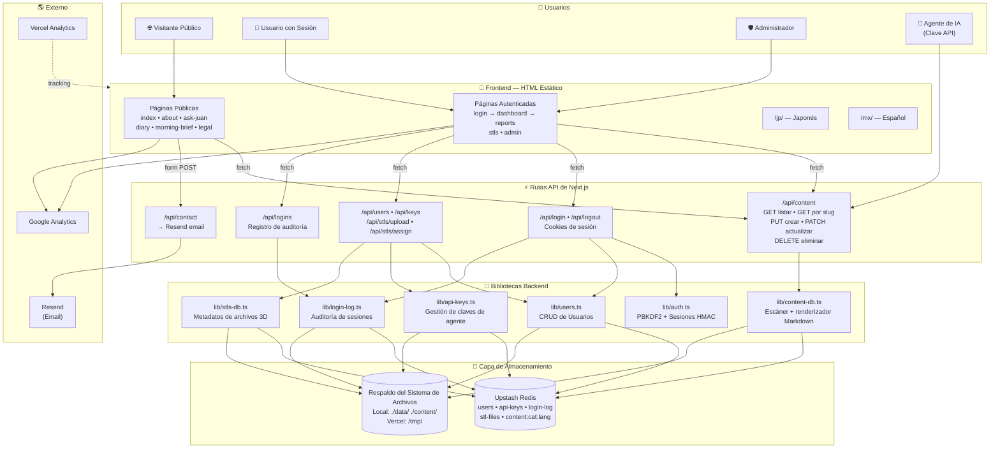

# El Mundo de Juan — Manual DevOps para Desarrolladores de IA

> Una guía técnica completa y accesible para comprender, operar y replicar la aplicación full-stack Juan's World.

---

## Tabla de Contenidos

1. [Resumen Ejecutivo](#1-resumen-ejecutivo)
2. [Conceptos Fundamentales Explicados](#2-conceptos-fundamentales-explicados)
3. [Diagrama de Arquitectura del Sistema (Anotado)](#3-diagrama-de-arquitectura-del-sistema-anotado)
4. [Recorridos del Flujo de Datos](#4-recorridos-del-flujo-de-datos)
5. [Tabla de Permisos y Control de Acceso](#5-tabla-de-permisos-y-control-de-acceso)
6. [Referencia del Modelo de Datos Redis](#6-referencia-del-modelo-de-datos-redis)
7. [Referencia de la API](#7-referencia-de-la-api)
8. [Guía de Configuración de Variables de Entorno](#8-guía-de-configuración-de-variables-de-entorno)
9. [Cómo Replicar Este Sistema (Paso a Paso)](#9-cómo-replicar-este-sistema-paso-a-paso)
10. [Glosario](#10-glosario)

---

## 1. Resumen Ejecutivo

**El Mundo de Juan** es un sitio web de contenido multilingüe construido para un único operador — Juan — que desea publicar entradas de diario, informes y reportes en tres idiomas (inglés, japonés y español mexicano) mientras mantiene parte del contenido restringido a usuarios específicos con sesión iniciada. El sistema es inusual porque está diseñado para ser **co-administrado por un agente de IA**: un modelo de lenguaje grande puede iniciar sesión con una clave API especial, crear nuevas publicaciones, actualizar las existentes y eliminar contenido — todo sin intervención humana.

En esencia, la aplicación es un sitio web de **Next.js**. Next.js es un framework que se ejecuta sobre React y Node.js. Si nunca has visto Next.js, piensa en él como una herramienta que te permite escribir tanto las partes visibles de un sitio web (las páginas que la gente ve en su navegador) como la lógica backend invisible (el código que maneja inicios de sesión, guarda datos y envía correos electrónicos) en el mismo proyecto. Las páginas visibles en el Mundo de Juan son archivos HTML planos almacenados en la carpeta `public/` — son "estáticos", lo que significa que no cambian cuando diferentes personas las visitan. Las partes dinámicas — como obtener la última publicación del diario o verificar si un usuario ha iniciado sesión — son manejadas por pequeños programas llamados **rutas API** que viven dentro de la carpeta `app/api/`.

El sitio está alojado en **Vercel**, una plataforma en la nube diseñada específicamente para aplicaciones Next.js. Vercel toma automáticamente el código de un repositorio de GitHub, lo compila y lo sirve a visitantes de todo el mundo. Una peculiaridad importante de Vercel es que su sistema de archivos es de solo lectura excepto por una carpeta temporal llamada `/tmp/`. Esto significa que la aplicación no puede guardar archivos nuevos en disco permanentemente. Para resolver esto, el sistema usa **Upstash Redis** como su base de datos principal. Redis es un almacén de datos extremadamente rápido que mantiene todo en memoria. Upstash proporciona Redis como un servicio alojado con una API REST, lo que significa que la aplicación Next.js puede comunicarse con él a través de internet usando solicitudes HTTP simples. Si Redis alguna vez no está disponible, la aplicación recurre a escribir archivos JSON en `/tmp/` en Vercel (que sobreviven durante la vida de la función serverless) o a una carpeta local `data/` durante el desarrollo.

El sistema sirve a cuatro tipos distintos de usuarios. Los **visitantes públicos** pueden navegar la página de inicio, leer el diario, ver informes y enviar mensajes a través de un formulario de contacto. Los **usuarios con sesión iniciada** obtienen acceso a un panel personal, reportes asignados a ellos y una lista de archivos STL 3D. Los **administradores** tienen todos los privilegios de usuario más la capacidad de gestionar otros usuarios, crear claves API para el agente de IA y ver registros de auditoría. Finalmente, el **agente de IA** es un actor especial que se autentica con una cadena secreta larga llamada clave API. Cuando el agente envía una solicitud firmada correctamente, puede crear, editar o eliminar contenido directamente. Esta arquitectura fue elegida porque le da a Juan un flujo de publicación "sin manos": puede decirle a su IA que escriba y publique contenido, y este aparece en el sitio en cuestión de segundos.

---

## 2. Conceptos Fundamentales Explicados

### Frontend HTML Estático vs. Rutas API

En un sitio web tradicional, cada página es generada por un servidor cuando alguien la visita. En el Mundo de Juan, la mayoría de las páginas son **archivos HTML estáticos**. Esto significa que fueron escritos una vez por un humano (o generados una vez en tiempo de compilación) y se sirven a cada visitante exactamente como están. Puedes encontrar estos archivos en el directorio `public/` — archivos como `index.html`, `diary.html` y `about.html`. Cuando un visitante escribe `juansworld.xyz/diary.html` en su navegador, Vercel simplemente encuentra ese archivo en disco y lo envía de vuelta. No hay código ejecutándose para construir esa página sobre la marcha.

Sin embargo, los archivos estáticos no pueden hacer todo. No pueden verificar si alguien ha iniciado sesión. No pueden obtener una lista de las últimas publicaciones del diario desde una base de datos. No pueden enviar un correo electrónico. Para estas tareas dinámicas, el sistema usa **rutas API**. Una ruta API es un pequeño fragmento de código que se ejecuta en el servidor cuando se solicita una URL específica. En Next.js, las rutas API viven en archivos llamados `route.ts` dentro de carpetas bajo `app/api/`. Por ejemplo, cuando la página del diario quiere cargar las actualizaciones más recientes, ejecuta JavaScript en el navegador que envía una solicitud `fetch` a `/api/content?category=update&lang=en`. El servidor recibe esa solicitud, ejecuta el código dentro de `app/api/content/route.ts`, obtiene los datos de Redis y los devuelve como JSON. El navegador toma ese JSON y lo inyecta en la página. Piensa en el HTML estático como el "marco" del sitio web, y las rutas API como el "motor" que llena el marco con datos en vivo.

### Redis como Base de Datos Principal con Respaldo del Sistema de Archivos

Una **base de datos** es simplemente un lugar para almacenar información para poder encontrarla más tarde. La mayoría de los sitios web usan bases de datos tradicionales como PostgreSQL o MySQL. El Mundo de Juan usa **Redis** en su lugar. Redis es especial porque almacena todo en memoria (RAM) en lugar de en un disco duro. Esto lo hace increíblemente rápido — leer o escribir un dato toma fracciones de milisegundo. El servicio específico usado es **Upstash Redis**, que proporciona una instancia Redis alojada a la que puedes conectarte por HTTPS usando una API REST simple. Esto es perfecto para Vercel porque no hay un servidor persistente; cada solicitud se ejecuta en una "función serverless" de corta duración, y Upstash Redis le da a esa función un lugar para guardar datos que sobreviven a la función misma.

El sistema está diseñado con una **estrategia de respaldo de tres capas**. Cuando la aplicación necesita leer o escribir datos, siempre intenta Redis primero. Si Redis responde, excelente — esa es la ruta más rápida y confiable. Si Redis falla (por ejemplo, debido a un tiempo de espera de red o porque el servicio está temporalmente caído), la aplicación intenta leer o escribir un archivo JSON en el sistema de archivos local. En la laptop de un desarrollador, este archivo vive en `./data/`. En Vercel, vive en `/tmp/`. La carpeta `/tmp/` en Vercel es escribible, pero su contenido se pierde cada vez que la plataforma inicia una nueva instancia de servidor — lo que sucede impredeciblemente. Así que el respaldo del sistema de archivos es una red de seguridad de "mejor esfuerzo". Si incluso el sistema de archivos no está disponible (por ejemplo, porque el disco está lleno o los permisos son incorrectos), la aplicación mantiene una copia de los datos en una **caché en memoria** — una variable de JavaScript que existe solo durante la vida de la función serverless actual. Los datos en memoria son los más rápidos de acceder, pero se pierden por completo cuando la función termina. Este enfoque por capas asegura que la aplicación siga funcionando incluso cuando su base de datos principal tiene problemas.

### Autenticación Basada en Sesiones Usando Firmas HMAC

La **autenticación** es el proceso de probar quién eres. Cuando Juan inicia sesión en su sitio web, el sistema necesita recordar que es Juan en cada página que visita después. El mecanismo estándar de la web para esto es una **cookie de sesión**. Aquí está cómo funciona en lenguaje sencillo: cuando Juan envía su nombre de usuario y contraseña en la página de inicio de sesión, el servidor verifica la contraseña. Si es correcta, el servidor crea un pequeño fragmento de texto llamado **token de sesión**. Este token contiene el nombre de usuario de Juan más una **firma digital** creada con una clave secreta que solo el servidor conoce. El servidor luego envía este token de vuelta al navegador dentro de una **cookie** — un tipo especial de archivo de texto que el navegador almacena y envía automáticamente con cada solicitud futura al mismo sitio web.

La firma se crea usando una técnica llamada **HMAC** (Código de Autenticación de Mensajes Basado en Hash). En este sistema, el servidor toma la cadena `"juan:mi-super-secreto"`, la ejecuta a través del algoritmo de hash SHA-256 y conserva solo los primeros 32 caracteres hexadecimales del resultado. Esto se convierte en la firma. El token final se ve como `"juan: firma"`. En cada solicitud posterior, el servidor lee la cookie, la divide en nombre de usuario y firma, vuelve a calcular cuál debería ser la firma usando la misma clave secreta y compara ambas. Si coinciden, el servidor sabe que la cookie fue creada genuinamente por este servidor y no ha sido alterada. Si no coinciden, la solicitud es rechazada. La cookie está marcada como `httpOnly`, lo que significa que el JavaScript que se ejecuta en el navegador no puede leerla — esto protege contra un ataque común llamado **cross-site scripting (XSS)** donde scripts maliciosos intentan robar cookies.

### Autenticación con Clave API para Agentes de IA

Las sesiones y las cookies funcionan muy bien para humanos usando navegadores, pero los agentes de IA no usan navegadores. Un agente de IA es un programa (a menudo ejecutándose en una computadora diferente o en una nube diferente) que necesita interactuar con la API del sitio web directamente. Para este propósito, el sistema usa **claves API**. Una clave API es una cadena larga y aleatoria de letras y números que actúa como una contraseña, pero está destinada a ser usada por software en lugar de por una persona escribiéndola. En el Mundo de Juan, las claves API son generadas por un administrador en el panel `admin.html` y se almacenan en Redis bajo la clave `api-keys`. Una clave típica se ve como `jw_7b8ea214866210a23d22693cd205109b28b710785d15c69bc36a2e7597a7c9af`.

Cuando el agente de IA quiere publicar una nueva entrada de diario, envía una solicitud HTTP al servidor. En los encabezados de esa solicitud, incluye `x-api-key: jw_7b8ea...`. El servidor recibe la solicitud, lee la clave del encabezado y verifica si esa cadena exacta existe en la lista de claves API válidas almacenadas en Redis. Si existe, la solicitud puede continuar. Si no, el servidor devuelve un error `403 Prohibido`. Este es un modelo de autenticación mucho más simple que las sesiones porque no hay cookie, no hay verificación de firma y no hay expiración — la clave es válida o no lo es. La compensación es que si una clave API es robada, cualquiera que la tenga puede suplantar al agente de IA hasta que un administrador elimine la clave del sistema.

### Ciclo de Vida del Contenido: Cómo el Markdown Va de un Agente de IA a una Página Web en Vivo

El contenido en el Mundo de Juan se almacena como **Markdown** — un formato de texto ligero que usa símbolos simples como `#` para encabezados y `*` para énfasis. Markdown es popular porque es fácil de leer y escribir tanto para humanos como para IA. Cada pieza de contenido también tiene un pequeño bloque de **frontmatter** en la parte superior: una sección entre triples guiones (`---`) que contiene metadatos como el título, fecha y si la publicación es pública. El frontmatter se escribe en **YAML**, un formato de datos amigable para humanos.

Aquí está el viaje completo de una nueva entrada de diario desde el agente de IA hasta la pantalla de un visitante:

1. **El agente compone la publicación.** La IA escribe un cuerpo de Markdown (por ejemplo, `## Día 10\n\nHoy probé la nueva función...`), decide un título y un identificador amigable para URL llamado **slug** (por ejemplo, `dia-10-prueba`).
2. **El agente envía una solicitud PUT.** Hace una solicitud HTTP a `PUT https://juansworld.xyz/api/content/upload` con la clave API en el encabezado y un cuerpo JSON que contiene `slug`, `title`, `content`, `category` (establecido como `update` para entradas de diario) y `lang` (establecido como `en`, `ja` o `es`).
3. **El servidor valida la clave API.** El manejador de ruta en `app/api/content/upload/route.ts` llama a `validateApiKey()` para asegurar que la solicitud vino de un agente confiable.
4. **El servidor construye el frontmatter.** Toma el título y la fecha de hoy y construye un bloque YAML. Si el título contiene caracteres especiales como dos puntos, lo envuelve entre comillas dobles para mantener el YAML válido.
5. **El servidor elimina el frontmatter accidental.** A veces la IA incluye su propio bloque `---` en el contenido. El servidor usa la biblioteca `gray-matter` para detectar y eliminar cualquier frontmatter incrustado, conservando solo el texto del cuerpo.
6. **El servidor guarda en Redis.** Llama a `saveContentToRedis('update', 'dia-10-prueba', markdownCompleto, 'en')`, que envía un comando `HSET` a Redis. La clave de Redis es `content:update:en`, y el nombre del campo es el slug. El valor es la cadena Markdown completa incluyendo el frontmatter.
7. **El visitante carga la página del diario.** Cuando alguien visita `diary.html`, el JavaScript de la página se ejecuta y envía una solicitud `fetch` a `GET /api/content?category=update&lang=en`.
8. **El servidor lee desde Redis.** La API de contenido llama a `scanCategory('update', 'en')`, que le pide a Redis todos los campos dentro del hash `content:update:en`.
9. **El servidor renderiza HTML.** Para cada cadena Markdown devuelta por Redis, el servidor usa `gray-matter` para analizar el frontmatter y `marked` para convertir el cuerpo Markdown a HTML. Devuelve un arreglo JSON de elementos de contenido.
10. **El navegador muestra la publicación.** El JavaScript de la página del diario recibe el JSON, genera elementos HTML y los inyecta en la página. Si la publicación tiene `isPublic: true`, aparece en la parte superior de la página con una insignia "En vivo".

Este ciclo completo — desde el agente de IA escribiendo una publicación hasta que un visitante la ve — toma menos de un segundo.

### Control de Acceso Basado en Roles (Público / Usuario / Admin / Agente de IA)

El **control de acceso basado en roles (RBAC)** es un patrón de seguridad donde a diferentes usuarios se les asignan diferentes "roles", y cada rol tiene permiso para hacer cosas diferentes. En el Mundo de Juan, hay cuatro roles, aunque uno de ellos (el Agente de IA) técnicamente no es una cuenta de usuario en el sentido tradicional.

**Público** no es realmente un rol — simplemente significa "no se requiere autenticación". Cualquiera en internet puede visitar las páginas públicas: la página de inicio, el diario, el informe matutino, la página de información y el formulario de contacto. El contenido público no es personalizado; todos ven lo mismo.

**Usuario** es el rol autenticado estándar. Cuando alguien inicia sesión con un nombre de usuario y contraseña, el sistema lo busca en la base de datos de usuarios y ve que su rol es `user`. Un usuario puede acceder al panel, ver reportes y archivos STL que estén asignados a ellos o no restringidos a usuarios específicos, y ver su propio historial de inicios de sesión. No pueden ver el contenido de otros usuarios, acceder al panel de administración ni crear nuevas publicaciones.

**Admin** es el rol de superusuario. Los administradores pueden hacer todo lo que los usuarios pueden hacer, más pueden acceder a `admin.html` para crear y eliminar cuentas de usuario, generar y revocar claves API para el agente de IA, y ver el registro de auditoría de inicios de sesión completo para cada usuario. En el código, las verificaciones de administrador se realizan llamando a `checkAuth()` para obtener el nombre de usuario actual, luego `findUser(username)` para buscar su rol, y finalmente verificando si `role === 'admin'`.

**Agente de IA** es un actor especial que se autentica con una clave API en lugar de un nombre de usuario y contraseña. El agente tiene su propio conjunto de permisos completamente separado de la jerarquía usuario/administrador. Puede crear, actualizar y eliminar contenido a través de los puntos finales `/api/content/upload`, pero no puede iniciar sesión a través de la página de inicio normal, ver el panel ni acceder a reportes. En la matriz de permisos, el agente es el único actor que puede modificar contenido, mientras que los administradores son los únicos humanos que pueden gestionar usuarios y claves.

---

## 3. Diagrama de Arquitectura del Sistema (Anotado)

A continuación se muestra el diagrama de visión general del sistema de la guía de arquitectura, reproducido con comentarios en línea explicando cada nodo y conexión.



### Recorrido del Diagrama

Comienza en la parte superior con el subgrafo **Usuarios**. A la izquierda, un **Visitante Público** llega al sitio. Solo puede acceder a las **Páginas Públicas** en la sección Frontend — la página de inicio, información, diario, etc. Estas páginas son archivos HTML estáticos, así que Vercel las sirve directamente sin ejecutar ningún código. Sin embargo, la página del diario y la página de informes matutinos contienen JavaScript que hace llamadas `fetch` a la **API de Contenido** en la capa API. La API de Contenido luego habla con la **Biblioteca de Base de Datos de Contenido**, que intenta leer de **Upstash Redis** primero. Si Redis tiene los datos, se devuelven como JSON, se analizan en el navegador y se muestran en la página. Si Redis está caído, la biblioteca recurre a leer archivos Markdown del **Sistema de Archivos**.

En el centro del diagrama, un **Usuario con Sesión Iniciada** sigue un camino diferente. Comienza en `login.html`, que envía sus credenciales a la **API de Autenticación**. La API de Autenticación usa la **Biblioteca de Autenticación** para verificar su contraseña (usando hash PBKDF2) y crear una cookie de sesión firmada (usando HMAC-SHA256). Una vez autenticado, el usuario puede acceder al panel y otras páginas protegidas. Cada página protegida incluye la cookie de sesión, que el servidor valida en cada solicitud. El usuario puede ver reportes y archivos STL, pero solo aquellos asignados a ellos o marcados como públicos.

A la derecha, un **Administrador** usa el mismo flujo de inicio de sesión pero ve controles adicionales en `admin.html`. El panel de administración hace solicitudes a la **API de Administración**, que verifica que el rol del usuario sea `admin` antes de permitirle crear usuarios, generar claves API o gestionar archivos STL. La API de Administración habla con las bibliotecas **Usuarios**, **Claves API** y **Base de Datos STL**, todas las cuales usan el mismo patrón de almacenamiento Redis primero, sistema de archivos como respaldo.

Finalmente, a la extrema derecha, el **Agente de IA** omite el frontend HTML por completo. Envía solicitudes HTTP directamente a la **API de Contenido** con un encabezado `x-api-key`. La API de Contenido valida esta clave contra la **Biblioteca de Claves API** (que lee de Redis). Si la clave es válida, el agente puede crear, actualizar o eliminar contenido que inmediatamente se vuelve visible para todos los visitantes. El agente nunca ve páginas HTML, nunca usa cookies y nunca interactúa con el sistema de inicio de sesión — es un actor máquina-a-máquina que opera enteramente a través de llamadas API JSON.

---

## 4. Recorridos del Flujo de Datos

### Flujo A: Un Visitante Público Lee una Entrada de Diario

Este recorrido traza cada salto de red y paso de ejecución de código cuando un desconocido visita la página del diario.

1. **El visitante abre su navegador y escribe `juansworld.xyz/diary.html`.**
   Su navegador envía una solicitud HTTP `GET` por internet a los servidores de Vercel.

2. **Vercel recibe la solicitud y busca un archivo coincidente.**
   Como la ruta termina en `.html`, Vercel la trata como una solicitud de archivo estático. Encuentra `public/diary.html` y comienza a transmitirlo de vuelta al navegador.

3. **El navegador recibe el HTML y comienza a analizarlo.**
   El HTML contiene etiquetas `<link>` para CSS, etiquetas `<script>` para JavaScript, y la estructura básica de la página del diario incluyendo la barra de navegación del calendario y las entradas colapsables del Día 0 al Día 9.

4. **El navegador encuentra una etiqueta `<script>` que llama a `loadLiveUpdates()`.**
   Esta función de JavaScript se ejecuta en el navegador del visitante. Crea una solicitud `fetch` a `GET /api/content?category=update&lang=en`.

5. **El navegador envía la solicitud `fetch` al servidor.**
   Esta es una segunda solicitud HTTP, separada de la carga inicial de la página. Como es un `fetch` al mismo dominio, el navegador automáticamente incluye cualquier cookie, pero como el visitante no ha iniciado sesión, no hay cookie de sesión.

6. **Vercel enruta la solicitud a `app/api/content/route.ts`.**
   Next.js ve la ruta `/api/content` y sabe ejecutar el manejador `GET` en ese archivo.

7. **El manejador llama a `checkAuth()`.**
   Esta función busca una cookie `session`. No hay ninguna, así que devuelve `null`. El manejador nota que el usuario es un invitado.

8. **El manejador llama a `getAllContent('en')`.**
   Esta función está definida en `lib/content-db.ts`. Necesita encontrar todos los elementos de contenido en la categoría `update` para inglés.

9. **`scanCategory('update', 'en')` se ejecuta dentro de la biblioteca de contenido.**
   Esta función hace dos cosas en paralelo:
   - Llama a `scanRedisCategory('update', 'en')`, que envía un comando `HGETALL content:update:en` a Upstash Redis.
   - Llama a `scanFilesystemCategory('update', 'en')`, que lee archivos Markdown de `content/updates/`.

10. **Redis responde con un hash de todas las entradas de diario almacenadas.**
    Cada campo en el hash es un slug (como `dia-10-prueba`), y cada valor es la cadena Markdown completa incluyendo frontmatter. Si Redis no está disponible, la función devuelve un arreglo vacío y el escaneo del sistema de archivos toma el control.

11. **La biblioteca de contenido analiza cada cadena Markdown.**
    Para cada elemento devuelto por Redis (y cada archivo encontrado en disco), la biblioteca llama a `parseMarkdownItem()`. Esta función usa `gray-matter` para separar el frontmatter del cuerpo, extrae el título y la fecha, y usa `marked` para convertir el cuerpo Markdown a HTML.

12. **La biblioteca fusiona resultados de Redis y el sistema de archivos, deduplicando por slug.**
    Si el mismo slug existe tanto en Redis como en disco, la versión de Redis gana. La lista fusionada se ordena por fecha, la más reciente primero.

13. **El manejador filtra por visibilidad.**
    Como el visitante no ha iniciado sesión, el manejador elimina cualquier elemento que no sea público, no sea un informe breve, o tenga fechas de publicación futuras. Solo los elementos con `isPublic: true` o `category: 'brief'` permanecen.

14. **El manejador pagina los resultados.**
    Toma los primeros 20 elementos (página 1) y los devuelve como JSON.

15. **El navegador recibe la respuesta JSON.**
    La función `loadLiveUpdates()` inspecciona el arreglo. Si está vacío, oculta el contenedor de actualizaciones en vivo por completo. Si hay elementos, genera HTML para cada uno — un título, cuerpo HTML renderizado, y una insignia "En vivo" — y lo inyecta en el div `#live-updates` en la parte superior de la página del diario.

16. **El visitante ve la página completa del diario.**
    Las entradas estáticas (Día 0–9) son visibles desde la carga inicial del HTML, y cualquier actualización en vivo es visible en la parte superior de la solicitud API. El proceso completo típicamente toma 200–500 milisegundos.

---

### Flujo B: Un Usuario con Sesión Iniciada se Autentica

Este recorrido traza la secuencia completa de inicio de sesión desde el momento en que Juan ingresa su contraseña hasta que su panel se carga.

1. **Juan navega a `login.html` e ingresa su nombre de usuario y contraseña.**
   Hace clic en el botón "Iniciar Sesión". El JavaScript de la página intercepta el envío del formulario y evita que el navegador recargue la página.

2. **El JavaScript envía una solicitud `POST` a `/api/login`.**
   El cuerpo de la solicitud es un objeto JSON: `{"username": "juan", "password": "hunter2"}`. Aún no hay cookie porque esta es la primera solicitud.

3. **Vercel enruta la solicitud a `app/api/login/route.ts`.**
   El manejador `POST` recibe el cuerpo JSON y extrae el nombre de usuario y la contraseña.

4. **El manejador llama a `verifyUserPassword('juan', 'hunter2')`.**
   Esta función está en `lib/users.ts`. Primero llama a `getUsers()` para cargar la lista completa de usuarios.

5. **`getUsers()` intenta Redis primero.**
   Envía `GET users` a Redis. Si Redis devuelve un arreglo JSON, se analiza en objetos JavaScript. Si Redis está vacío o caído, intenta leer `data/users.json` (o `/tmp/users.json` en Vercel). Si ese archivo no existe, crea un usuario administrador por defecto con la contraseña `changeme123` y lo guarda.

6. **`findUser('juan')` busca en la lista de usuarios.**
   Escanea el arreglo buscando un objeto donde `username === 'juan'`.

7. **El hash de la contraseña se divide en sal y hash.**
   Las contraseñas almacenadas se ven como `sal:hash` — por ejemplo, `a1b2c3:7d8e9f...`. La función extrae la sal y ejecuta `verifyPassword('hunter2', 'a1b2c3', '7d8e9f...')`.

8. **PBKDF2 vuelve a calcular el hash.**
   Dentro de `lib/auth.ts`, `hashPassword()` ejecuta PBKDF2 con la misma sal, 100,000 iteraciones, y SHA-256. Produce un nuevo hash y lo compara con el hash almacenado. Si coinciden, la contraseña es correcta.

9. **El manejador llama a `createSession('juan')`.**
   Esta función toma el nombre de usuario y la variable de entorno `SESSION_SECRET`, los concatena como `"juan:SESSION_SECRET"`, y ejecuta SHA-256 sobre el resultado. Conserva los primeros 32 caracteres hexadecimales como la firma. El token completo es `"juan:firma"`.

10. **El manejador establece la cookie de sesión.**
    Llama a `cookies().set('session', token, { httpOnly: true, secure: true, sameSite: 'lax', maxAge: 604800 })`. Esto le dice al navegador que almacene la cookie por 7 días y la envíe automáticamente en cada solicitud futura al dominio. Como es `httpOnly`, JavaScript no puede leerla, lo que previene ataques XSS.

11. **El manejador actualiza la última hora de inicio de sesión del usuario.**
    Llama a `updateUserLastLogin('juan')`, que modifica el campo `lastLoginAt` del usuario y guarda la lista de usuarios de vuelta a Redis.

12. **El manejador registra el evento de inicio de sesión.**
    Llama a `recordLoginEvent()` en `lib/login-log.ts`, que añade un objeto de evento conteniendo el nombre de usuario, acción (`login`), marca de tiempo, dirección IP y agente de usuario del navegador. Esto se guarda en Redis bajo la clave `login-log`.

13. **El manejador devuelve `{ success: true, username: 'juan' }`.**
    El navegador recibe este JSON y redirige a `dashboard.html`.

14. **La página del panel se carga.**
    El navegador solicita `dashboard.html` (un archivo estático), y Vercel lo sirve. La página incluye JavaScript que hace varias llamadas `fetch`, incluyendo una a `GET /api/content` y otra a `GET /api/logins`.

15. **Cada `fetch` automáticamente incluye la cookie de sesión.**
    El navegador adjunta `Cookie: session=juan:firma` a cada solicitud al mismo dominio.

16. **El servidor valida la cookie en cada solicitud.**
    `checkAuth()` lee la cookie, la divide en nombre de usuario y firma, vuelve a calcular la firma esperada usando la misma `SESSION_SECRET`, y compara. Si coinciden, devuelve el nombre de usuario. Si no, devuelve `null` y la API devuelve un error `401`.

17. **`findUser('juan')` devuelve el objeto de usuario incluyendo `role: 'admin'`.**
    La API de contenido usa este rol para decidir qué puede ver el usuario. Los administradores ven todo el contenido; los usuarios regulares ven solo su contenido asignado.

18. **El panel renderiza datos personalizados.**
    El navegador recibe la lista de contenido filtrada y el historial de inicios de sesión, y muestra los reportes de Juan, actualizaciones, archivos STL y una tarjeta "Actividad de Sesión" mostrando su última hora de inicio de sesión y eventos recientes.

---

### Flujo C: Un Agente de IA Publica una Nueva Publicación

Este recorrido traza la solicitud PUT completa desde el momento en que la IA decide publicar hasta que la publicación aparece en vivo en el sitio.

1. **El agente de IA decide publicar una entrada de diario.**
   El agente ha compuesto un título (`"Día 11 — Reflexiones"`), un slug (`"dia-11-reflexiones"`), y un cuerpo Markdown. Sabe que el punto final objetivo es `PUT https://juansworld.xyz/api/content/upload`.

2. **El agente construye la solicitud HTTP.**
   Establece el encabezado `x-api-key: jw_7b8ea214866210a23d22693cd205109b28b710785d15c69bc36a2e7597a7c9af` y construye el cuerpo JSON:
   ```json
   {
     "slug": "dia-11-reflexiones",
     "title": "Día 11 — Reflexiones",
     "content": "## Mañana\n\nHoy yo...",
     "category": "update",
     "lang": "en",
     "isPublic": true
   }
   ```

3. **El agente envía la solicitud PUT.**
   La solicitud viaja por internet a la red de borde de Vercel.

4. **Vercel enruta la solicitud a `app/api/content/upload/route.ts`.**
   Next.js coincide con la ruta `/api/content/upload` y ejecuta el manejador `PUT`.

5. **El manejador lee el encabezado `x-api-key`.**
   Extrae la cadena de la clave API y llama a `validateApiKey(apiKey)` de `lib/api-keys.ts`.

6. **`validateApiKey()` carga la lista de claves.**
   Llama a `getAllApiKeys()`, que intenta Redis primero (`GET api-keys`), luego recurre a `data/api-keys.json` o `/tmp/api-keys.json`, y finalmente a memoria.

7. **La clave se encuentra en la lista.**
   `keys.some((k) => k.key === key)` devuelve `true` porque la clave del agente fue previamente generada por un administrador y almacenada. La solicitud está autenticada.

8. **El manejador valida los campos requeridos.**
   Verifica que `slug`, `title` y `content` estén presentes y que `category` sea uno de `report`, `brief` o `update`. El slug se sanitiza reemplazando cualquier carácter no alfanumérico con guiones bajos.

9. **El manejador elimina el frontmatter accidental.**
   El agente podría haber incluido su propio bloque `---` en el contenido. El manejador llama a `matter(content).content.trim()` para extraer solo el texto del cuerpo, descartando cualquier YAML que el agente incluyera accidentalmente.

10. **El manejador construye el frontmatter YAML.**
    Construye una cadena comenzando con `---` y añade líneas para `title`, `date` (fecha de hoy en formato `YYYY-MM-DD`), y cualquier campo opcional como `isPublic`. El título se envuelve entre comillas dobles si contiene dos puntos u otros caracteres especiales de YAML. El frontmatter final se ve como:
    ```yaml
    ---
    title: "Día 11 — Reflexiones"
    date: 2026-04-25
    isPublic: true
    ---
    ```

11. **El manejador combina frontmatter y cuerpo.**
    Concatena el frontmatter, dos saltos de línea, el contenido limpio, y un salto de línea final en una sola cadena Markdown.

12. **El manejador llama a `saveContentToRedis()`.**
    Pasa la categoría (`update`), el slug sanitizado (`dia-11-reflexiones`), la cadena Markdown completa, y el idioma (`en`) a la biblioteca de base de datos de contenido.

13. **`saveContentToRedis()` envía un comando `HSET` a Redis.**
    La clave de Redis es `content:update:en`. El nombre del campo es el slug, y el valor es el Markdown completo. El comando se ve como:
    ```
    HSET content:update:en dia-11-reflexiones "---\ntitle: ..."
    ```

14. **Redis confirma el guardado.**
    Redis devuelve un entero indicando que el campo fue establecido. La biblioteca devuelve `true` al manejador.

15. **El manejador devuelve éxito al agente.**
    Responde con JSON: `{ success: true, slug: "dia-11-reflexiones", category: "update", storage: "redis" }`.

16. **Un visitante carga la página del diario momentos después.**
    Su navegador envía `GET /api/content?category=update&lang=en`.

17. **`scanCategory()` lee desde Redis.**
    Envía `HGETALL content:update:en` y recibe el hash, que ahora incluye el nuevo campo `dia-11-reflexiones`.

18. **La nueva publicación se analiza y renderiza.**
    `parseMarkdownItem()` extrae el título y la fecha del frontmatter y convierte el cuerpo a HTML usando `marked`. Como `isPublic` es `true`, la API de contenido la incluye en la respuesta.

19. **El visitante ve la nueva publicación en la parte superior del diario.**
    El navegador inyecta el HTML renderizado en la sección de actualizaciones en vivo con una insignia "En vivo". El proceso completo desde el PUT del agente hasta la pantalla del visitante tomó menos de un segundo.

---

## 5. Tabla de Permisos y Control de Acceso

| Característica | Público | Usuario | Admin | Agente de IA | Cómo se Aplica |
|---------|--------|------|-------|----------|-------------------|
| Ver página de inicio (`index.html`) | ✅ | ✅ | ✅ | — | No se requiere autenticación; archivo estático servido por Vercel |
| Ver diario (`diary.html`) | ✅ | ✅ | ✅ | — | No se requiere autenticación; archivo estático con solicitud API pública |
| Ver informes breves (`morning-brief.html`) | ✅ | ✅ | ✅ | — | No se requiere autenticación; la categoría brief es pública por defecto |
| Ver reportes | ❌ | ✅ (asignados solo) | ✅ (todos) | — | `checkAuth()` en `GET /api/reports`; filtra por `assignedUsers` a menos que `role === 'admin'` |
| Ver lista STL | ❌ | ✅ (asignados solo) | ✅ (todos) | — | `checkAuth()` en `GET /api/stls`; filtra por `assignedUsers` a menos que `role === 'admin'` |
| Descargar STL | ❌ | ✅ (asignados solo) | ✅ (todos) | — | `checkAuth()` en `GET /api/stls/[filename]`; verifica asignación antes de transmitir archivo |
| Panel | ❌ | ✅ | ✅ | — | `checkAuth()` devuelve 401 si no hay cookie de sesión; el HTML del panel es público pero las APIs de datos requieren autenticación |
| Panel de administración (`admin.html`) | ❌ | ❌ | ✅ | — | `requireAdmin()` en `GET /api/users` y `GET /api/keys`; devuelve 403 si `role !== 'admin'` |
| Crear contenido | ❌ | ❌ | ❌ | ✅ | `validateApiKey()` en `PUT /api/content/upload`; devuelve 401/403 si falta el encabezado o es inválido |
| Actualizar contenido | ❌ | ❌ | ❌ | ✅ | `validateApiKey()` en `PATCH /api/content/upload`; misma validación de clave que crear |
| Eliminar contenido | ❌ | ❌ | ❌ | ✅ | `validateApiKey()` en `DELETE /api/content/upload`; misma validación de clave que crear |
| Formulario de contacto | ✅ | ✅ | ✅ | — | No se requiere autenticación; `POST /api/contact` acepta datos de formulario de cualquiera |
| Ver registro de auditoría | ❌ | ✅ (solo propio) | ✅ (todos) | — | `checkAuth()` en `GET /api/logins`; los no-administradores ven `getUserLoginLog(username)`, los administradores pueden pasar `?all=true` |

### Descripción General del Modelo de Seguridad

El modelo de seguridad es un enfoque de **defensa en profundidad** con dos sistemas de autenticación paralelos y verificaciones de rol explícitas en cada límite sensible. Para usuarios humanos, el modelo se basa en **cookies de sesión** firmadas con un secreto del lado del servidor (HMAC-SHA256). La cookie es `httpOnly`, `secure` en producción, y `sameSite=lax`, lo que protege contra ataques XSS, man-in-the-middle, y CSRF respectivamente. Cada ruta API protegida comienza llamando a `checkAuth()`, que verifica la firma de la cookie antes de continuar. Después de la autenticación, las rutas llaman a `findUser()` para verificar el `role` del usuario, y las rutas de contenido adicionalmente filtran por `assignedUsers` y ventanas de visibilidad (`publishAt` / `expireAt`).

Para el agente de IA, el modelo usa **claves API** — cadenas largas aleatorias almacenadas en Redis. El agente debe incluir su clave en el encabezado `x-api-key` en cada solicitud. No hay sesión, no hay cookie, y no hay jerarquía de roles para el agente; la clave es válida o no lo es. Esta separación es intencional: si una clave API es comprometida, un atacante solo puede crear, actualizar o eliminar contenido. No pueden suplantar a un usuario humano, acceder al panel, ni ver reportes restringidos a través de los puntos finales del agente. Inversamente, si la sesión de un usuario es robada, el atacante solo puede acceder al contenido asignado a ese usuario y no puede modificar contenido de todo el sitio a través de los puntos finales del agente. Las cuentas de administrador son el único puente entre los dos sistemas, y el acceso de administrador requiere tanto una sesión válida como el rol `admin`.

---

## 6. Referencia del Modelo de Datos Redis

| Nombre de Clave | Tipo | Qué Almacena | Quién Lee | Quién Escribe | Valor de Ejemplo |
|----------|------|----------------|--------------|---------------|---------------|
| `users` | Cadena (JSON) | Arreglo de todas las cuentas de usuario | `lib/users.ts` (inicio de sesión, APIs de admin) | `lib/users.ts` (crear, actualizar, eliminar usuarios) | `[{"username":"admin","passwordHash":"sal:hash","role":"admin","lastLoginAt":"2026-04-25T10:00:00Z"}]` |
| `api-keys` | Cadena (JSON) | Arreglo de claves API válidas del agente de IA | `lib/api-keys.ts` (autenticación de agente) | `lib/api-keys.ts` (admin crea/elimina claves) | `[{"key":"jw_abc123...","name":"Agente-1","createdAt":"2026-04-25T10:00:00Z","createdBy":"admin"}]` |
| `login-log` | Cadena (JSON) | Arreglo de eventos de auditoría de inicio/cierre de sesión | `lib/login-log.ts` (visualización del panel) | `lib/login-log.ts` (manejadores de inicio/cierre de sesión) | `[{"username":"juan","action":"login","timestamp":"2026-04-25T10:00:00Z","ip":"203.0.113.1","userAgent":"Mozilla/5.0..."}]` |
| `stl-files` | Cadena (JSON) | Arreglo de registros de metadatos de archivos STL 3D | `lib/stls-db.ts` (API de lista STL) | `lib/stls-db.ts` (subir, asignar, eliminar) | `[{"id":"1234567890-abc","title":"Modelo A","filename":"modelo-a.stl","assignedUsers":["juan"],"uploadedAt":"2026-04-25T10:00:00Z","uploadedBy":"admin"}]` |
| `incoming-emails` | Cadena (JSON) | Arreglo de correos electrónicos entrantes recibidos | `lib/email-db.ts` (API de lectura del agente) | `lib/email-db.ts` (webhook entrante) | `[{"id":"1712345678901-abc","from":"remitente@ejemplo.com","to":"hola@juansworld.xyz","subject":"Hola","text":"...","receivedAt":"2026-04-25T10:00:00Z","read":false}]` |
| `content:report:en` | Hash | Mapa de slug → cadena Markdown para reportes en inglés | `lib/content-db.ts` (API de contenido) | `lib/content-db.ts` (subida del agente) | `{ "apology-to-nick": "---\ntitle: Apology...\n---\n\nContenido..." }` |
| `content:brief:en` | Hash | Mapa de slug → cadena Markdown para informes breves en inglés | `lib/content-db.ts` (API de contenido) | `lib/content-db.ts` (subida del agente) | `{ "brief-2026-04-25": "---\ntitle: Morning Brief...\n---\n\nContenido..." }` |
| `content:brief:ja` | Hash | Mapa de slug → cadena Markdown para informes breves en japonés | `lib/content-db.ts` (API de contenido) | `lib/content-db.ts` (subida del agente) | Misma estructura que `content:brief:en` |
| `content:brief:es` | Hash | Mapa de slug → cadena Markdown para informes breves en español | `lib/content-db.ts` (API de contenido) | `lib/content-db.ts` (subida del agente) | Misma estructura que `content:brief:en` |
| `content:update:en` | Hash | Mapa de slug → cadena Markdown para actualizaciones de diario en inglés | `lib/content-db.ts` (actualizaciones en vivo del diario) | `lib/content-db.ts` (subida del agente) | `{ "dia-11-reflexiones": "---\ntitle: Día 11...\n---\n\nHoy yo..." }` |
| `content:update:ja` | Hash | Mapa de slug → cadena Markdown para actualizaciones de diario en japonés | `lib/content-db.ts` (actualizaciones en vivo del diario) | `lib/content-db.ts` (subida del agente) | Misma estructura que `content:update:en` |
| `content:update:es` | Hash | Mapa de slug → cadena Markdown para actualizaciones de diario en español | `lib/content-db.ts` (actualizaciones en vivo del diario) | `lib/content-db.ts` (subida del agente) | Misma estructura que `content:update:en` |

### Por Qué Se Elegió Redis

**Redis** fue elegido como la base de datos principal por tres razones. Primera, **velocidad**: porque Redis almacena todo en memoria, las operaciones de lectura y escritura se completan en tiempo sub-milisegundo. Esto es crítico para un sitio web donde los visitantes esperan cargas de página instantáneas y el agente de IA puede publicar contenido en rápida sucesión. Segunda, **simplicidad**: las estructuras de datos de Redis (cadenas y hashes) se mapean limpiamente a las necesidades de la aplicación. Las listas de usuarios, claves API y registros de auditoría se almacenan como cadenas JSON. Los elementos de contenido se almacenan como hashes de Redis donde el nombre del campo es el slug y el valor es el Markdown — esto hace trivial obtener, actualizar o eliminar publicaciones individuales sin leer toda la base de datos. Tercera, **compatibilidad con Vercel**: Upstash Redis expone una API REST, lo que significa que las funciones serverless de Next.js pueden comunicarse con ella usando solicitudes HTTP ordinarias. No hay necesidad de mantener una conexión TCP persistente, lo cual sería problemático en el entorno efímero de funciones de Vercel.

### Cómo el Respaldo del Sistema de Archivos Protege Contra Pérdida de Datos

El respaldo del sistema de archivos es una estrategia de **degradación elegante**. En el caso ideal, Redis siempre está disponible y todos los datos viven de forma segura en la nube. Pero las redes no son confiables. Si Redis se vuelve inaccesible — quizás debido a una interrupción de Upstash, una partición de red, o una variable de entorno mal configurada — la aplicación no se bloquea. En su lugar, cada biblioteca (`users.ts`, `api-keys.ts`, `login-log.ts`, `content-db.ts`, `stls-db.ts`, `email-db.ts`) tiene una ruta de sistema de archivos paralela. En la máquina de un desarrollador, estos archivos viven en `./data/` y se comprometen a Git o se añaden a `.gitignore` dependiendo de si los datos deben persistir entre reinstalaciones. En Vercel, viven en `/tmp/`, que es el único directorio escribible en el entorno serverless.

El respaldo `/tmp/` en Vercel tiene una limitación importante: **no es persistente entre despliegues o arranques en frío**. Cuando Vercel despliega una nueva versión del código, o cuando una instancia de función que ha estado inactiva se apaga y reinicia, el directorio `/tmp/` se borra. Esto significa que si Redis está caído *y* la función tiene un arranque en frío, los datos escritos en `/tmp/` desde la última instancia cálida se perderán. La capa final de protección es la **caché en memoria**: cada biblioteca mantiene una variable de JavaScript que contiene los datos más recientemente cargados. Si tanto Redis como el sistema de archivos fallan, la aplicación aún sirve los datos que cargó anteriormente en la misma invocación de función. Este pastel de tres capas — Redis (nube persistente), sistema de archivos (local semi-persistente), memoria (efímero pero rápido) — asegura que la aplicación permanezca operacional bajo casi cualquier escenario de fallo, incluso si algunos datos recientemente escritos pueden estar temporalmente no disponibles después de un arranque en frío.

---

## 7. Referencia de la API

### APIs de Contenido

#### `GET /api/content`

| Atributo | Valor |
|-----------|-------|
| **Método** | `GET` |
| **Autenticación requerida** | No para contenido público; cookie de sesión requerida para contenido privado |
| **Parámetros de consulta** | `category` (opcional): `report`, `brief`, o `update`; `lang` (opcional): `en`, `ja`, o `es` (default `en`); `page` (opcional): número de página (default `1`); `slug` (opcional): obtener un solo elemento por slug |
| **Respuesta** | JSON `{ items: [...], page, total_pages, total, user, role }` o `{ item, user, role }` para búsqueda por slug |

Lista elementos de contenido, filtrados por visibilidad y permisos de usuario. Los visitantes públicos ven solo informes breves públicos y actualizaciones. Los usuarios con sesión ven contenido asignado. Los administradores ven todo. Si se proporciona `slug`, devuelve un solo elemento o `404`.

---

#### `PUT /api/content/upload`

| Atributo | Valor |
|-----------|-------|
| **Método** | `PUT` |
| **Autenticación requerida** | Encabezado `x-api-key` |
| **Cuerpo de la solicitud** | JSON: `{ slug, title, content, category, lang, isPublic, publishAt?, expireAt?, assignedUsers? }` |
| **Respuesta** | JSON `{ success: true, slug, category, storage: "redis" }` o `{ success: true, slug, category, path }` para respaldo del sistema de archivos |

Crea un nuevo elemento de contenido. Elimina el frontmatter accidental del `content`, construye el frontmatter YAML del lado del servidor, y guarda en Redis. Devuelve `401` si falta la clave API, `403` si es inválida, `400` si faltan campos requeridos.

---

#### `PATCH /api/content/upload`

| Atributo | Valor |
|-----------|-------|
| **Método** | `PATCH` |
| **Autenticación requerida** | Encabezado `x-api-key` |
| **Cuerpo de la solicitud** | JSON: `{ slug, title?, content?, category?, lang?, isPublic?, publishAt?, expireAt?, assignedUsers? }` |
| **Respuesta** | JSON `{ success: true, slug, category, action: "updated" }` |

Actualiza parcialmente un elemento de contenido existente. Lee el Markdown actual de Redis, analiza el frontmatter, fusiona los campos proporcionados, reconstruye el frontmatter, y guarda de vuelta. Devuelve `404` si el slug no existe.

---

#### `DELETE /api/content/upload`

| Atributo | Valor |
|-----------|-------|
| **Método** | `DELETE` |
| **Autenticación requerida** | Encabezado `x-api-key` |
| **Parámetros de consulta** | `slug` (requerido), `category` (opcional, default `update`), `lang` (opcional, default `en`) |
| **Respuesta** | JSON `{ success: true, slug, category, action: "deleted" }` |

Elimina un elemento de contenido de Redis y del sistema de archivos si existe allí. Devuelve `400` si falta el slug.

---

### APIs de Autenticación

#### `POST /api/login`

| Atributo | Valor |
|-----------|-------|
| **Método** | `POST` |
| **Autenticación requerida** | No |
| **Cuerpo de la solicitud** | JSON: `{ username, password }` |
| **Respuesta** | JSON `{ success: true, username }` o `{ error, status: 401 }` |

Verifica el nombre de usuario y la contraseña usando hash PBKDF2. Si es válido, crea una cookie de sesión firmada con HMAC-SHA256 con expiración de 7 días, actualiza `lastLoginAt`, registra un evento de inicio de sesión, y devuelve éxito.

---

#### `POST /api/logout`

| Atributo | Valor |
|-----------|-------|
| **Método** | `POST` |
| **Autenticación requerida** | Cookie de sesión (opcional pero recomendada) |
| **Cuerpo de la solicitud** | Ninguno |
| **Respuesta** | JSON `{ success: true, message: "Sesión cerrada exitosamente" }` |

Limpia la cookie de sesión estableciéndola a un valor vacío con `maxAge: 0`. Si existía una sesión válida, registra un evento de cierre de sesión en el registro de auditoría.

---

### APIs de Administración

#### `GET /api/users`

| Atributo | Valor |
|-----------|-------|
| **Método** | `GET` |
| **Autenticación requerida** | Cookie de sesión + `role: admin` |
| **Respuesta** | JSON `{ users: [{ username, role }] }` o `{ error, status: 401/403 }` |

Devuelve una lista de todas las cuentas de usuario con nombres de usuario y roles. Los hashes de contraseña nunca se incluyen en la respuesta.

---

#### `POST /api/users`

| Atributo | Valor |
|-----------|-------|
| **Método** | `POST` |
| **Autenticación requerida** | Cookie de sesión + `role: admin` |
| **Cuerpo de la solicitud** | JSON: `{ action: "create"|"update"|"delete", username, password?, role?, newUsername? }` |
| **Respuesta** | JSON `{ success: true, user? }` o `{ error, status: 400/401/403 }` |

Realiza operaciones CRUD en cuentas de usuario. `create` crea un nuevo usuario con contraseña hasheada con PBKDF2. `update` cambia nombre de usuario, contraseña, o rol. `delete` elimina un usuario.

---

#### `GET /api/keys`

| Atributo | Valor |
|-----------|-------|
| **Método** | `GET` |
| **Autenticación requerida** | Cookie de sesión + `role: admin` |
| **Respuesta** | JSON `{ keys: [{ key, name, createdAt, createdBy }] }` o `{ error, status: 401/403 }` |

Devuelve todas las claves API del agente de IA. La cadena completa de la clave es visible para que los administradores puedan compartirla con el agente.

---

#### `POST /api/keys`

| Atributo | Valor |
|-----------|-------|
| **Método** | `POST` |
| **Autenticación requerida** | Cookie de sesión + `role: admin` |
| **Cuerpo de la solicitud** | JSON: `{ name }` para crear, o `{ action: "delete", key }` para revocar |
| **Respuesta** | JSON `{ success: true, key: { key, name, createdAt, createdBy } }` o `{ success: true }` |

Genera una nueva clave API aleatoria (prefijo `jw_` + 64 caracteres hex) o elimina una existente. El nombre de usuario del administrador se registra como `createdBy`.

---

### APIs de Reportes

#### `GET /api/reports`

| Atributo | Valor |
|-----------|-------|
| **Método** | `GET` |
| **Autenticación requerida** | Cookie de sesión |
| **Parámetros de consulta** | `page` (opcional, default `1`), `opponent` (opcional, filtra por título) |
| **Respuesta** | JSON `{ reports, page, total_pages, total, user, role }` o `{ error, status: 401 }` |

Devuelve una lista paginada de reportes Markdown del directorio `reports/`. Los usuarios no-administradores solo ven reportes asignados a ellos o sin asignaciones. Los administradores ven todos los reportes con un campo `status` (`live` o `scheduled`).

---

#### `GET /api/report`

| Atributo | Valor |
|-----------|-------|
| **Método** | `GET` |
| **Autenticación requerida** | Cookie de sesión |
| **Parámetros de consulta** | `id` (requerido, el slug del reporte) |
| **Respuesta** | JSON `{ report: { slug, title, date, content, html, ... }, user }` o `{ error, status: 400/401/404 }` |

Devuelve un solo reporte con su contenido Markdown completo y HTML renderizado. Sujeto a los mismos filtros de asignación y visibilidad que `/api/reports`.

---

### API de Contacto

#### `POST /api/contact`

| Atributo | Valor |
|-----------|-------|
| **Método** | `POST` |
| **Autenticación requerida** | No |
| **Cuerpo de la solicitud** | `multipart/form-data`: `name`, `email`, `reason`, `message` |
| **Respuesta** | Redirección HTTP 303 a `ask-juan.html?sent=1` o `ask-juan.html?error=...` |

Acepta un envío de formulario de contacto y lo reenvía como correo electrónico vía Resend. La dirección `from` es `onboarding@resend.dev` (remitente por defecto de Resend) y la dirección `to` proviene de la variable de entorno `CONTACT_EMAIL`. Redirige de vuelta a la página de contacto con un parámetro de consulta de éxito o error.

---

### API de Auditoría

#### `GET /api/logins`

| Atributo | Valor |
|-----------|-------|
| **Método** | `GET` |
| **Autenticación requerida** | Cookie de sesión |
| **Parámetros de consulta** | `all` (opcional): si es `true` y el usuario es admin, devuelve eventos de todos los usuarios |
| **Respuesta** | JSON `{ events: [...], lastLoginAt, user, role }` o `{ error, status: 401/404 }` |

Devuelve el historial de auditoría de inicios/cierres de sesión. Los usuarios regulares solo ven sus propios eventos. Los administradores pueden pasar `?all=true` para ver los eventos de todos. El campo `lastLoginAt` muestra la marca de tiempo del inicio de sesión más reciente del perfil del usuario.

---

### APIs de STL

#### `GET /api/stls`

| Atributo | Valor |
|-----------|-------|
| **Método** | `GET` |
| **Autenticación requerida** | Cookie de sesión |
| **Respuesta** | JSON `{ stls: [{ id, title, filename, assignedUsers, uploadedAt, uploadedBy }] }` o `{ error, status: 401 }` |

Devuelve una lista de metadatos de archivos STL 3D. Los usuarios no-administradores solo ven archivos asignados a ellos. Los administradores ven todos los archivos.

---

#### `POST /api/stls/upload`

| Atributo | Valor |
|-----------|-------|
| **Método** | `POST` |
| **Autenticación requerida** | Cookie de sesión + `role: admin` |
| **Cuerpo de la solicitud** | `multipart/form-data`: `file` (archivo STL binario), `title` |
| **Respuesta** | JSON `{ success: true, stl: { id, title, filename, ... } }` o `{ error, status: 401/403 }` |

Sube un archivo STL 3D al servidor y registra sus metadatos. En Vercel, los archivos se guardan en `/tmp/stls/`. En desarrollo local, van a `public/stls/`.

---

#### `POST /api/stls/assign`

| Atributo | Valor |
|-----------|-------|
| **Método** | `POST` |
| **Autenticación requerida** | Cookie de sesión + `role: admin` |
| **Cuerpo de la solicitud** | JSON: `{ id, usernames: string[] }` |
| **Respuesta** | JSON `{ success: true }` o `{ error, status: 400/401/403 }` |

Asigna una lista de nombres de usuario a un archivo STL. Solo esos usuarios (y administradores) verán el archivo en su lista.

---

### APIs de Correo Electrónico

#### `POST /api/email/inbound`

| Atributo | Valor |
|-----------|-------|
| **Método** | `POST` |
| **Autenticación requerida** | El encabezado `x-webhook-secret` debe coincidir con la variable de entorno `EMAIL_WEBHOOK_SECRET` |
| **Cuerpo de la solicitud** | JSON con campos comunes de correo: `from`, `to`, `subject`, `text`, `html` (acepta múltiples nombres de campo usados por diferentes servicios de reenvío) |
| **Respuesta** | JSON `{ success: true, id, from, subject }` o `{ success: true, ignored: true, reason: "auto-reply" }` |

Punto final de webhook para servicios de reenvío de correo electrónico entrante (ImprovMX, Cloudflare Email Routing, etc.). Almacena el correo en Redis. Las respuestas automáticas y los mensajes de fuera de oficina se ignoran silenciosamente.

---

#### `GET /api/email`

| Atributo | Valor |
|-----------|-------|
| **Método** | `GET` |
| **Autenticación requerida** | Encabezado `x-api-key` |
| **Parámetros de consulta** | `id` (opcional): obtener un solo correo por ID; `unread` (opcional): si es `true`, filtra solo no leídos |
| **Respuesta** | JSON `{ emails: [{ id, from, to, subject, receivedAt, read, preview }], total }` o `{ email }` para búsqueda individual |

Devuelve correos electrónicos entrantes almacenados para el agente de IA. La vista de lista omite los cuerpos HTML para mantener los payloads pequeños. Devuelve `404` si un ID específico no se encuentra.

---

#### `PATCH /api/email`

| Atributo | Valor |
|-----------|-------|
| **Método** | `PATCH` |
| **Autenticación requerida** | Encabezado `x-api-key` |
| **Parámetros de consulta** | `id` (requerido) |
| **Cuerpo de la solicitud** | JSON: `{ read: boolean }` |
| **Respuesta** | JSON `{ success: true, id, read }` o `{ error, status: 400/404 }` |

Marca un correo como leído o no leído. Útil para que un agente rastree qué correos ya ha procesado.

---

#### `DELETE /api/email`

| Atributo | Valor |
|-----------|-------|
| **Método** | `DELETE` |
| **Autenticación requerida** | Encabezado `x-api-key` |
| **Parámetros de consulta** | `id` (requerido) |
| **Respuesta** | JSON `{ success: true, id, action: "deleted" }` o `{ error, status: 400/404 }` |

Elimina permanentemente un correo electrónico del almacenamiento.

---

## 8. Guía de Configuración de Variables de Entorno

Esta sección te guía paso a paso por cada variable de entorno que el sistema necesita, dónde obtener cada valor, y qué sucede si falta.

### Paso 1: Crear un archivo `.env.local`

En la raíz de tu proyecto, crea un archivo llamado `.env.local`. Este archivo se carga automáticamente por Next.js durante el desarrollo y es ignorado por Git (debería estar ya en `.gitignore`). Nunca comprometas este archivo en control de versiones — contiene secretos.

```bash
touch .env.local
```

### Paso 2: Agregar cada variable

#### `UPSTASH_REDIS_REST_URL`

| Propiedad | Valor |
|----------|-------|
| **Qué es** | El endpoint HTTPS de tu base de datos Upstash Redis |
| **Dónde obtenerlo** | Ve a [upstash.com](https://upstash.com) → Regístrate → Crea una nueva base de datos Redis → Elige una región cercana a tu despliegue de Vercel → En el panel de la base de datos, copia el valor **REST API → UPSTASH_REDIS_REST_URL**. Se ve como `https://us1-ample-cod-12345.upstash.io` |
| **Qué pasa si falta** | Redis no se conectará. Todas las bibliotecas de base de datos recurrirán al sistema de archivos (`./data/` localmente, `/tmp/` en Vercel) o almacenamiento en memoria. Los datos pueden perderse en arranques en frío de Vercel. |
| **¿Requerida?** | Sí (para producción) |

#### `UPSTASH_REDIS_REST_TOKEN`

| Propiedad | Valor |
|----------|-------|
| **Qué es** | El token de autenticación para tu base de datos Upstash Redis |
| **Dónde obtenerlo** | En el mismo panel de la base de datos de Upstash, copia el valor **REST API → UPSTASH_REDIS_REST_TOKEN**. Es una cadena larga que comienza con `AYaA...` o similar |
| **Qué pasa si falta** | Igual que arriba — la conexión a Redis falla y el sistema recurre al sistema de archivos/memoria |
| **¿Requerida?** | Sí (para producción) |

#### `SESSION_SECRET`

| Propiedad | Valor |
|----------|-------|
| **Qué es** | Una cadena secreta usada para firmar cookies de sesión. Si alguien aprende este secreto, pueden falsificar cookies de sesión y suplantar a cualquier usuario |
| **Dónde obtenerlo** | Genera tú mismo usando un generador de números aleatorios criptográficamente seguro. Ejecuta este comando en tu terminal: `openssl rand -hex 32`. La salida es una cadena hexadecimal de 64 caracteres |
| **Qué pasa si falta** | Next.js generará un secreto aleatorio al inicio, pero **esto es peligroso** porque el secreto cambia en cada despliegue/arranque en frío, invalidando todas las cookies de sesión existentes. Los usuarios serán cerrados de sesión inesperadamente |
| **¿Requerida?** | Sí |

#### `ADMIN_PASSWORD_HASH`

| Propiedad | Valor |
|----------|-------|
| **Qué es** | Un reemplazo opcional para el hash de contraseña de administrador por defecto. Si se establece, el sistema crea un usuario administrador con esta contraseña pre-hasheada en lugar de la contraseña por defecto `changeme123` |
| **Dónde obtenerlo** | Genera un hash usando un pequeño script de Node.js. Crea un archivo llamado `hash-password.js`:<br>`const crypto = require('crypto');`<br>`const password = 'tu-contraseña-admin-segura';`<br>`const salt = crypto.randomBytes(16).toString('hex');`<br>`const hash = crypto.pbkdf2Sync(password, salt, 100000, 32, 'sha256').toString('hex');`<br>`console.log(\`ADMIN_PASSWORD_HASH=${salt}:${hash}\`);`<br>Ejecútalo con `node hash-password.js` |
| **Qué pasa si falta** | El sistema crea un usuario administrador por defecto con nombre de usuario `admin` y contraseña `changeme123`. Esto es conveniente para la primera configuración pero inseguro para producción |
| **¿Requerida?** | No (pero fuertemente recomendada para producción) |

#### `CONTACT_EMAIL`

| Propiedad | Valor |
|----------|-------|
| **Qué es** | La dirección de correo electrónico donde se reenvían los envíos del formulario de contacto |
| **Dónde obtenerlo** | Usa tu propia dirección de correo, como `hola@juansworld.xyz` o `tucorreo@gmail.com`. Asegúrate de que sea una dirección que realmente revises |
| **Qué pasa si falta** | El formulario de contacto fallará con un error de "configuración". Los visitantes verán un mensaje de error después de enviar el formulario |
| **¿Requerida?** | Sí (si quieres que el formulario de contacto funcione) |

#### `RESEND_API_KEY`

| Propiedad | Valor |
|----------|-------|
| **Qué es** | La clave API para el servicio de correo Resend, usada para enviar correos electrónicos desde el formulario de contacto |
| **Dónde obtenerlo** | Ve a [resend.com](https://resend.com) → Regístrate → Ve a API Keys → Crea una clave API → Copia la clave (comienza con `re_`) |
| **Qué pasa si falta** | Los envíos del formulario de contacto no pueden enviar correos electrónicos. El formulario redirigirá con un parámetro de consulta `?error=config` |
| **¿Requerida?** | Sí (si quieres que el formulario de contacto funcione) |

#### `EMAIL_WEBHOOK_SECRET`

| Propiedad | Valor |
|----------|-------|
| **Qué es** | Una cadena secreta usada para verificar que los webhooks de correo electrónico entrante provengan de un servicio de reenvío confiable, no de un atacante aleatorio |
| **Dónde obtenerlo** | Genera la misma manera que `SESSION_SECRET`: `openssl rand -hex 32` |
| **Qué pasa si falta** | El punto final de webhook aceptará correos de cualquiera que conozca la URL, permitiendo a atacantes inyectar correos falsos en el sistema. Establécelo para producción |
| **¿Requerida?** | No (pero fuertemente recomendada para producción) |

#### `VERCEL`

| Propiedad | Valor |
|----------|-------|
| **Qué es** | Una variable de entorno establecida automáticamente a `"1"` por la plataforma Vercel cuando tu código se ejecuta en su nube |
| **Dónde obtenerlo** | No la estableces manualmente. Vercel la inyecta automáticamente |
| **Qué pasa si falta** | El sistema asume que se está ejecutando en desarrollo local y usa rutas `./data/` y `./public/stls/` en lugar de `/tmp/`. Este es el comportamiento correcto para desarrollo local |
| **¿Requerida?** | No (establecida automáticamente por la plataforma) |

### Paso 3: Ejemplo de archivo `.env.local`

```bash
# Base de datos
UPSTASH_REDIS_REST_URL=https://us1-ample-cod-12345.upstash.io
UPSTASH_REDIS_REST_TOKEN=AYaA...tu-token-aquí...

# Seguridad
SESSION_SECRET=a3f7b2c9...cadena-hex-de-64-caracteres...
ADMIN_PASSWORD_HASH=opcional:sal:hash...si-generaste-uno...

# Correo
CONTACT_EMAIL=hola@juansworld.xyz
RESEND_API_KEY=re_...tu-clave-resend...
EMAIL_WEBHOOK_SECRET=b4e1d8f2...cadena-hex-de-64-caracteres...
```

### Paso 4: Configurar Variables de Entorno en Vercel

Después de enviar tu código a GitHub e importarlo a Vercel, debes agregar las mismas variables en el panel de Vercel:

1. Ve a [vercel.com](https://vercel.com) → Selecciona tu proyecto → Settings → Environment Variables.
2. Agrega cada variable una por una. **No** pegues los valores entre comillas — Vercel los almacena exactamente como se escriben.
3. Haz clic en **Save**.
4. Redespliega el proyecto (Vercel usualmente te solicita hacer esto automáticamente).

Sin este paso, tu despliegue de producción no podrá conectarse a Redis ni enviar correos electrónicos, incluso si `.env.local` funciona perfectamente en tu laptop.

---

## 9. Cómo Replicar Este Sistema (Paso a Paso)

Esta guía asume que conoces HTML y JavaScript básicos pero nunca has construido un backend. Al final, tendrás una copia funcional de la arquitectura del Mundo de Juan ejecutándose en Vercel.

### Paso 1: Crear la Estructura de una App Next.js

**Qué está pasando:** Next.js proporciona una herramienta de línea de comandos que crea un nuevo proyecto con todos los archivos y configuraciones necesarios.

Abre tu terminal y ejecuta:

```bash
npx create-next-app@latest juansworld --typescript --tailwind --eslint --app --src-dir=false --import-alias "@/*"
```

Cuando te pregunte, responde:
- **¿Te gustaría usar Turbopack?** → Sí (recomendado)
- **¿Te gustaría personalizar el alias de importación por defecto?** → No

Esto crea una carpeta llamada `juansworld/` con la estructura básica de Next.js. Navega a ella:

```bash
cd juansworld
```

### Paso 2: Instalar Dependencias Requeridas

El sistema usa varias bibliotecas que no están incluidas en la plantilla por defecto de Next.js. Instálalas:

```bash
npm install @upstash/redis resend marked gray-matter
```

| Paquete | Propósito |
|---------|---------|
| `@upstash/redis` | Se comunica con Upstash Redis por HTTPS |
| `resend` | Envía correos electrónicos a través del servicio Resend |
| `marked` | Convierte texto Markdown a HTML |
| `gray-matter` | Analiza el frontmatter YAML de archivos Markdown |

### Paso 3: Configurar Upstash Redis

**Qué está pasando:** Estás creando una base de datos en la nube que tu aplicación usará para almacenar usuarios, contenido y claves API.

1. Ve a [upstash.com](https://upstash.com) y regístrate para una cuenta gratuita.
2. Haz clic en **Create Database**.
3. Nómbrala `juansworld`.
4. Elige una región cercana a donde viven la mayoría de tus visitantes (por ejemplo, `us-east-1` para Norteamérica).
5. Espera unos segundos a que la base de datos se cree.
6. En la página de la base de datos, encuentra la sección **REST API**.
7. Copia los valores `UPSTASH_REDIS_REST_URL` y `UPSTASH_REDIS_REST_TOKEN`.
8. Crea un archivo `.env.local` en la raíz de tu proyecto y péguelos:
   ```bash
   UPSTASH_REDIS_REST_URL=https://...tu-url...
   UPSTASH_REDIS_REST_TOKEN=AYaA...tu-token...
   SESSION_SECRET=$(openssl rand -hex 32)
   ```

### Paso 4: Crear la Biblioteca de Autenticación

**Qué está pasando:** Estás construyendo el módulo de seguridad central que maneja el hash de contraseñas y las cookies de sesión.

Crea el archivo `lib/auth.ts`:

```typescript
import { cookies } from 'next/headers';
import crypto from 'crypto';

const SESSION_SECRET = process.env.SESSION_SECRET || crypto.randomBytes(32).toString('hex');
export const ADMIN_PASSWORD_HASH = process.env.ADMIN_PASSWORD_HASH || '';

export function hashPassword(password: string, salt?: string): { salt: string; hash: string } {
  const s = salt || crypto.randomBytes(16).toString('hex');
  const hash = crypto.pbkdf2Sync(password, s, 100000, 32, 'sha256').toString('hex');
  return { salt: s, hash };
}

export function verifyPassword(password: string, salt: string, hashed: string): boolean {
  const { hash } = hashPassword(password, salt);
  return hash === hashed;
}

export function createSession(username: string): string {
  const signature = crypto.createHash('sha256').update(`${username}:${SESSION_SECRET}`).digest('hex').slice(0, 32);
  return `${username}:${signature}`;
}

export async function checkAuth(): Promise<string | null> {
  const cookieStore = await cookies();
  const sessionToken = cookieStore.get('session')?.value;
  if (!sessionToken) return null;

  const parts = sessionToken.split(':');
  if (parts.length !== 2) return null;

  const [username, signature] = parts;
  const expected = crypto.createHash('sha256').update(`${username}:${SESSION_SECRET}`).digest('hex').slice(0, 32);

  if (signature === expected) {
    return username;
  }
  return null;
}
```

### Paso 5: Crear la Biblioteca de Base de Datos de Usuarios

**Qué está pasando:** Estás construyendo el módulo que almacena y recupera cuentas de usuario, con el patrón de respaldo Redis → sistema de archivos → memoria.

Crea el archivo `lib/users.ts`. La implementación completa es aproximadamente 200 líneas y sigue este patrón:

1. Intenta conectar a Redis usando `@upstash/redis`.
2. Define una ruta `USERS_FILE` que cambia entre `/tmp/users.json` (Vercel) y `./data/users.json` (local).
3. Implementa `getUsersFromRedis()`, `saveUsersToRedis()`, `getUsersFromFile()`, y `saveUsersToFile()`.
4. Implementa `getUsers()` con la cadena de respaldo: Redis → archivo → memoria → semilla por defecto.
5. Implementa funciones CRUD: `findUser()`, `verifyUserPassword()`, `createUser()`, `updateUser()`, `deleteUser()`.
6. En la primera ejecución (sin usuarios en Redis ni en el sistema de archivos), siembra un administrador por defecto con contraseña `changeme123`.

Consulta el archivo fuente `lib/users.ts` en este repositorio para la implementación completa y funcional.

### Paso 6: Crear la Biblioteca de Claves API

**Qué está pasando:** Estás construyendo el módulo que genera y valida las claves secretas usadas por los agentes de IA.

Crea el archivo `lib/api-keys.ts`. El patrón es idéntico a `lib/users.ts` pero con un modelo de datos más simple:

```typescript
export interface ApiKey {
  key: string;        // La clave secreta misma, ej. "jw_abc123..."
  name: string;       // Etiqueta legible por humanos, ej. "Agente de Producción"
  createdAt: string;  // Marca de tiempo ISO
  createdBy: string;  // Nombre de usuario del admin que la creó
}
```

Funciones clave:
- `generateApiKey()` → devuelve `jw_${randomBytes(32).toString('hex')}`
- `validateApiKey(key)` → carga todas las claves y verifica si la cadena proporcionada existe
- `createApiKey(name, createdBy)` → genera una nueva clave y la guarda
- `deleteApiKey(key)` → elimina una clave del almacenamiento

### Paso 7: Crear la Biblioteca de Base de Datos de Contenido

**Qué está pasando:** Estás construyendo el módulo que lee archivos Markdown, analiza frontmatter, renderiza HTML, y se comunica con Redis.

Crea el archivo `lib/content-db.ts`. Esta es la biblioteca más compleja. Necesita:

1. Definir `ContentDirs` que mapea pares `(category, lang)` a rutas del sistema de archivos:
   ```typescript
   const CONTENT_DIRS = {
     report: { en: path.join(process.cwd(), 'reports') },
     brief: { en: 'content/briefs', ja: 'content/briefs-jp', es: 'content/briefs-mx' },
     update: { en: 'content/updates', ja: 'content/updates-jp', es: 'content/updates-mx' },
   };
   ```
2. Usar `gray-matter` para analizar frontmatter y `marked` para renderizar HTML.
3. Implementar `scanRedisCategory()` usando `HGETALL` en claves como `content:update:en`.
4. Implementar `scanFilesystemCategory()` usando `fs.readdir` y `fs.readFile`.
5. Implementar `scanCategory()` que fusiona resultados de Redis y el sistema de archivos, con Redis ganando en conflictos de slug.
6. Implementar `saveContentToRedis()` usando `HSET`.
7. Implementar `deleteContentFromRedis()` usando `HDEL`.

### Paso 8: Crear las Rutas API de Inicio y Cierre de Sesión

**Qué está pasando:** Estás construyendo los puntos finales HTTP que manejan la autenticación.

Crea `app/api/login/route.ts`:

```typescript
import { NextResponse } from 'next/server';
import { cookies } from 'next/headers';
import { createSession } from '@/lib/auth';
import { verifyUserPassword, updateUserLastLogin } from '@/lib/users';
import { recordLoginEvent } from '@/lib/login-log';

export async function POST(request: Request) {
  const { username, password } = await request.json();
  const valid = await verifyUserPassword(username, password);
  if (!valid) {
    return NextResponse.json({ error: 'Credenciales inválidas' }, { status: 401 });
  }
  const token = createSession(username);
  const cookieStore = await cookies();
  cookieStore.set('session', token, {
    httpOnly: true,
    secure: process.env.NODE_ENV === 'production',
    sameSite: 'lax',
    maxAge: 7 * 24 * 60 * 60,
    path: '/',
  });
  await updateUserLastLogin(username);
  await recordLoginEvent({
    username,
    action: 'login',
    timestamp: new Date().toISOString(),
    ip: request.headers.get('x-forwarded-for') || 'unknown',
    userAgent: request.headers.get('user-agent') || 'unknown',
  });
  return NextResponse.json({ success: true, username });
}
```

Crea `app/api/logout/route.ts` que limpia la cookie y registra un evento de cierre de sesión.

### Paso 9: Crear las Rutas API de Contenido

**Qué está pasando:** Estás construyendo los puntos finales que sirven contenido a los visitantes y aceptan contenido del agente de IA.

Crea `app/api/content/route.ts` (manejador GET para listar/leer contenido) y `app/api/content/upload/route.ts` (manejadores PUT/PATCH/DELETE para CRUD del agente).

El manejador GET debería:
- Llamar a `checkAuth()` para identificar opcionalmente al usuario.
- Llamar a `getAllContent(lang)` o `getContentBySlug(slug)`.
- Filtrar por visibilidad (`isContentVisible`) y asignaciones.
- Paginar y devolver JSON.

Los manejadores de subida deberían:
- Leer `x-api-key` y llamar a `validateApiKey()`.
- Validar campos requeridos (`slug`, `title`, `content`).
- Eliminar frontmatter, construir nuevo frontmatter, guardar en Redis.
- Devolver JSON de éxito.

### Paso 10: Crear Páginas HTML Estáticas

**Qué está pasando:** Estás construyendo las partes visibles del sitio web que los visitantes ven.

Crea archivos HTML en la carpeta `public/`:

```bash
mkdir -p public/jp public/mx
```

Como mínimo, crea:
- `public/index.html` — Página de inicio
- `public/diary.html` — Diario con entradas colapsables y carga de actualizaciones en vivo
- `public/login.html` — Formulario de inicio de sesión que hace POST a `/api/login`
- `public/dashboard.html` — Página protegida que obtiene contenido de usuario
- `public/admin.html` — Panel de administración que obtiene usuarios y claves API

Cada página debería incluir:
- Un `<script>` que llama a `fetch('/api/content?category=update')` para cargar datos en vivo.
- Un `<script>` que verifica la cookie de sesión y redirige a login si no está autenticado (para páginas protegidas).
- Un script de detección automática de idioma en el `<head>` que redirige a visitantes de primera vez a `/jp/` o `/mx/` basado en `navigator.language`.

### Paso 11: Desplegar en Vercel

**Qué está pasando:** Estás poniendo tu sitio web en internet.

1. Envía tu código a un repositorio de GitHub:
   ```bash
   git init
   git add .
   git commit -m "Commit inicial"
   gh repo create juansworld --public --source=. --push
   ```

2. Ve a [vercel.com](https://vercel.com) y regístrate.
3. Haz clic en **Add New Project**.
4. Importa tu repositorio de GitHub.
5. Vercel detectará automáticamente que es un proyecto Next.js.
6. Haz clic en **Deploy**.

### Paso 12: Establecer Variables de Entorno en Vercel

**Qué está pasando:** Estás diciéndole a Vercel cómo conectarse a Redis y enviar correos electrónicos.

1. En el panel de Vercel, ve a tu proyecto → Settings → Environment Variables.
2. Agrega cada variable de tu archivo `.env.local` (consulta la Sección 8 para la lista completa).
3. Haz clic en **Save** y redespliega.

### Paso 13: Probar el Flujo de Clave API del Agente de IA

**Qué está pasando:** Estás verificando que el agente de IA pueda autenticarse y publicar contenido.

1. Abre tu sitio desplegado en un navegador.
2. Ve a la página de inicio de sesión y accede como `admin` con contraseña `changeme123` (o tu contraseña de administrador personalizada).
3. Navega al panel de administración.
4. Crea una nueva clave API. Dale un nombre como "Agente de Prueba" y copia la clave generada.
5. Abre una terminal y ejecuta:
   ```bash
   curl -X PUT https://tu-dominio.vercel.app/api/content/upload \
     -H "Content-Type: application/json" \
     -H "x-api-key: jw_...tu-clave-copiada..." \
     -d '{
       "slug": "publicacion-de-prueba",
       "title": "Mi Primera Publicación de Agente",
       "content": "## Hola Mundo\n\nEsto fue publicado por un agente de IA!",
       "category": "update",
       "lang": "en",
       "isPublic": true
     }'
   ```
6. Deberías recibir: `{ "success": true, "slug": "publicacion-de-prueba", "storage": "redis" }`.
7. Abre la página del diario en tu navegador. La nueva publicación debería aparecer en la parte superior con una insignia "En vivo".

Si esto funciona, todo tu sistema — desde el agente de IA hasta la página web en vivo — está operativo.

---

## 10. Glosario

| Término | Definición |
|------|------------|
| **Next.js** | Un framework de React que te permite construir tanto sitios web estáticos como aplicaciones renderizadas por servidor en un solo proyecto. Maneja el enrutamiento, puntos finales API y optimización de compilación automáticamente. |
| **App Router** | El sistema de enrutamiento moderno en Next.js donde las páginas y rutas API se definen por archivos dentro del directorio `app/`. Reemplaza al enrutador "Pages" anterior. |
| **Ruta API** | Una función del lado del servidor en una aplicación Next.js que responde a solicitudes HTTP en una ruta URL específica. En el App Router, estos son archivos llamados `route.ts` dentro de carpetas bajo `app/api/`. |
| **Redis** | Un almacén de datos en memoria que mantiene todos los datos en RAM para acceso extremadamente rápido. Soporta cadenas, hashes, listas y otras estructuras de datos. |
| **Upstash** | Un proveedor de hospedaje en la nube que ofrece Redis como servicio gestionado con una API REST, haciéndolo fácil de usar desde entornos serverless como Vercel. |
| **Vercel** | Una plataforma en la nube diseñada para hospedar frameworks frontend como Next.js. Compila y despliega automáticamente tu código desde GitHub y lo sirve a través de una CDN global. |
| **HMAC** | Código de Autenticación de Mensajes Basado en Hash. Una técnica para crear una firma digital combinando una clave secreta con datos y ejecutándolos a través de una función hash. Usado aquí para firmar cookies de sesión para que el servidor pueda verificar que no fueron alteradas. |
| **PBKDF2** | Función de Derivación de Claves Basada en Contraseña 2. Un algoritmo estándar para hashear contraseñas de forma segura. Ejecuta muchos miles de iteraciones para hacer el craqueo de contraseñas computacionalmente costoso. |
| **Cookie de Sesión** | Un pequeño fragmento de texto almacenado por el navegador que identifica a un usuario con sesión iniciada. Se envía automáticamente con cada solicitud al mismo sitio web, permitiendo al servidor recordar quién es el usuario. |
| **Frontmatter** | Un bloque de metadatos en la parte superior de un archivo Markdown, escrito en formato YAML y delimitado por triples guiones (`---`). Almacena información como el título, fecha y autor sin aparecer en la salida renderizada. |
| **gray-matter** | Una biblioteca JavaScript que analiza el frontmatter de archivos Markdown. Separa los metadatos YAML del texto del cuerpo para que cada uno pueda ser procesado por separado. |
| **marked** | Una biblioteca JavaScript que convierte sintaxis Markdown a HTML. Transforma texto como `## Encabezado` en `<h2>Encabezado</h2>`. |
| **Resend** | Un servicio de entrega de correo electrónico con una API simple para enviar correos transaccionales. Se usa en este sistema para reenviar envíos de formularios de contacto al propietario del sitio. |
| **MCP** | Protocolo de Contexto de Modelo. Un protocolo que permite a los agentes de IA interactuar con sistemas externos. Aunque no está implementado directamente en esta base de código, el sistema de claves API sirve un propósito similar al dar a la IA una forma estructurada de leer y escribir datos. |
| **HTML Estático** | Una página web que se guarda como un archivo completo y se sirve a cada visitante de manera idéntica. No es generada sobre la marcha por un programa de servidor. |
| **SSR** | Renderizado del Lado del Servidor. Una técnica donde el servidor genera el HTML para cada solicitud dinámicamente. Este sistema no usa SSR para sus páginas; usa HTML estático con JavaScript del lado del cliente obteniendo datos. |
| **CDN** | Red de Entrega de Contenido. Una red de servidores distribuidos alrededor del mundo que almacena en caché y sirve archivos estáticos desde ubicaciones cercanas a los visitantes, reduciendo los tiempos de carga. |
| **Clave API** | Una cadena secreta larga que los programas de software usan para autenticarse ante una API. A diferencia de un nombre de usuario y contraseña, una clave API está típicamente destinada a ser usada por sistemas automatizados en lugar de personas. |
| **Control de Acceso Basado en Roles (RBAC)** | Un modelo de seguridad donde a los usuarios se les asignan roles (como "usuario" o "administrador"), y los permisos se otorgan a roles en lugar de a usuarios individuales. |
| **Markdown** | Un lenguaje de marcado ligero que usa símbolos de formato de texto plano (como `#` para encabezados y `*` para énfasis) para estructurar documentos. Es fácil de leer y escribir sin software especial. |
| **Slug** | Un identificador amigable para URL de una pieza de contenido. Típicamente es una versión en minúsculas y con guiones del título. Por ejemplo, el slug para "Día 11 — Reflexiones" podría ser `dia-11-reflexiones`. |
| **Respaldo del sistema de archivos** | Una estrategia de almacenamiento de respaldo donde la aplicación escribe datos en archivos locales cuando su base de datos principal no está disponible. En este sistema, la ruta de respaldo es `/tmp/` en Vercel y `./data/` durante el desarrollo local. |
| **Caché en memoria** | Un mecanismo de almacenamiento temporal donde los datos se mantienen en las variables de un programa (RAM) mientras el programa se está ejecutando. Es el tipo de almacenamiento más rápido pero se pierde cuando el programa se detiene. |
| **Función serverless** | Un fragmento de código que se ejecuta en la nube solo cuando es desencadenado por un evento (como una solicitud HTTP). No se ejecuta en un servidor persistente; en cambio, el proveedor de nube lo inicia bajo demanda y lo detiene cuando la solicitud se completa. |
| **Hash (estructura de datos)** | En Redis, un hash es una estructura de datos que mapea nombres de campo de cadena a valores de cadena, similar a un objeto de JavaScript. El sistema usa hashes para almacenar elementos de contenido donde el campo es el slug y el valor es el Markdown. |
| **HSET / HGETALL** | Comandos de Redis. `HSET` almacena un par campo-valor dentro de un hash. `HGETALL` recupera todos los pares campo-valor de un hash de una vez. |
| **HTTP 401** | Un código de estado HTTP que significa "No autorizado." El servidor entendió la solicitud pero requiere autenticación. En este sistema, se devuelve cuando falta una cookie de sesión o una clave API. |
| **HTTP 403** | Un código de estado HTTP que significa "Prohibido." La solicitud fue autenticada pero el usuario no tiene permiso para realizar la acción. En este sistema, se devuelve cuando un no-administrador intenta acceder a puntos finales de administrador. |
| **HTTP 404** | Un código de estado HTTP que significa "No encontrado." El recurso solicitado no existe. En este sistema, se devuelve cuando un slug de contenido o un usuario no existe en la base de datos. |
| **Cross-site scripting (XSS)** | Un ataque de seguridad donde JavaScript malicioso se inyecta en una página web para robar datos o realizar acciones en nombre del usuario. La bandera `httpOnly` de la cookie protege contra esto al evitar que JavaScript lea la cookie de sesión. |
| **CSRF** | Falsificación de Solicitud Entre Sitios. Un ataque donde un sitio web malicioso engaña al navegador de un usuario para que haga una solicitud no deseada a otro sitio donde el usuario tiene una sesión iniciada. La configuración `sameSite=lax` de la cookie mitiga esto. |
| **Arranque en frío** | En computación serverless, el retraso que ocurre cuando una instancia de función que ha sido apagada necesita iniciarse de nuevo. En Vercel, esto también significa que el directorio `/tmp/` se limpia por completo. |
| **YAML** | YAML Ain't Markup Language. Un formato de serialización de datos amigable para humanos usado para archivos de configuración y, en este sistema, para el frontmatter del contenido. |
| **Fetch API** | Una función de JavaScript integrada del navegador (`fetch()`) para hacer solicitudes HTTP a servidores. Se usa en todo el frontend para cargar datos de las rutas API. |
| **JSON** | Notación de Objetos JavaScript. Un formato de texto ligero para representar datos estructurados. Las rutas API en este sistema devuelven todas respuestas JSON. |

---

*Fin del Manual DevOps*
